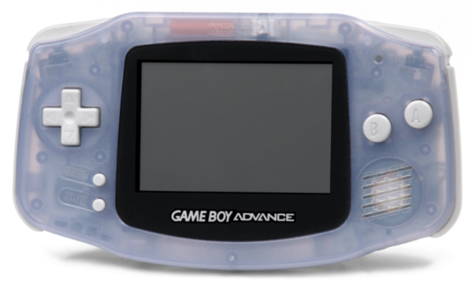
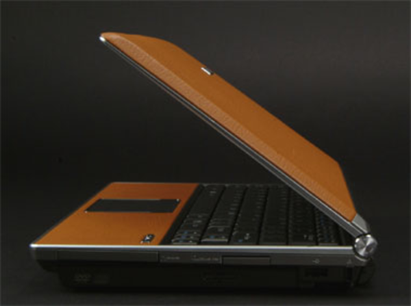

When I was kid I always dreamed to go off my comfort zone and be the best Pokemon trainer out there. It was in early 2004, my father gave me a GameBoy Advance (GBA). It was my first ever electronics device I grew attachment into. Later in the same year, summer 2004, I went to a wholesale center with my grandmother. The building was bridged in such ways it connects to the building in the opposite of the road. That building is still the biggest consumer electronics market in Jakarta, the city I lived. Since I used to bring my GBA anywhere I go, my grandmother told me that I could pick a new video game. I bought the best video game I have ever played that day, Pokemon Crystal.

Unknown to her, this event set my life goals to go away of conveniences and start to build my "Pokemon" roster. I want to set my self to build and make competitive products that people use and like. I then took study in Creative Technology at UT, because their orientation in less theory and more into making stuffs happen.

In my teenage years, I brought my laptop anywhere I go to codes anytime, everywhere I want. I started my programming with Pascal, but there was not much attention I gave into. Up until when ActionScript was getting popular and programming became more visual than ASCII diamonds displayed in terminal, I started to spent my time trying to program myself video games. I started my likes of open source framework with Flixel. It was an arcade video game framework based on Adobe's open sourced Flex.

I learned and touched resistor at the first time in my first year of Creative Technology. The program started with students learning how to use Arduino. I feel the lower entry point given from Arduino is what enabled me into electronics development. I have been using Arduino and its variant for my projects since my first year in Creative Technology. Nowadays, I like the flexibility to code and test first in Linux before setup the electronics with single board computer (SBC) like Raspberry PI.

In the end, I want to make rosters of products that enable society to achieve good things in their life.

## this website...

This website I made as a replacement of Evernote. Here I put every public notes I made. Notes are all written Markdown format, a lightweight markup language. I moved from Evernote because there is no support for Linux client, whereas since four years ago I do all of my works in Linux. Their solution for their Linux user is to use Evernote web client. However, the web client is buggy (specially for bullet and numbering, limitation how many image I can upload in a go, ...) and lack of features that the desktop clients have. Since then, I have tried to adjust my digital note taking habit by trying other note taking/storing applications, from the open source to the non-open source ones. In the end, I ended up storing my note as a Markdown file and showing the public notes via this website I made with MKDocs. Between MKDocs and my end, there are Python automation scripts to handle directories structuring and naming convention.

MKDocs itself is a Python static flat-file site generator. I write all my notes in a folder with all of its attachments (.pdf files, images, and compressed directories). Then, my automation script will automatically handle the naming convention of the note (add date, time, and time zone). The directories outputted from the automation script will be the directories I put in MKDocs. Due to the nature of no-database, flat-file website, all data will not verified but rather taken directly from the folder's structure. Hence, 404 web page not found, for note that used to exists, could be because I change the note's name or I move the note into different directory.

I have two main note directories, this one, in this website, for my public notes and a directory for all of my private note. I made this website to share my public notes, to make me (and others) easier to track my projects, and as a offline documentation when I work my codes without internet connection (I remember the hard time of using Indonesian internet to work, the availability and the speed). This website is working offline in smartphone as well. This whole website is packaged in a directory with index.html to open, no other system dependencies.

So far, my note taking habit helps me a lot when I am working on projects. It was hard to collaborate and share notes for projects I did with others. This system enables me to do collaboration and share notes with others. Although, the most notes are supposed only for my own benefits, I hope somehow my notes help others too.

## note taking applications and work flows...

I started to like to take notes when I was in my second year of my senior high school. Back then there is no proper internet connection, nor I have proper computer to take digital notes. It started with the traditional pen and paper notes. I used to have an A5 looseleaf binder to hold my notes. Looseleaf binder let me adjust my notes liberally and share it to friends in case they need a copy of it.

Near in the end of my second year, my father gave me his 12 inches Asus S6F laptop. The laptop is still working until now (2017) and is still my best experience with any laptop I have ever used. With this laptop I started to take my notes digitally. The first web service I used to store my notes was [Scribd](https://www.scribd.com/). It was not a specific service for note per see, but you can store any amount of .pdf documents there. Although I am not using Scribd anymore, my high school notes has been seen ~20.000 times and I received occasional emails from teachers wanted to use my notes for their teaching materials.

I started using Evernote when I was in my second year in UT. I used the normal, free version until I realized I need more storage. Then, I decided to subscribe to its premium features. It was all good, with 1 GB additional memory to store higher resolution images and note scans. The struggle came when I started to used Linux more religiously. There is no Evernote desktop client for Linux. The only solution is either to use GeekNote (third party Evernote client) or use Evernote web application. I have no luck on setting up the former and the Evernote web application has less features than the desktop version. Around 2014, I looked up for alternative for Evernote.

I was keen into open source software (I am not am not limiting myself to always use open source software :D, I use commercial software as well), some Evernote alternatives I had used were Laverna and Paperworks. Both were still in development. Laverna is more flexible, because you can host it or use it offline as a standalone Atom based desktop application. Whereas, Paperworks (as far as I know) is strictly to be used as a hosted web application. There was still no comfort of using both of these, I still gradually moved back using Evernote.

After I used Laverna and Paperworks, I used traditional CMS like Drupal and Wordpress. Both are very good, solid, and industry staple CMSs. It was a pleasant experience when taking notes and when sharing notes to others, but it lacks the flexibility to be moved. It was not an easy job to convert, export, and import Wordpress posts into different computer or server. However, I have not yet tried Drupal setting with the portable SQLite database (SQLite seems to be the solution, because you have all your post in a single, stand-alone file).

I found my home in [TagSpaces](https://www.tagspaces.org/). TagSpaces is an open source file management/tagging software. Albeit it is open source, it has some premium features that people can buy to use. Its main functionality comes as a file management with tagging. So, directory and file search can be done faster within the TagSpaces client. What drew me into TagSpaces was its file manager and the ability to make note as a single HTML or Markdown. The good part about the single HTML note is that regardless how many images attached in the HTML note, it will still be compiled into a single file. Although, the lag is apparent when HTML note with big image files is being opened.

TagSpaces has a WebDAV version to be hosted in a server as well. With this, TagSpaces can be hosted like it is a CMS. However, I feel like the WebDAV version is not maintained (at least, the last time I saw it), with some tutorials are left dated.

I looked up for solution and I was very excited with flat-file CMS or static-site generator. These things can generate website based on some .txt files without any server nor OS dependencies. The first thing I tried was Jekyll, Raneto, and then MKDocs. I tried Jekyll, it is made with Ruby programming language. I like it, but I have some troubles on setting up Ruby in my Linux computer (occasional installation error, when I download it from package manager). Raneto is made with NodeJS, the people's programming language :D while, MKDocs is made with Python. In the end I choose MKDocs over Raneto because it has higher stars in GitHub (~4.000 vs ~1.200) and I like Python and Jinja2 more than the template engine Raneto used.

With MKDocs and Python automation script I can easily maintain my notes both online (can be hosted in GitHub for free with no file exceed 50 MB, I think), offline, and offline to be viewed in smart phone as well. The two drawbacks is now my private notes and my public notes are in separate directories and slow compiling time (I have like 4.000 notes, I think that is why). But, so far I like my MKDocs setup for taking note.