* [http://www.crunchyroll.com/](http://www.crunchyroll.com/), I am thinking to move to CrunchyRoll instead of Netflix for a while because it has Digimon Tri anime.

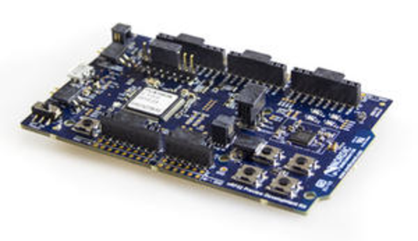

* [http://eu.mouser.com/Search/ProductDetail.aspx?qs=79dOc3%2f91%2fccrafuGv4fOw%3d%3d](http://eu.mouser.com/Search/ProductDetail.aspx?qs=79dOc3%2f91%2fccrafuGv4fOw%3d%3d), NRF52 - DK Blutooth Low Energy (BLE) microcontroller development kit. My main interest is to develop electronics that can be powered with only a coin battery.

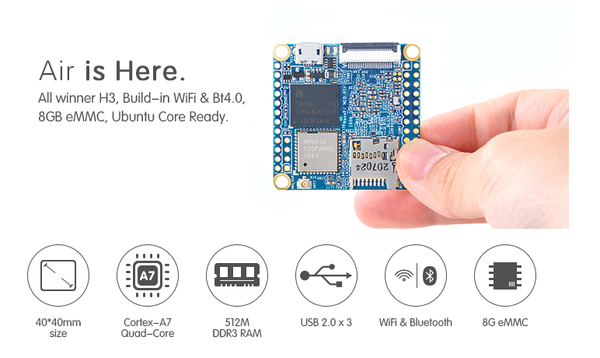

* [http://www.friendlyarm.com/index.php?route=product/product&product_id=151](http://www.friendlyarm.com/index.php?route=product/product&product_id=151), NanoPI Air. RaspBerry PI Zero alternative with WiFi and Bluetooth and it is twice smaller too!

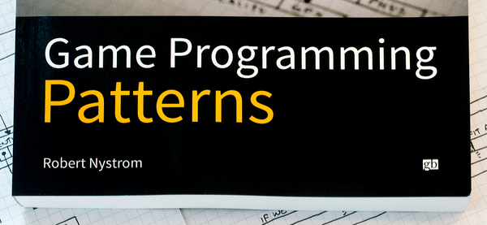

* [http://gameprogrammingpatterns.com/](http://gameprogrammingpatterns.com/), game patterns programming book. I have been reading two chapters so far and I am satisfied. Having this in PDF format or even physical would be even better for me, so I can have all references in one single place. There is web book version that is free though.

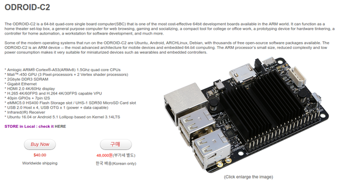

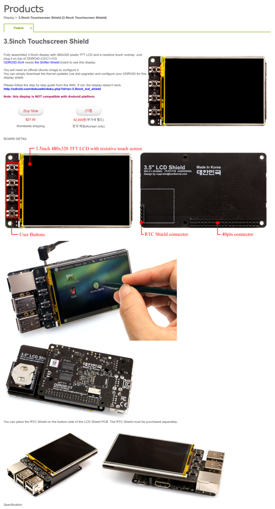

* [http://www.hardkernel.com/main/products/prdt_info.php](http://www.hardkernel.com/main/products/prdt_info.php), ODROID SBC.
* [http://www.hardkernel.com/main/products/prdt_info.php?g_code=G147435282441](http://www.hardkernel.com/main/products/prdt_info.php?g_code=G147435282441), ODRIOD SBC official touch screen monitor.

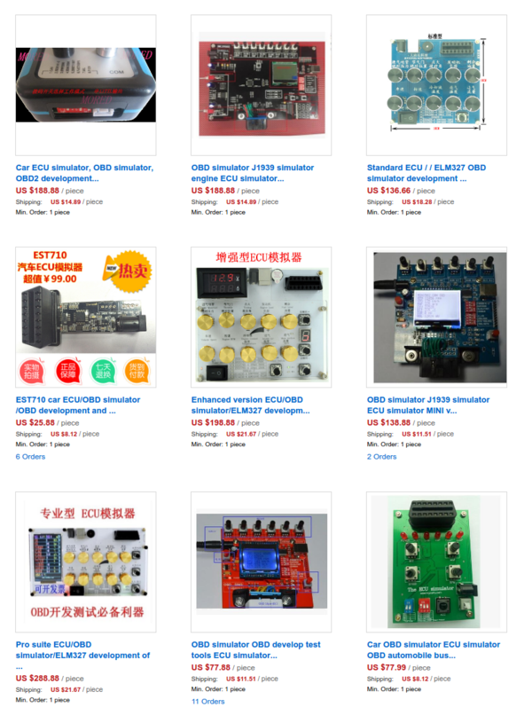

* [https://www.aliexpress.com/cheap/cheap-obd-simulator.html](https://www.aliexpress.com/cheap/cheap-obd-simulator.html), listing of cheap OBD simulator.

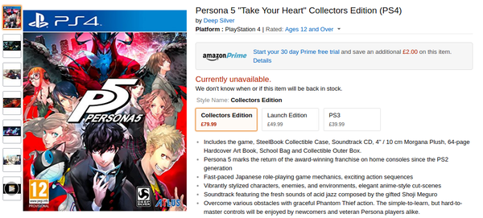

* [https://www.amazon.co.uk/Persona-5-SteelBook-Launch-PS4/dp/B01K6T8C6S/](https://www.amazon.co.uk/Persona-5-SteelBook-Launch-PS4/dp/B01K6T8C6S/), I want to play Persona 5 so bad, but I do not even own PlayStation4.

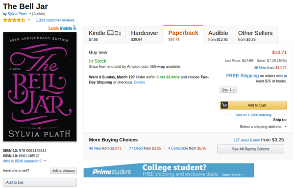

* [https://www.amazon.com/Bell-Jar-Sylvia-Plath/dp/0061148512](https://www.amazon.com/Bell-Jar-Sylvia-Plath/dp/0061148512), a novel recommended by a redditor. They say that this book is about someone getting depressed.

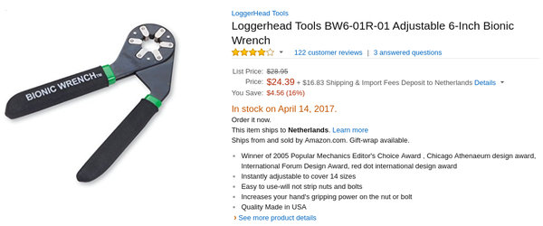

* [https://www.amazon.com/gp/product/B000JPN2QK/](https://www.amazon.com/gp/product/B000JPN2QK/), I want this flexible wrench. With this I do not need to care to bring any wrench with specific sizes.

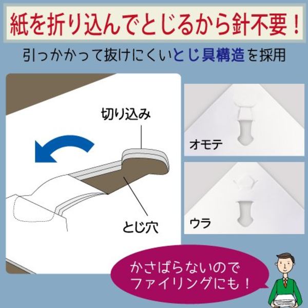

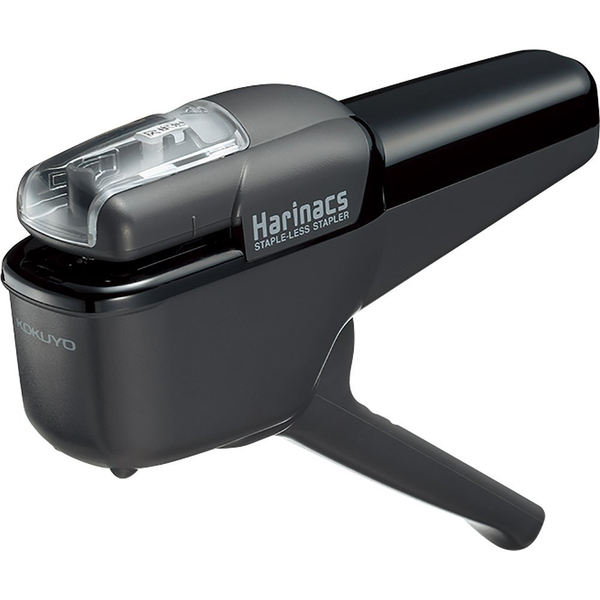

* [https://www.amazon.com/Kokuyo-Harinacs-Japanese-Stapleless-Stapler/dp/B00F2YSDYY/](https://www.amazon.com/Kokuyo-Harinacs-Japanese-Stapleless-Stapler/dp/B00F2YSDYY/), staples that no need to be filled. It uses specific folding mechanics to bind papers. However, this can only be used to bind less than 10 papers.

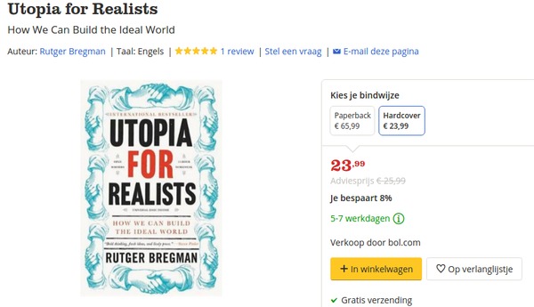

* [https://www.bol.com/nl/f/utopia-for-realists/9200000057795195/](https://www.bol.com/nl/f/utopia-for-realists/9200000057795195/), book I want to read. I am actually sold by its title.

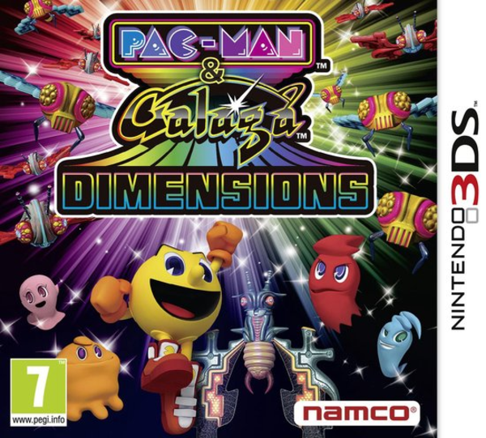

* [https://www.bol.com/nl/p/pac-man-galaga-dimensions/1004004011303984/?suggestionType=typedsearch](https://www.bol.com/nl/p/pac-man-galaga-dimensions/1004004011303984/?suggestionType=typedsearch), I want to play classic Pac Man in 3DS.

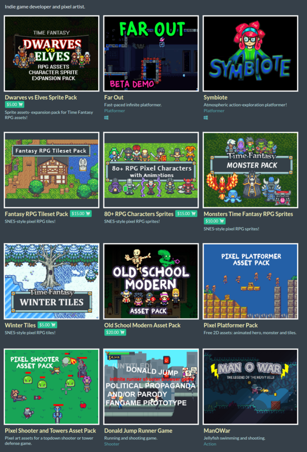

* [https://finalbossblues.itch.io/](https://finalbossblues.itch.io/), video game asset from FinalBossBlue. He/she is my favorite sprite artist that provides cheap and easy to modified sprite art.

* [https://www.interaction-design.org/](https://www.interaction-design.org/), dedicated website to learn UX (user experience), a compendium of user experience as well as human media interaction courses. The annual fee is 144 US Dollars and for student the annual fee is 96 US Dollars. Pretty steep price in my opinion to just get started in user experience design. I might get started somewhere else first and get into this later on. But a lot of people are recommending this media as it is cheaper in long term.

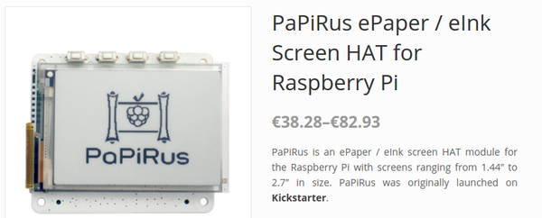

* [https://www.pi-supply.com/product/papirus-epaper-eink-screen-hat-for-raspberry-pi/](https://www.pi-supply.com/product/papirus-epaper-eink-screen-hat-for-raspberry-pi/), Papirus e - ink display for Raspberry PI.

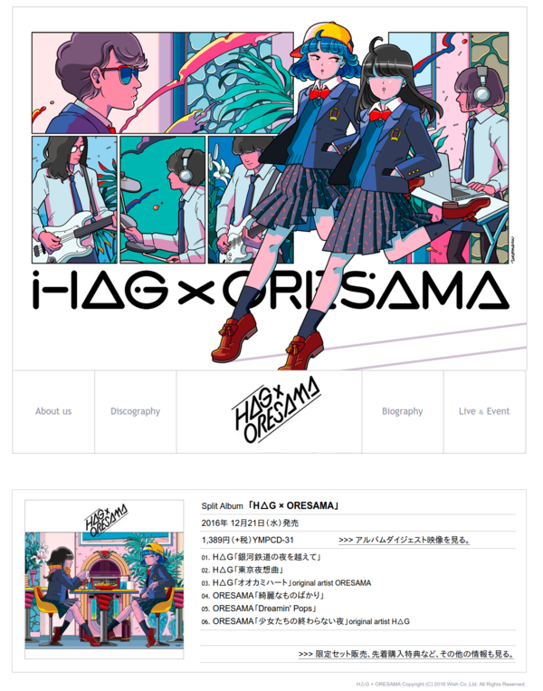

* __*(BOUGHT)*__ _[http://wish-japan.co.jp/hag-oresama/](http://wish-japan.co.jp/hag-oresama/), HAG and Oresama collaboration album, here are some sample clips, [https://www.youtube.com/watch?v=WX0rq9pAxoo](https://www.youtube.com/watch?v=WX0rq9pAxoo)._