* I think I would like to learn on how to use Django.
* So, now my first aim is to look for Django getting started tutorial.
* Here is the link to Django getting started tutorial, [https://docs.djangoproject.com/en/1.11/intro/tutorial01/](https://docs.djangoproject.com/en/1.11/intro/tutorial01/).
* Here is the screenshot of the tutorial.

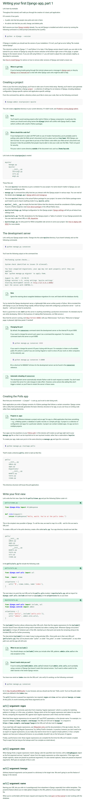

[./20170816-2007-cet-3-2.png](./20170816-2007-cet-3-2.png)

* Here is an example commands on how to run Django server on different port (the default port is on port 8000 at localhost). The example below will show you on how to run Django server at port 8080.

```markdown
python3 manage.py runserver 8080
```

* It is says here that with Django manage.py it is possible to change the development IP address as well. Below is the example commands.

```markdown
python3 manage.py runserver 0:8000
```

* The `0` there is a shortcut to `0.0.0.0`.
* The Django development server will automatically reload changes. So there is no need to restart the server if there are changes in the file.
* However, adding or removing file will not be able to be detected in real - time. Hence, for adding and removing file the Django server still needs to be restarted.
* There are multiple ways to set up `url()`. I will documentation on this later on as a screenshot.

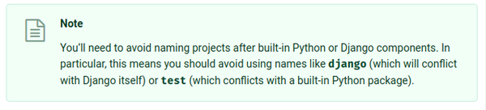

[./20170816-2007-cet-3-4.png](./20170816-2007-cet-3-4.png)

* The website made with Django can be used/mentioned as a Python package.
* Based from the screenshot above, and because the website can be used as a Python package, it is not a good idea to name the project/website the same with Django's or Python's standard library.

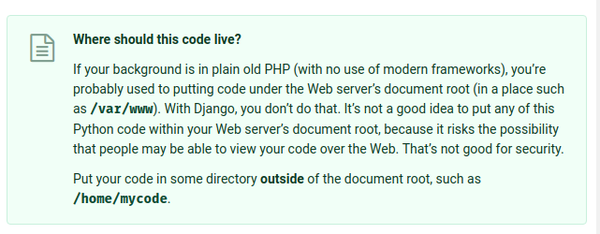

[./20170816-2007-cet-3-6.png](./20170816-2007-cet-3-6.png)

* For development purpose, do not put Django project in a super user owned directories.
* Instead, Django website can be put everywhere else but not in super user directories.

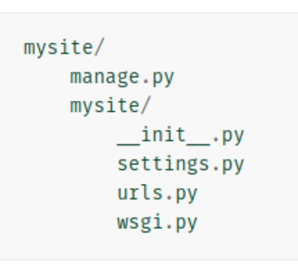

[./20170816-2007-cet-3-8.png](./20170816-2007-cet-3-8.png)

* General project structures for a Django generated website.
* This is the command line to generate skeleton project to kick - start Django development.

```markdown
django-admin startproject mysite
```

* Where `mysite` is the project name.

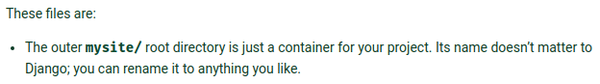

[./20170816-2007-cet-3-10.png](./20170816-2007-cet-3-10.png)

* The outermost `mysite` is the container folder for the Django project.
* The name does not matter and can be changed without refactoring.

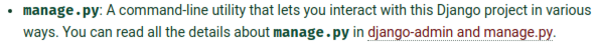

[./20170816-2007-cet-3-12.png](./20170816-2007-cet-3-12.png)

* The manage.py is a command line utility.
* The manage.py is like a program to manage the Django project (starting server, ...).

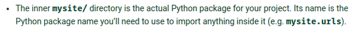

[./20170816-2007-cet-3-14.png](./20170816-2007-cet-3-14.png)

* The inner mysite directory is meant as the main Python package.
* The name can be changed but with refactoring because it will be referred by other package or sub - web application.

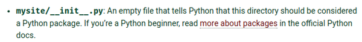

[./20170816-2007-cet-3-16.png](./20170816-2007-cet-3-16.png)

* Inside that mysite directory there is __init__.py.
* In general __init__.py is used to let the interpreter knows that the directory is meant as a Python package.

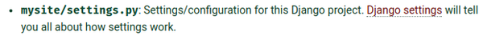

[./20170816-2007-cet-3-18.png](./20170816-2007-cet-3-18.png)

* The settings.py in inner mysite directory tell Django on general settings about the website.

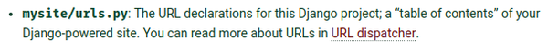

[./20170816-2007-cet-3-20.png](./20170816-2007-cet-3-20.png)

* The nice thing about Django is the urls.py inside inner mysite directory.
* The urls.py are meant as a table of content for the website.
* Every possible links and routings goes here.
* In ExpressJS or Flask the routings are separated per functions.

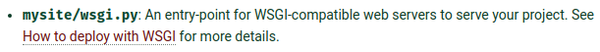

[./20170816-2007-cet-3-22.png](./20170816-2007-cet-3-22.png)

* In the inner mysite directory, there is a wsgi.py.
* The wsgi.py are meant for entry point for WSGI compatible web server for later when deploying the project somewhere.

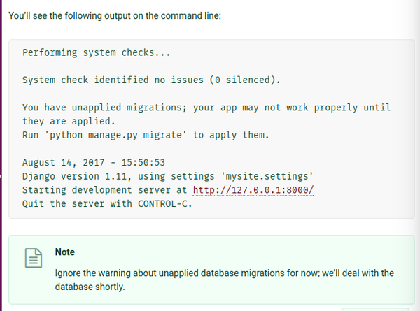

[./20170816-2007-cet-3-24.png](./20170816-2007-cet-3-24.png)

* This is the general run command for Django web application, when using server that is meant for developing purposes.

```markdown
python3 manage.py runserver
```

* At basic skeleton there are some warnings for settings similar to what it is shown in the above screenshot.

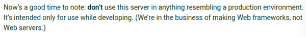

[./20170816-2007-cet-3-26.png](./20170816-2007-cet-3-26.png)

* Do not use this as production environment.
* Only use this for debugging.

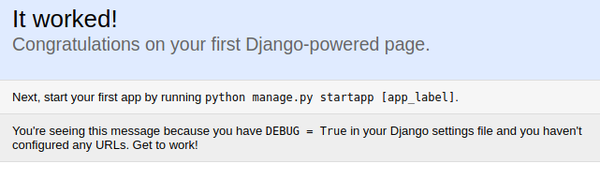

[./20170816-2007-cet-3-28.png](./20170816-2007-cet-3-28.png)

* Basic Django skeleton view in web browser.

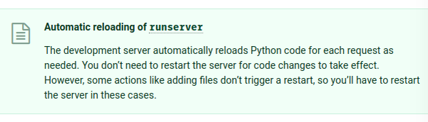

[./20170816-2007-cet-3-30.png](./20170816-2007-cet-3-30.png)

* The `runserver` command will automatically reload updated files.
* However, adding or removing files will not be updated. Hence, for these 2 the Django server needs to be restarted.

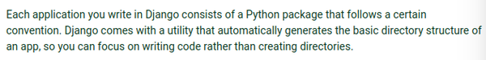

[./20170816-2007-cet-3-32.png](./20170816-2007-cet-3-32.png)

* Here is mentioned the nice thing about Django.
* Every application written in Django will come out as a Python packages that can be re - used easily.

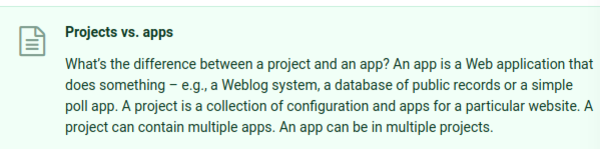

[./20170816-2007-cet-3-34.png](./20170816-2007-cet-3-34.png)

* General differences between application and project (in Django's term).
    * App is a web application that do something.
    * Project is a collection of applications and configurations for a website.
* A project can has multiple applications.
* An application can be in multiple projects.
* So, I think I should imagine project as the operating system (like Android or iOS) then added with web applications.

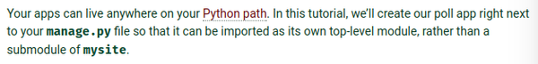

[./20170816-2007-cet-3-36.png](./20170816-2007-cet-3-36.png)

* This is a 7 pages long tutorial on getting started with Django.
* This tutorial's goal is to make a polling application right next to manage.py (so in the root project folder).
* In the end, the polling application can be imported as its top - down module, rather than a submodule of mysite.

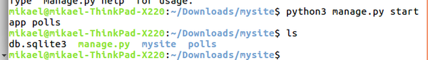

[./20170816-2007-cet-3-38.png](./20170816-2007-cet-3-38.png)

* This is the command to create a web application in a Django project directories.

```markdown
python3 manage.py startapp polls
```

* The `polls` the is the application name. It can be arbitrary as long as not the same name used in Django/Python package.

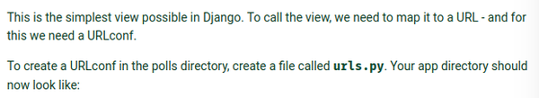

[./20170816-2007-cet-3-40.png](./20170816-2007-cet-3-40.png)

* Each Django applications (for example in here is the polling application) needs to have a urls.py.
* The urls.py are used as a internal URLs routing for the web application.
* However, the developer needs to create the urls.py by themselves.
* I am not sure why would not Django create it automatically when `startapp` runs.

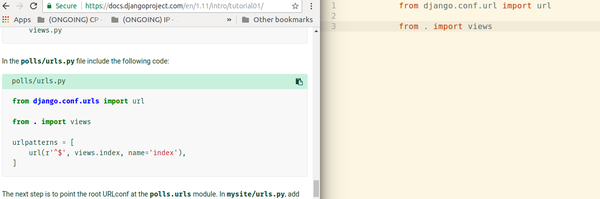

[./20170816-2007-cet-3-42.png](./20170816-2007-cet-3-42.png)

* Today I learned, `from . import views` means to import package from the same root.
* In this case there is views.py in the same directories with urls.py that was just created.
* The `views` in `from . import views` is a file name (not a function nor a class).

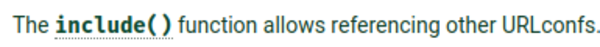

[./20170816-2007-cet-3-44.png](./20170816-2007-cet-3-44.png)

* The Django `include()` is used to referencing to another URL configurations.

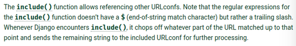

[./20170816-2007-cet-3-46.png](./20170816-2007-cet-3-46.png)

* The Regular Expression (RegEx) does not start with `$` in `include()` but with suffix `/`.
* Django's `include()` will process URL split with `/`.

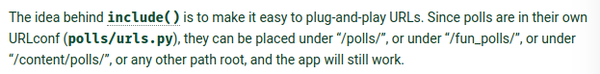

[./20170816-2007-cet-3-48.png](./20170816-2007-cet-3-48.png)

* The idea behind `include()` is to make easy plug  - and - play URLs configurations and paths.
* The polling application will be made within this tutorial is in their own URLconfs.
* In this case the polling tutorial resides in /polls/.
* However, it can be in other paths as well like for example under /fun_polls/ or under `/content/polls/`

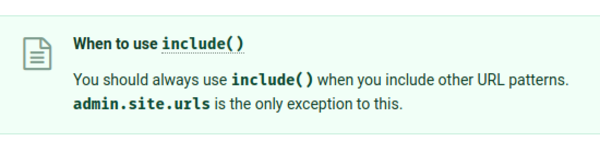

[./20170816-2007-cet-3-50.png](./20170816-2007-cet-3-50.png)

* `include()` should always be used when including URL patterns excluding URL patterns from a constant `admin.site.urls`.

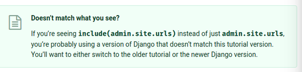

[./20170816-2007-cet-3-52.png](./20170816-2007-cet-3-52.png)

* The older version of Django is still using `include(admin.site.url)`.
* For the newer version of Django `admin.site.url` should not be put into `include()`.

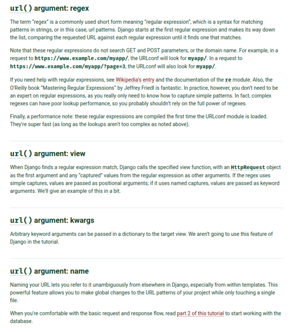

[./20170816-2007-cet-3-54.png](./20170816-2007-cet-3-54.png)

* Example on Django's `url()` priorities.
    * First the `url()` will look for similar RegEx patterns. There is a `re` Python module to deal with RegEx.
    * If not then `url()` will look in to a `view` object. I am not sure what is `view()` object just yet, but I assume it is a relative path to a HTML file.
    * If the parameter provided is also not a `view` object then any arbitrary parameters can be processed. Perhaps like Python object or something like that.
    * Then, I think, the `url()` will process the parameter as a link to an external location on The Internet.