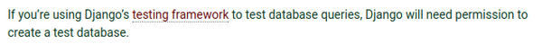
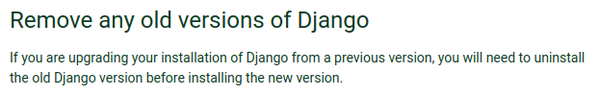
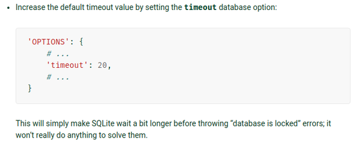
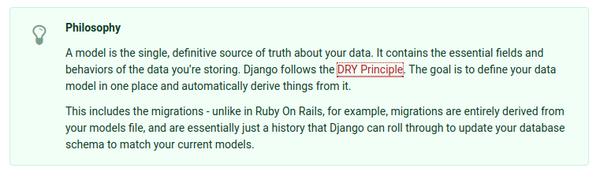
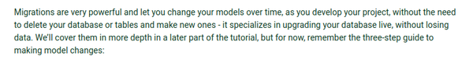

* This is my note for the second chapter of Django database tutorial.
* Here is the link to the tutorial, [https://docs.djangoproject.com/en/1.11/intro/tutorial02/](https://docs.djangoproject.com/en/1.11/intro/tutorial02/).
* Here is the screenshot of the tutorial.


[./20170816-2007-cet-4-2.png](./20170816-2007-cet-4-2.png)


[./20170816-2007-cet-4-4.png](./20170816-2007-cet-4-4.png)

* The default database used in Django is SQLite.
* The SQLite is portable enough for small website where most operations are about reading data and less about concurrency.
* The scalable solution for database is actually the PostgreSQL.


[./20170816-2007-cet-4-6.png](./20170816-2007-cet-4-6.png)

* In the settings.py there some constant for adjusting which database is to use for the web application.
* These database driver are provided as a first party driver.
    * `django.db.backends.sqlite3` for SQLite based database.
    * `django.db.backends.postgresql` for PostgreSQL.
    * `django.db.backends.mysql` for MySQL.
    * `django.db.backends.oracle` for Oracle.
* The `NAME` constant should be filled with the database name.
* For example the SQLite database only need the path to the SQLite file as a `NAME` since one SQLite file is actually a database with some tables in it.


[./20170816-2007-cet-4-8.png](./20170816-2007-cet-4-8.png)

* For non - using SQLite database there are some additional settings that should be provided as well.
    * `HOST`.
    * `PASSWORD`.
    * `USER`.


[./20170816-2007-cet-4-10.png](./20170816-2007-cet-4-10.png)

* Some additional system packages that need to be installed in the computer when using non - SQLite database.
* I am not sure if these packages are meant to be installed globally or locally.
* Anyway the CLI application to "shell" out SQLite in Ubuntu is `sqlite3`.
* The application can be installed in Ubuntu with this command.

```markdown
sudo apt-get install sqlite3
```


[./20170816-2007-cet-4-12.png](./20170816-2007-cet-4-12.png)

* The infamous Django's `migrate` can be used to automatically create database tables for the Django application.
* However, the developer needs to make sure the Django have he proper permission to update the database.
* There will be a case when the table needs to be created manually. In this case Django needs to have these permissions to the database.
    * `DELETE`.
    * `INSERT`.
    * `SELECT`.
    * `UPDATE`.



[./20170816-2007-cet-4-14.png](./20170816-2007-cet-4-14.png)

* For unit testing in Django it is necessary for Django to have permission to create new database.
* This means that unit test in Django needs an additional SQLite file.



[./20170816-2007-cet-4-16.png](./20170816-2007-cet-4-16.png)

* If you want to upgrade Django to the new version, the old Django should be uninstalled first.


[./20170816-2007-cet-4-18.png](./20170816-2007-cet-4-18.png)

* If the old Django installed with setup.py then the uninstallation can be done by just deleting the Django folder in site-package directory.
* Anyway, to find the directory, you can use this Python command.

```markdown
python3 -c "import django; print(django.__path__);"
```

* The `django` can be replaced with any installed Python packages to search where is the library/package located.


[./20170816-2007-cet-4-20.png](./20170816-2007-cet-4-20.png)

* There are some differences that SQLite has compared to other database.


[./20170816-2007-cet-4-22.png](./20170816-2007-cet-4-22.png)

* In general what this screenshot says is that there is an inconsistency in SQLite when dealing with case - sensitive string.
* Perhaps, for my case I will keep everything as lower case for now.
* My only concern is when inputting name with nobiliary particle like Dutch's von, German's von, ... because these words should be in lower letter.
* Regardless, I will keep everything in lower case from now on.
* Specifically for SQLite there are these two filters that act differently.
    * `contains`.
    * `iexact`.


[./20170816-2007-cet-4-24.png](./20170816-2007-cet-4-24.png)

* For `contains` the matches are happened without regard to case - sensitivity.


[./20170816-2007-cet-4-26.png](./20170816-2007-cet-4-26.png)

* If there are character outside ASCII range the `iexact` will behaves the same like `exact` which means to pass the filter for case - sensitive.
* The bug will not regard if case - insensitive options are passed into query. If there is at least a character lies outside ASCII range then it will be treated as case - sensitive filter.


[./20170816-2007-cet-4-28.png](./20170816-2007-cet-4-28.png)

* There is workaround mentioned in the main website of SQLite.
* However, this workaround is not implemented in SQLite backend for Django just yet.
* It says there in the screenshot that the attempt to fix the bug would be fairly difficult to be done.


[./20170816-2007-cet-4-30.png](./20170816-2007-cet-4-30.png)

* Hence, the bug should be known as a natural thing that happened in Django. Django developers are expected to work around the database schema as the work around for this problem.


[./20170816-2007-cet-4-32.png](./20170816-2007-cet-4-32.png)

* It is better to not use Python 2.X to develop Django with.
* It is mentioned here that the SQLite Python driver in Windows is rather outdated.


[./20170816-2007-cet-4-34.png](./20170816-2007-cet-4-34.png)

* If there is `Database is locked` error, this means that the SQLite file are having so many concurrent connections and the client received a timeout from the database server which then result in `Database locked error`.


[./20170816-2007-cet-4-36.png](./20170816-2007-cet-4-36.png)

* This concurrency problem can be solved with doing some configurations.
* The `Database is locked` error means that one thread or a process has an exclusive lock on the database while other requests stacked started to get timeout.


[./20170816-2007-cet-4-38.png](./20170816-2007-cet-4-38.png)

* The solution to the `Database locked error`.
    * Switch to another database. SQLite is meant for simple small application with mostly read requests. The error means that the SQLite database is not an ideal solution anymore for the project.
    * Write database code that reduce concurrency and "short - lived" database transactions.
    * Increase the timeout value in the configurations file (this is not the ideal solution).



[./20170816-2007-cet-4-40.png](./20170816-2007-cet-4-40.png)

* Image below is an example of configuration to setup more timeout when the total request traffics for the SQLite database is heavy.


[./20170816-2007-cet-4-42.png](./20170816-2007-cet-4-42.png)

* SQLite has no support on `SELECT ... FOR UPDATE`.


[./20170816-2007-cet-4-44.png](./20170816-2007-cet-4-44.png)


[./20170816-2007-cet-4-46.png](./20170816-2007-cet-4-46.png)

* Aside from SQLite, the default database table usually should be created manually.
* And make sure the settings in project-name/settings.py has the "create database" privilege.
* And for SQLite everything is already setup automatically when they needed.


[./20170816-2007-cet-4-48.png](./20170816-2007-cet-4-48.png)

* Django projects works like an "operating system".
* In Django project there will be some add - ons and other applications that complement the overall Django project.
* The Django application is made to be modular and re - usable for later/other Django project.


[./20170816-2007-cet-4-50.png](./20170816-2007-cet-4-50.png)

* At the defaults there are these applications installed and used in fresh Django generated skeleton project.
    * `django.contrib.admin` the administrator site.
    * `django.contrib.auth` authentication system (password, session manager, ...).
    * `django.contrib.contenttypes` a framework for content types.
    * `django.contrib.sessions` a session frameworks.
    * `django.contrib.messages` a messaging frameworks.
    * `django.contrib.staticfiles` is used to manage static files.
* I think not everything here is mandatory and can be activate and deactivate based on the needs.


[./20170816-2007-cet-4-52.png](./20170816-2007-cet-4-52.png)


[./20170816-2007-cet-4-54.png](./20170816-2007-cet-4-54.png)


[./20170816-2007-cet-4-56.png](./20170816-2007-cet-4-56.png)

* In the Django configurations/settings (I think it is the settings.py) there is a `USE_TZ` constant.
* This are meant for database that does not support timezone like MySql, Oracle, and SQLite.
* The default timezone value is `"UTC"` if there is nothing specified.
* The most important thing mentioned in the screenshot above is that, "... you should not set this option for database that is managed by Django". This warning is for daylight time saving (DST) related issues.
* There are some caveats for this matter.
    * If `USE_TZ` is `True` and the database does not use timezone the `TIME_ZONE` value is used (default value for `TIME_ZONE` is `"UTC"`).
    * If `USE_TZ` is `True` but database support timezone (for example PostgreSQL) then Django will return an error.
    * If `USE_TZ` is `False` but `TIME_ZONE` is set the Django will also return an error.
* Here are list of strings that can be used as timezone.

```markdown
Africa/Abidjan
Africa/Accra
Africa/Addis_Ababa
Africa/Algiers
Africa/Asmara
Africa/Asmera
Africa/Bamako
Africa/Bangui
Africa/Banjul
Africa/Bissau
Africa/Blantyre
Africa/Brazzaville
Africa/Bujumbura
Africa/Cairo
Africa/Casablanca
Africa/Ceuta
Africa/Conakry
Africa/Dakar
Africa/Dar_es_Salaam
Africa/Djibouti
Africa/Douala
Africa/El_Aaiun
Africa/Freetown
Africa/Gaborone
Africa/Harare
Africa/Johannesburg
Africa/Juba
Africa/Kampala
Africa/Khartoum
Africa/Kigali
Africa/Kinshasa
Africa/Lagos
Africa/Libreville
Africa/Lome
Africa/Luanda
Africa/Lubumbashi
Africa/Lusaka
Africa/Malabo
Africa/Maputo
Africa/Maseru
Africa/Mbabane
Africa/Mogadishu
Africa/Monrovia
Africa/Nairobi
Africa/Ndjamena
Africa/Niamey
Africa/Nouakchott
Africa/Ouagadougou
Africa/Porto-Novo
Africa/Sao_Tome
Africa/Timbuktu
Africa/Tripoli
Africa/Tunis
Africa/Windhoek
America/Adak
America/Anchorage
America/Anguilla
America/Antigua
America/Araguaina
America/Argentina/Buenos_Aires
America/Argentina/Catamarca
America/Argentina/ComodRivadavia
America/Argentina/Cordoba
America/Argentina/Jujuy
America/Argentina/La_Rioja
America/Argentina/Mendoza
America/Argentina/Rio_Gallegos
America/Argentina/Salta
America/Argentina/San_Juan
America/Argentina/San_Luis
America/Argentina/Tucuman
America/Argentina/Ushuaia
America/Aruba
America/Asuncion
America/Atikokan
America/Atka
America/Bahia
America/Bahia_Banderas
America/Barbados
America/Belem
America/Belize
America/Blanc-Sablon
America/Boa_Vista
America/Bogota
America/Boise
America/Buenos_Aires
America/Cambridge_Bay
America/Campo_Grande
America/Cancun
America/Caracas
America/Catamarca
America/Cayenne
America/Cayman
America/Chicago
America/Chihuahua
America/Coral_Harbour
America/Cordoba
America/Costa_Rica
America/Creston
America/Cuiaba
America/Curacao
America/Danmarkshavn
America/Dawson
America/Dawson_Creek
America/Denver
America/Detroit
America/Dominica
America/Edmonton
America/Eirunepe
America/El_Salvador
America/Ensenada
America/Fort_Wayne
America/Fortaleza
America/Glace_Bay
America/Godthab
America/Goose_Bay
America/Grand_Turk
America/Grenada
America/Guadeloupe
America/Guatemala
America/Guayaquil
America/Guyana
America/Halifax
America/Havana
America/Hermosillo
America/Indiana/Indianapolis
America/Indiana/Knox
America/Indiana/Marengo
America/Indiana/Petersburg
America/Indiana/Tell_City
America/Indiana/Vevay
America/Indiana/Vincennes
America/Indiana/Winamac
America/Indianapolis
America/Inuvik
America/Iqaluit
America/Jamaica
America/Jujuy
America/Juneau
America/Kentucky/Louisville
America/Kentucky/Monticello
America/Knox_IN
America/Kralendijk
America/La_Paz
America/Lima
America/Los_Angeles
America/Louisville
America/Lower_Princes
America/Maceio
America/Managua
America/Manaus
America/Marigot
America/Martinique
America/Matamoros
America/Mazatlan
America/Mendoza
America/Menominee
America/Merida
America/Metlakatla
America/Mexico_City
America/Miquelon
America/Moncton
America/Monterrey
America/Montevideo
America/Montreal
America/Montserrat
America/Nassau
America/New_York
America/Nipigon
America/Nome
America/Noronha
America/North_Dakota/Beulah
America/North_Dakota/Center
America/North_Dakota/New_Salem
America/Ojinaga
America/Panama
America/Pangnirtung
America/Paramaribo
America/Phoenix
America/Port-au-Prince
America/Port_of_Spain
America/Porto_Acre
America/Porto_Velho
America/Puerto_Rico
America/Rainy_River
America/Rankin_Inlet
America/Recife
America/Regina
America/Resolute
America/Rio_Branco
America/Rosario
America/Santa_Isabel
America/Santarem
America/Santiago
America/Santo_Domingo
America/Sao_Paulo
America/Scoresbysund
America/Shiprock
America/Sitka
America/St_Barthelemy
America/St_Johns
America/St_Kitts
America/St_Lucia
America/St_Thomas
America/St_Vincent
America/Swift_Current
America/Tegucigalpa
America/Thule
America/Thunder_Bay
America/Tijuana
America/Toronto
America/Tortola
America/Vancouver
America/Virgin
America/Whitehorse
America/Winnipeg
America/Yakutat
America/Yellowknife
Antarctica/Casey
Antarctica/Davis
Antarctica/DumontDUrville
Antarctica/Macquarie
Antarctica/Mawson
Antarctica/McMurdo
Antarctica/Palmer
Antarctica/Rothera
Antarctica/South_Pole
Antarctica/Syowa
Antarctica/Vostok
Arctic/Longyearbyen
Asia/Aden
Asia/Almaty
Asia/Amman
Asia/Anadyr
Asia/Aqtau
Asia/Aqtobe
Asia/Ashgabat
Asia/Ashkhabad
Asia/Baghdad
Asia/Bahrain
Asia/Baku
Asia/Bangkok
Asia/Beirut
Asia/Bishkek
Asia/Brunei
Asia/Calcutta
Asia/Choibalsan
Asia/Chongqing
Asia/Chungking
Asia/Colombo
Asia/Dacca
Asia/Damascus
Asia/Dhaka
Asia/Dili
Asia/Dubai
Asia/Dushanbe
Asia/Gaza
Asia/Harbin
Asia/Hebron
Asia/Ho_Chi_Minh
Asia/Hong_Kong
Asia/Hovd
Asia/Irkutsk
Asia/Istanbul
Asia/Jakarta
Asia/Jayapura
Asia/Jerusalem
Asia/Kabul
Asia/Kamchatka
Asia/Karachi
Asia/Kashgar
Asia/Kathmandu
Asia/Katmandu
Asia/Kolkata
Asia/Krasnoyarsk
Asia/Kuala_Lumpur
Asia/Kuching
Asia/Kuwait
Asia/Macao
Asia/Macau
Asia/Magadan
Asia/Makassar
Asia/Manila
Asia/Muscat
Asia/Nicosia
Asia/Novokuznetsk
Asia/Novosibirsk
Asia/Omsk
Asia/Oral
Asia/Phnom_Penh
Asia/Pontianak
Asia/Pyongyang
Asia/Qatar
Asia/Qyzylorda
Asia/Rangoon
Asia/Riyadh
Asia/Saigon
Asia/Sakhalin
Asia/Samarkand
Asia/Seoul
Asia/Shanghai
Asia/Singapore
Asia/Taipei
Asia/Tashkent
Asia/Tbilisi
Asia/Tehran
Asia/Tel_Aviv
Asia/Thimbu
Asia/Thimphu
Asia/Tokyo
Asia/Ujung_Pandang
Asia/Ulaanbaatar
Asia/Ulan_Bator
Asia/Urumqi
Asia/Vientiane
Asia/Vladivostok
Asia/Yakutsk
Asia/Yekaterinburg
Asia/Yerevan
Atlantic/Azores
Atlantic/Bermuda
Atlantic/Canary
Atlantic/Cape_Verde
Atlantic/Faeroe
Atlantic/Faroe
Atlantic/Jan_Mayen
Atlantic/Madeira
Atlantic/Reykjavik
Atlantic/South_Georgia
Atlantic/St_Helena
Atlantic/Stanley
Australia/ACT
Australia/Adelaide
Australia/Brisbane
Australia/Broken_Hill
Australia/Canberra
Australia/Currie
Australia/Darwin
Australia/Eucla
Australia/Hobart
Australia/LHI
Australia/Lindeman
Australia/Lord_Howe
Australia/Melbourne
Australia/North
Australia/NSW
Australia/Perth
Australia/Queensland
Australia/South
Australia/Sydney
Australia/Tasmania
Australia/Victoria
Australia/West
Australia/Yancowinna
Brazil/Acre
Brazil/DeNoronha
Brazil/East
Brazil/West
Canada/Atlantic
Canada/Central
Canada/East-Saskatchewan
Canada/Eastern
Canada/Mountain
Canada/Newfoundland
Canada/Pacific
Canada/Saskatchewan
Canada/Yukon
CET
Chile/Continental
Chile/EasterIsland
CST6CDT
Cuba
EET
Egypt
Eire
EST
EST5EDT
Etc/GMT
Etc/GMT+0
Etc/GMT+1
Etc/GMT+10
Etc/GMT+11
Etc/GMT+12
Etc/GMT+2
Etc/GMT+3
Etc/GMT+4
Etc/GMT+5
Etc/GMT+6
Etc/GMT+7
Etc/GMT+8
Etc/GMT+9
Etc/GMT-0
Etc/GMT-1
Etc/GMT-10
Etc/GMT-11
Etc/GMT-12
Etc/GMT-13
Etc/GMT-14
Etc/GMT-2
Etc/GMT-3
Etc/GMT-4
Etc/GMT-5
Etc/GMT-6
Etc/GMT-7
Etc/GMT-8
Etc/GMT-9
Etc/GMT0
Etc/Greenwich
Etc/UCT
Etc/Universal
Etc/UTC
Etc/Zulu
Europe/Amsterdam
Europe/Andorra
Europe/Athens
Europe/Belfast
Europe/Belgrade
Europe/Berlin
Europe/Bratislava
Europe/Brussels
Europe/Bucharest
Europe/Budapest
Europe/Chisinau
Europe/Copenhagen
Europe/Dublin
Europe/Gibraltar
Europe/Guernsey
Europe/Helsinki
Europe/Isle_of_Man
Europe/Istanbul
Europe/Jersey
Europe/Kaliningrad
Europe/Kiev
Europe/Lisbon
Europe/Ljubljana
Europe/London
Europe/Luxembourg
Europe/Madrid
Europe/Malta
Europe/Mariehamn
Europe/Minsk
Europe/Monaco
Europe/Moscow
Europe/Nicosia
Europe/Oslo
Europe/Paris
Europe/Podgorica
Europe/Prague
Europe/Riga
Europe/Rome
Europe/Samara
Europe/San_Marino
Europe/Sarajevo
Europe/Simferopol
Europe/Skopje
Europe/Sofia
Europe/Stockholm
Europe/Tallinn
Europe/Tirane
Europe/Tiraspol
Europe/Uzhgorod
Europe/Vaduz
Europe/Vatican
Europe/Vienna
Europe/Vilnius
Europe/Volgograd
Europe/Warsaw
Europe/Zagreb
Europe/Zaporozhye
Europe/Zurich
GB
GB-Eire
GMT
GMT+0
GMT-0
GMT0
Greenwich
Hongkong
HST
Iceland
Indian/Antananarivo
Indian/Chagos
Indian/Christmas
Indian/Cocos
Indian/Comoro
Indian/Kerguelen
Indian/Mahe
Indian/Maldives
Indian/Mauritius
Indian/Mayotte
Indian/Reunion
Iran
Israel
Jamaica
Japan
Kwajalein
Libya
MET
Mexico/BajaNorte
Mexico/BajaSur
Mexico/General
MST
MST7MDT
Navajo
NZ
NZ-CHAT
Pacific/Apia
Pacific/Auckland
Pacific/Chatham
Pacific/Chuuk
Pacific/Easter
Pacific/Efate
Pacific/Enderbury
Pacific/Fakaofo
Pacific/Fiji
Pacific/Funafuti
Pacific/Galapagos
Pacific/Gambier
Pacific/Guadalcanal
Pacific/Guam
Pacific/Honolulu
Pacific/Johnston
Pacific/Kiritimati
Pacific/Kosrae
Pacific/Kwajalein
Pacific/Majuro
Pacific/Marquesas
Pacific/Midway
Pacific/Nauru
Pacific/Niue
Pacific/Norfolk
Pacific/Noumea
Pacific/Pago_Pago
Pacific/Palau
Pacific/Pitcairn
Pacific/Pohnpei
Pacific/Ponape
Pacific/Port_Moresby
Pacific/Rarotonga
Pacific/Saipan
Pacific/Samoa
Pacific/Tahiti
Pacific/Tarawa
Pacific/Tongatapu
Pacific/Truk
Pacific/Wake
Pacific/Wallis
Pacific/Yap
Poland
Portugal
PRC
PST8PDT
ROC
ROK
Singapore
Turkey
UCT
Universal
US/Alaska
US/Aleutian
US/Arizona
US/Central
US/East-Indiana
US/Eastern
US/Hawaii
US/Indiana-Starke
US/Michigan
US/Mountain
US/Pacific
US/Pacific-New
US/Samoa
UTC
W-SU
WET
Zulu
```

* The above list of timezones can be known with the help of Python library called `pytz`.
* This is the command to list all available timezones.

```markdown
for tz in pytz.all_timezones:
    print tz
```

* Here is the StackOverflow link to the discussion about which strings can be used as a timezone in Django settings, [https://stackoverflow.com/questions/13866926/python-pytz-list-of-timezones](https://stackoverflow.com/questions/13866926/python-pytz-list-of-timezones).


[./20170816-2007-cet-4-58.png](./20170816-2007-cet-4-58.png)

* `migrate` command for manage.py is a powerful command to setting up database automatically.
* However, be careful because made changes cannot be (it is possible but very tedious) reverted back.


[./20170816-2007-cet-4-60.png](./20170816-2007-cet-4-60.png)

* Generally, `migrate` command will look for every settings of installed/used Django applications inside a Django project.
* Then it will automatically adjust the and provide scheme for the each corresponding table in the database.


[./20170816-2007-cet-4-62.png](./20170816-2007-cet-4-62.png)

* You can cherry pick what applications you would like to use in the Django project.
* It is said in the above screenshot that you can even comment out all of the default applications.
* The `migrate` commands will only run migrations from the used applications (installed application but not used will not be migrated).



[./20170816-2007-cet-4-64.png](./20170816-2007-cet-4-64.png)

* The model of database design in Django is DRY a.k.a. do not repeat yourself.
* "Redundancy is bad and normalization is good!". Hence, please make the database scheme as simple as possible.


[./20170816-2007-cet-4-66.png](./20170816-2007-cet-4-66.png)

* The first positional argument in `models.Model`'s `Field` can be a human read - able name.
* This can be meant as a documentation as well later on.
* If the positional parameter is not provided then Djangon will automatically use machine read - able name.
* I am not sure what is the best practice for this. Because to put a human readable name is not mandatory. Perhaps, in later project I would just put every database field with human read - able name.


[./20170816-2007-cet-4-68.png](./20170816-2007-cet-4-68.png)

* `Field` class has a `CharField` inherited class (child class) that must have `max_length` to have a value.
* For the other field please refer back to the Django API documentation and check which parameter are required and what `Field` parameter do what.


[./20170816-2007-cet-4-70.png](./20170816-2007-cet-4-70.png)

* There is a `ForeignKey` that is used for a relation from a particular cell into other table in the same database.
* These are database relations that Django supports.
    * many - to - many.
    * many - to - one.
    * one - to one.


[./20170816-2007-cet-4-72.png](./20170816-2007-cet-4-72.png)

* The philosophy of Django application is pluggable.
* You can use Django application in multiple Django project. Each application is not tied to a Django project.


[./20170816-2007-cet-4-74.png](./20170816-2007-cet-4-74.png)

* The `makemigration` command in manage.py is used to know what is the change that will be applied when `migrate` ran.
* The `makemigration` command is in like with `git add` command and `migration` is in like with `git commit` command.
* By running `python3 manage.py makemigration` you tell Django that there are changes to be made.



[./20170816-2007-cet-4-76.png](./20170816-2007-cet-4-76.png)

* The `migrate` command is very powerful because it can update the database schema without the risk of losing data.


[./20170816-2007-cet-4-78.png](./20170816-2007-cet-4-78.png)

* These are 3 steps guide to making model change.
    1. Change the model manually in models.py.
    1. `python3 manage.py makemigrations` to create migrations for the changes.
    1. `python3 manage.py migrate` to apply the change in the database.


[./20170816-2007-cet-4-80.png](./20170816-2007-cet-4-80.png)

* There is a way to bypass manage.py so that it can be used without the proceeding `python3` command.
* However, for now I feel there is no use of this knowledge just yet for me. So, I will just use the `python3 manage.py` to adjust and launch the web application.


[./20170816-2007-cet-4-82.png](./20170816-2007-cet-4-82.png)

* Here, I finally know that `__str__` is used to return a string from a Python object.


[./20170816-2007-cet-4-84.png](./20170816-2007-cet-4-84.png)


[./20170816-2007-cet-4-86.png](./20170816-2007-cet-4-86.png)

* The use `__str__` is important not only for make it easier to identify the object but also for Djnago automatically generated administrator.
* So, for each class there need to have `def __str__(self):`.


[./20170816-2007-cet-4-88.png](./20170816-2007-cet-4-88.png)

* The `get()` function will only return an object. If the query return multiple objects then `get()` will return an error like the screenshot above shown.
* On the other hand with `filter()` multiple object can be returned.


[./20170816-2007-cet-4-90.png](./20170816-2007-cet-4-90.png)

* To lookup based on the primary key argument `pk` need to be filled.
* I think primary key need to be unique per cell/document.
* The example codes to get cell with specific primary key is shown below.

```markdown
ModelName.objects.get(pk=1)
```

* The term `pk` itself refer to the column. In this case the primary key is coming from the self - generated column `id`.


* For foreign key, the attached model can create value for its foreign key with this codes.

```markdown
ModelName.foreign_key_name_set.create()
```

* I was confused with this object (`foreign_key_name_lower_case_set`) until I realized that it is the foreign key with additional `_set()`.
* These codes.

```markdown
class TableTest1(models.Model):
    name = models.CharField(max_length=10)

    def __str__(self):
        return self.name

class TableTest2(models.Model):
    table_test_1 = models.ForeignKey(TableTest1, on_delete=models.CASCADE)
    name = models.CharField(max_length=10)

    def __str__(self):
        return self.name
```

* The `TableTest1` can access and create `TableTest2` with these codes.

```markdown
TableTest1.objects.tabletest2_set.create()
```


[./20170816-2007-cet-4-93.png](./20170816-2007-cet-4-93.png)

* Additionally Django `migrate` will automatically know if there is a change/rename in the model field.


[./20170816-2007-cet-4-95.png](./20170816-2007-cet-4-95.png)

* Example codes on how to show all cells/documents in a specific table.

```markdown
ModelName.objects.all()
```


[./20170816-2007-cet-4-97.png](./20170816-2007-cet-4-97.png)

* Example of using filter and how to search for the object you are looking for.
* This example use `__year`
* This example also show you on how to get from `Choice` model which linked to the parent model (from `ForeignKey`) `Question` via these codes.

```
Choice.objects.filter(question__pub_date__year=current_year)
```

* The `question` is from the `question` field in `Choice` model that contains `Question` model.
* The `pub_date` is from the `Question` model.


[./20170816-2007-cet-4-99.png](./20170816-2007-cet-4-99.png)

* The method `delet()` will effect only to the cells/documents returned from `filter()` or `get()`.


[./20170816-2007-cet-4-101.png](./20170816-2007-cet-4-101.png)

* Django has a pre - installed application to manage user and also meant for administration.
* With an administrator logged in that administrator can edit database value directly with form.


[./20170816-2007-cet-4-103.png](./20170816-2007-cet-4-103.png)

* Example of the administrator page.
* The "AUTHENTICATION AND AUTHORIZATION" is come from the `django.contrib.auth` application. These are the database model to store registered groups and users.


[./20170816-2007-cet-4-105.png](./20170816-2007-cet-4-105.png)


[./20170816-2007-cet-4-107.png](./20170816-2007-cet-4-107.png)

* To make the polling application models and tables shown here, some adjustment need to be made in the corresponding application admin.py.
* From the codes shown in the screenshot. I just realize that `from django.contrib import admin` the `admin` is meant to the administrator group. Or whatever it is available for the administrator.


[./20170816-2007-cet-4-109.png](./20170816-2007-cet-4-109.png)

* After that the poll application is shown in the administrator page (note the change in to all capital and additional suffix "s", from "poll" to "POLLS").


[./20170816-2007-cet-4-111.png](./20170816-2007-cet-4-111.png)

* The form is automatically generated from the `Question` model. Because the `Choice` model are a sub - model in the `Question` model.
* Each Django field has specific input in this administrator page.


* Basic buttons in the administration page to edit a cell/document value.
    * "Save" is used to save changes and automatically return the list page.
    * "Save and continue editing" is used to save changes and reload this current database editor page.
    * "Save and add another" is used to save changes and loads new blank form for the same type object.
    * "Delete" is used to remove a specific cell/document.


[./20170816-2007-cet-4-114.png](./20170816-2007-cet-4-114.png)

* Example history page. This page shown how, what, who make the changes to a specific document.
* I am not sure yet on how to delete the history though.