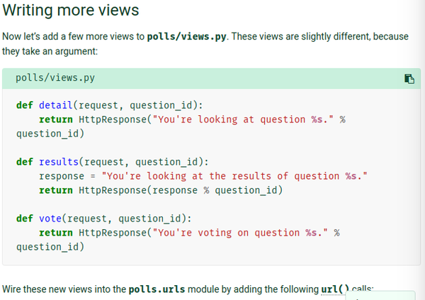

[./20170819-1303-cet-5-2.png](./20170819-1303-cet-5-2.png)

* This is an example of a basic HTML view without the HTML template.

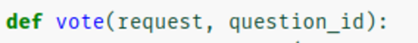

[./20170819-1303-cet-5-5.png](./20170819-1303-cet-5-5.png)

* The different is that these views make use of arguments (the `request` and `question_id`).
* I think the `request` should always be placed as the first positional argument.

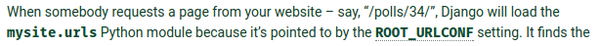

[./20170819-1303-cet-5-8.png](./20170819-1303-cet-5-8.png)

* The URL is handled by a Django module named `mysite.urls`.

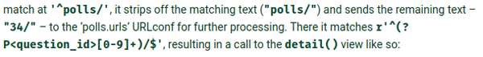

[./20170819-1303-cet-5-11.png](./20170819-1303-cet-5-11.png)

* The `question_id` is an argument that can be filled depending on the routing. It needs to be the same with the argument provided in the views.py.
* For example `url(r"^(?P<_question_id>[0-9]+)/$", views.details, name="detail"),` means that the call view function needs to have an argument called `_question_id` that will be filled into as a parameter for the view function. Below is an example of the view codes.

```markdown
def details(_request, _question_id):
    question = get_object_or_404(Question, pk=_question_id)

    return render(_request, "polls/detail.html", { "question": question })
```

* Notice that it has the same argument named after `_question_id`.
* Example on adding and constructing URL pathing in Django.
* Since the main application is "mysite" everything is taken from there.
* However, in the urls.py in mysite directory has a URL reference into the `polls.url`.
* The polls/urls.py is the designated URL pathing for every web pages that is related to the poll application.
* Here is the current codes for mysite/urls.py (the main application).

```markdown
urlpatterns = [
    url(r'^polls/', include("polls.urls")),
    url(r'^admin/', admin.site.urls)
]
```

* Here is the current codes for polls/urls.py.

```markdown
app_name = "polls"
urlpatterns = [
    # Example: /polls/.
    url(r"^$", views.index, name="index"),
    #Example: /polls/5/.
    url(r"^(?P<_question_id>[0-9]+)/$", views.details, name="detail"),
    #Example: /polls/5/results/.
    url(r"^(?P<_question_id>[0-9]+)/results/$", views.results, name="results"),
    #Example: /polls/5/vote/.
    url(r"^(?P<_question_id>[0-9]+)/vote/$", views.vote, name="vote"),
]
```

* Notice that in the mysite/urls.py there is this codes `url(r'^polls/', include("polls.urls")),` that "import" URL pathing/routing from the polls application.

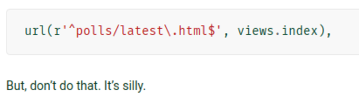

[./20170819-1303-cet-5-14.png](./20170819-1303-cet-5-14.png)

* You can put suffix .html in the routing but it is not necessary and is silly.

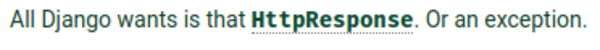

[./20170819-1303-cet-5-17.png](./20170819-1303-cet-5-17.png)

* For view, all Django wants is a `HTTPResponse` or an exception if the view function failed to be called.

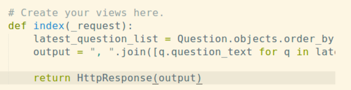

[./20170819-1303-cet-5-20.png](./20170819-1303-cet-5-20.png)

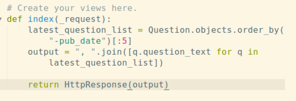

[./20170819-1303-cet-5-23.png](./20170819-1303-cet-5-23.png)

* Example of simple `HTTPResponse`.
* The call on method `HttpResponse()` is meant to only render a text into the web view.

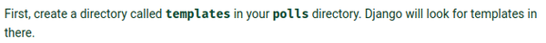

[./20170819-1303-cet-5-26.png](./20170819-1303-cet-5-26.png)

* Then in order for Django to use a HTML template, "templates" folder needs to be created inside the root directory of an application.
* At default the Django will look for "templates" directory to search over HTML template.

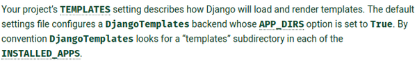

[./20170819-1303-cet-5-29.png](./20170819-1303-cet-5-29.png)

* There is a specific configurations for DjangoTemplates.
* In general Django will look into "templates" directory in the root of every application listed in `INSTALLED_APPS`.

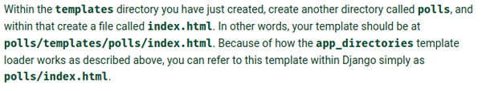

[./20170819-1303-cet-5-32.png](./20170819-1303-cet-5-32.png)

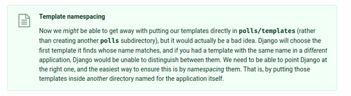

[./20170819-1303-cet-5-35.png](./20170819-1303-cet-5-35.png)

* There is a need to create another folder with the same name with the application in the newly created "templates" folder for namespacing.
* And also because Django needs to be able to determine which application use which template in case there are more than templates with the same name.
* In general Django will look into every "template" directories for each application to look after HTML template. This is the reason why namespacing is important!

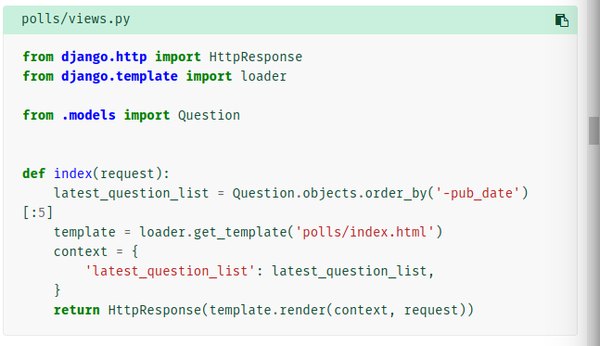

[./20170819-1303-cet-5-38.png](./20170819-1303-cet-5-38.png)

* Method `template.render()` can be used to render HTML template.

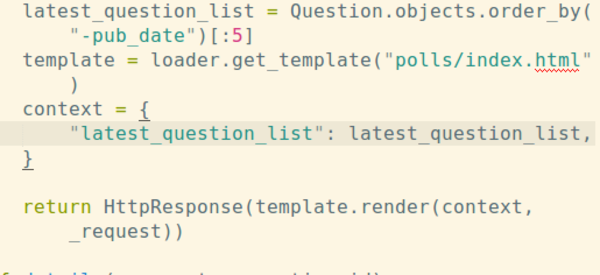

[./20170819-1303-cet-5-41.png](./20170819-1303-cet-5-41.png)

* This is an example of template rendering in Django.
* The `latest_question_list` is now callable variable in the template called by DjangoTemplates. For example by using {{ latest_question_list }} or in for loop statement like codes below.

```markdown

  {{ question.question_text }}

```

* The codes above will render every question (the text, not the object) to the web browser.
* Similarly, accessing "child" model is possible as well.

```markdown

  {{ choice.choice_text }}

```

* Remember that `choice_set` is based from the `Choice` as a model, turned all lower case and then added suffix `_set`.
* The concept of `question.choice_set.all` is the same with Python codes `question.choice_set.all()`.
* What I am not sure why it is suffixed as `_set` instead of `_get` though.

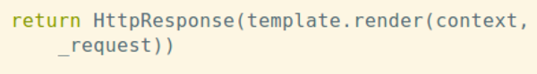

[./20170819-1303-cet-5-44.png](./20170819-1303-cet-5-44.png)

* The codes in the screenshot above means to call HTTP request to render a HTML templates using DjangoTemplates.

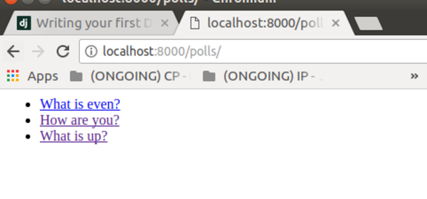

[./20170819-1303-cet-5-47.png](./20170819-1303-cet-5-47.png)

* The current result of URL polls that shows all recorded polls.

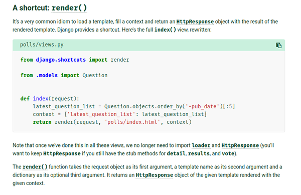

[./20170819-1303-cet-5-50.png](./20170819-1303-cet-5-50.png)

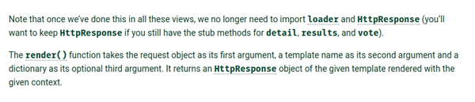

[./20170819-1303-cet-5-53.png](./20170819-1303-cet-5-53.png)

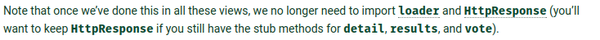

[./20170819-1303-cet-5-56.png](./20170819-1303-cet-5-56.png)

* Django has plethora of useful shortcuts.
* These shortcuts can be accessed via `django.shortcuts import ...`.
* For example, in this tutorial we use `from django.shortcuts import render`.
* `render()` is a set of function/method to call HTTP request for render.
* Hence, instead of `HttpResponse(template.render(context, _request))`, with `render()` it will be just `render(_request, "polls/index.html", context)`.
* The middle parameter is a relative path to where the template is located.
* In general this makes no use of `loader` and `HttpRespose` because everything is already packaged in `render()`.
* `render()` will return `HttpResponse` object.

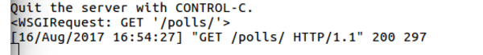

[./20170819-1303-cet-5-59.png](./20170819-1303-cet-5-59.png)

* The `<WSGIRequest: GET '/polls/'>` is the value from `_request`.

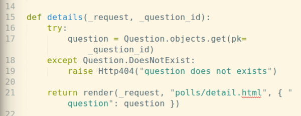

[./20170819-1303-cet-5-62.png](./20170819-1303-cet-5-62.png)

* The codes above is an example on how to raise the generic 404 error if routing brings the user to nothing.

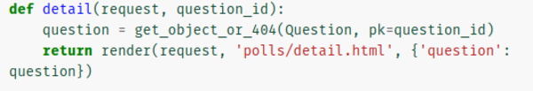

[./20170819-1303-cet-5-65.png](./20170819-1303-cet-5-65.png)

* However, `django.shortcuts` has `get_object_or_404()` to let you to search for an database object (cell/document) and if the such object is not exist then automatically return error 404.
* The codes above has the same result with raising error 404 with `try` and `except` but with more concise syntax.

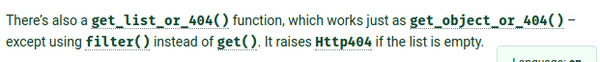

[./20170819-1303-cet-5-68.png](./20170819-1303-cet-5-68.png)

* There is a shortcut to get list as well instead of object, `get_list_or_404()`.
* This one is used when looking through database with `filter()` instead of return an object with `get()`.
* The `get_list_or_404` will return 404 error if the list is empty.

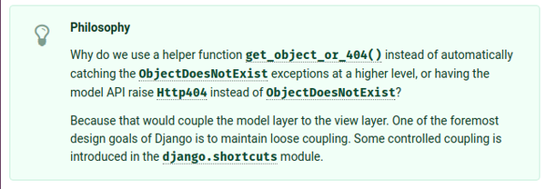

[./20170819-1303-cet-5-71.png](./20170819-1303-cet-5-71.png)

* There is this philosophical thought that I am not sure what it meant.
* I think the use of `django.shortcut` is to maintain the independence of model and view layer.
* That, or we need to keep Django manage anything between the model and view layer.

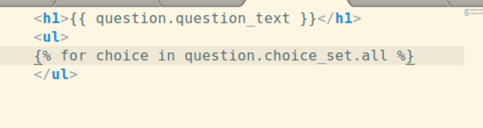

[./20170819-1303-cet-5-74.png](./20170819-1303-cet-5-74.png)

* As previously written, with the HTML template we can access the data from the "children" model as well.

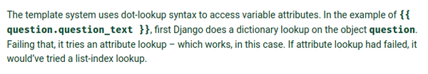

[./20170819-1303-cet-5-77.png](./20170819-1303-cet-5-77.png)

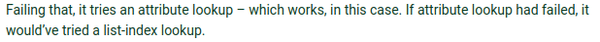

[./20170819-1303-cet-5-80.png](./20170819-1303-cet-5-80.png)

* This StackOverflow discussion explains this situation very well, [https://stackoverflow.com/questions/32767629/django-dot-lookup-syntax-to-access-variable-attributes](https://stackoverflow.com/questions/32767629/django-dot-lookup-syntax-to-access-variable-attributes).
* Full screenshot.

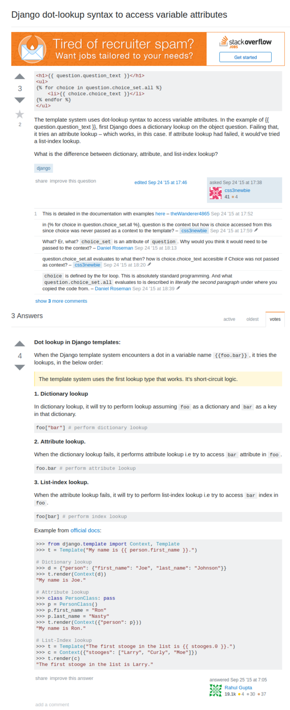

[./20170819-1303-cet-5-83.png](./20170819-1303-cet-5-83.png)

* In sense for the DjangoTemplates it will look each variable with these order.
    1. Dictionary lookup, for example `foo["bar"]`.
    1. Attribute lookup, for example `foo.bar`.
    1. List - index lookup, for example `foo[bar]`.

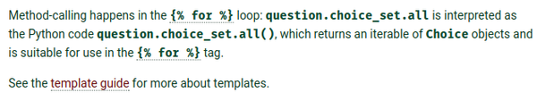

[./20170819-1303-cet-5-86.png](./20170819-1303-cet-5-86.png)

* As previously mentioned, the HTML template codes `question.choice_set.all` is the same with the Python codes `question.choice_set.all()`.

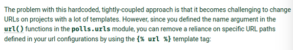

[./20170819-1303-cet-5-89.png](./20170819-1303-cet-5-89.png)

* When I thought the URL routing is dynamic enough.
* This Django tutorial said that the current URL routings is actually "hard - coded".
* There is more dynamic way on how to make the URL routings. This means that the URL variable is taken from the urls.py.
* This way if there is change necessary for the URL, the developer only needs to change whatever he/she wants to change in the urls.py.

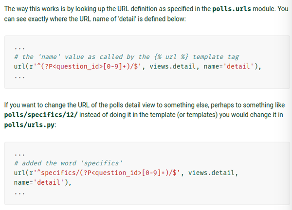

[./20170819-1303-cet-5-92.png](./20170819-1303-cet-5-92.png)

* Example of URL routings with Regular Expression.
* Here is an example when I need to add "specifics" before the `question_id`.

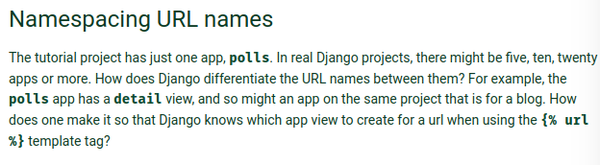

[./20170819-1303-cet-5-95.png](./20170819-1303-cet-5-95.png)

* The same with template. Django take the URL routing into the highest level.
* If there is a same URL routing name then Django will take whichever routing comes first.
* To solve this problem, URL namespace is necessary.
* Add these codes in the polls/urls.py.

```markdown
app_name = "polls"
```

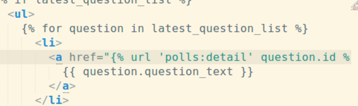

[./20170819-1303-cet-5-98.png](./20170819-1303-cet-5-98.png)

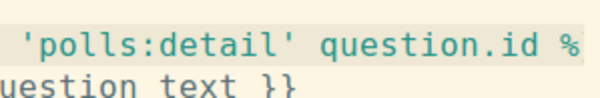

[./20170819-1303-cet-5-101.png](./20170819-1303-cet-5-101.png)

* Then do this in both URL routings and the HTML template.
* Here is the link to the tutorial, [https://docs.djangoproject.com/en/1.11/intro/tutorial03/](https://docs.djangoproject.com/en/1.11/intro/tutorial03/).
* Here is the screenshot.

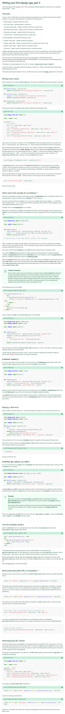

[./20170819-1303-cet-5-104.png](./20170819-1303-cet-5-104.png)