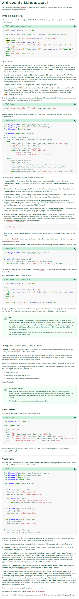

[./20170819-1303-cet-6-1.png](./20170819-1303-cet-6-1.png)

* This tutorial focuses on how to do simple form processing and cutting down the current codes.

[./20170819-1303-cet-6-2.png](./20170819-1303-cet-6-2.png)

[./20170819-1303-cet-6-3.png](./20170819-1303-cet-6-3.png)

* `` is used to prevent the Cross Site Request Forgeries.
* Cross Site Request Forgeries is a common hacker method to forge form in a website.

[./20170819-1303-cet-6-4.png](./20170819-1303-cet-6-4.png)

[./20170819-1303-cet-6-5.png](./20170819-1303-cet-6-5.png)

[./20170819-1303-cet-6-6.png](./20170819-1303-cet-6-6.png)

* The `{{ forloop.counter }}` refer to how many loop has been passed through.

[./20170819-1303-cet-6-7.png](./20170819-1303-cet-6-7.png)

* `<label for="..." ...`, the `for` is used to accompany the label with a specific `id` of other input element.
* In this case the label is tied to the the `id` of the radio button. Hence if a user clicked the label the radio button will be selected.
* I have the reference from this StackOverflow discussion, [https://stackoverflow.com/questions/698001/whats-the-for-for-in-a-label-tag](https://stackoverflow.com/questions/698001/whats-the-for-for-in-a-label-tag).

[./20170819-1303-cet-6-8.png](./20170819-1303-cet-6-8.png)

* This is the overall codes for the newly updated view for the detail page.

[./20170819-1303-cet-6-9.png](./20170819-1303-cet-6-9.png)

* Example to loop after foreign key list.

[./20170819-1303-cet-6-10.png](./20170819-1303-cet-6-10.png)

* The most common method for request is `GET` and `POST`.
* In form usually the request when submitting the form is `POST`.
* For every codes that can alter data in server - side should all go with `POST` request.
* This practice is not specific to Django but to general web development.

[./20170819-1303-cet-6-11.png](./20170819-1303-cet-6-11.png)

* What is Cross Site Request Forgeries?
    * This is the definition I can find in the Wikipedia page about Cross Site Request Forgeries, "Cross-site request forgery, also known as one-click attack or session riding and abbreviated as CSRF (sometimes pronounced sea-surf) or XSRF, is a type of malicious exploit of a website where unauthorized commands are transmitted from a user that the web application trusts. Unlike cross-site scripting (XSS), which exploits the trust a user has for a particular site, CSRF exploits the trust that a site has in a user's browser.".
    * I thought this is an another name for XSS (Cross Site Scripting). However, based from the Wikipedia page XSS and Cross Site Request Forgeries are different.
    * XSS is between a user and a website.
    * Cross Site Request Forgeries is between a web browser and a website.
    * Here is the Wikipedia page about Cross Site Request Forgeries, [https://en.wikipedia.org/wiki/Cross-site_request_forgery](https://en.wikipedia.org/wiki/Cross-site_request_forgery).

[./20170819-1303-cet-6-12.png](./20170819-1303-cet-6-12.png)

[./20170819-1303-cet-6-13.png](./20170819-1303-cet-6-13.png)

* The `"choice"` from `_request.POST["choice"]` is the `name` of the radio input button.
* The value of `_request.POST["choice"]` is the `value` attribute from the HTML tag of the corresponding radio button.

[./20170819-1303-cet-6-14.png](./20170819-1303-cet-6-14.png)

* There was an error of which my returned value is `"on"` instead of the id of the choice.
* I forgot to put `value` attribute there.

[./20170819-1303-cet-6-15.png](./20170819-1303-cet-6-15.png)

* For example the `request.POST["choice"]` will return the `value` (HTML attribute) from an input component with `name` (also HTML attribute) of `"choice"`.

[./20170819-1303-cet-6-16.png](./20170819-1303-cet-6-16.png)

* The `request.POST` values are always string.

[./20170819-1303-cet-6-17.png](./20170819-1303-cet-6-17.png)

* Based from the screenshot above it seems that using `request.GET` will also works fine.
* However, the safety net is there when using `request.POST` to make sure the data will only be altered via a `POST` call.

[./20170819-1303-cet-6-18.png](./20170819-1303-cet-6-18.png)

[./20170819-1303-cet-6-19.png](./20170819-1303-cet-6-19.png)

* The `request.POST["choice"]` will raise `KeyError` (default error when specific key is not found in a Python's dictionary) if the choice is not provided from the POST data.
* The codes will check for `KeyError` and return back the question's detail page.

[./20170819-1303-cet-6-20.png](./20170819-1303-cet-6-20.png)

* In this case the `HttpResponseRedirect` is used rather than `HttpResponse`.
* This is the best practice in web development, to redirect everything after a form has been processed.

[./20170819-1303-cet-6-21.png](./20170819-1303-cet-6-21.png)

[./20170819-1303-cet-6-22.png](./20170819-1303-cet-6-22.png)

* `reverse()` here is to construct valid URL from the list in the urls.py.
* I think in most Django related works the `reverse()` will always be used to refer to a routing instead of hard - coded the link.
* Hence, if the link changed, it can still be accessed with the same variable but with different routing.

[./20170819-1303-cet-6-23.png](./20170819-1303-cet-6-23.png)

* Example of `reverse()`.

[./20170819-1303-cet-6-24.png](./20170819-1303-cet-6-24.png)

[./20170819-1303-cet-6-25.png](./20170819-1303-cet-6-25.png)

* Example of `HttpRedirect` with `reverse()`.
* The `reverse()` shown here is wrong because `reverse()` actually takes 2 parameters.
* Here is the codes for the right use of `reverse()`.

```markdown
return HttpResponseRedirect(reverse("polls:results", args=(question.id,)))
```

* The `args` is an iterable `tuple` hence the ending comma (",") is a necessary.
* Because in this case, if there is no comma ending, the `args` will be filled with an `int`.

[./20170819-1303-cet-6-26.png](./20170819-1303-cet-6-26.png)

[./20170819-1303-cet-6-27.png](./20170819-1303-cet-6-27.png)

* There is this nice functionality of DjangoTemplates that will give automatic suffix "s" for every list with more than one elements.

```markdown
{{ choice.votes|pluralize }}
```

[./20170819-1303-cet-6-28.png](./20170819-1303-cet-6-28.png)

* The small problem is that, if there are 2 people submit vote at the exact same time, for any people there are, the vote will only be counted as 1 vote.

[./20170819-1303-cet-6-29.png](./20170819-1303-cet-6-29.png)

* I always write `Choice.DoesNotExists` and it returns error. I took me a while to notice it is actually `Choice.DoesNotExist`.

[./20170819-1303-cet-6-30.png](./20170819-1303-cet-6-30.png)

[./20170819-1303-cet-6-31.png](./20170819-1303-cet-6-31.png)

* There was an error as well when I forget to put `value` attribute in `<input type="radio" ...`.
* On the other hand, input radio button is grouped with the HTML attribute `name`.

[./20170819-1303-cet-6-32.png](./20170819-1303-cet-6-32.png)

[./20170819-1303-cet-6-33.png](./20170819-1303-cet-6-33.png)

* There is this generic views that will make less code for the same principle to display object or a list of object.

[./20170819-1303-cet-6-34.png](./20170819-1303-cet-6-34.png)

* The three steps to add generic views system to the current views.

[./20170819-1303-cet-6-35.png](./20170819-1303-cet-6-35.png)

* The `DetailView` needs to have `pk` as an argument listed as in the URL routings.
* The screenshot above shows the example codes.

[./20170819-1303-cet-6-36.png](./20170819-1303-cet-6-36.png)

[./20170819-1303-cet-6-37.png](./20170819-1303-cet-6-37.png)

* The code to use generic views system in Django.
* Usually it is `views.results` now it changed into `views.ResultsView.as_view()`.
* The `ResultView` itself is a class and not a function like it is in `results()`.
* `ResultView` is a class inherited from `generic.DetailView`.
* The `generic` is imported from `from django.views import generic`.

[./20170819-1303-cet-6-38.png](./20170819-1303-cet-6-38.png)

* By default the `DetailView` will look for a template named after `app_name/model_name_detail.html`.
* However it can be altered with explicitly mention the name of the template the generic views will use.
* For such, `template_name` variable can be overwritten with the relative location of the template.

[./20170819-1303-cet-6-39.png](./20170819-1303-cet-6-39.png)

* In all, each generic views in Django already know which cell/document/list that needs to be called when the document loads.
* Here is the final codes for polls/urls.py.

```markdown
from django.http import HttpResponse, HttpResponseRedirect
from django.shortcuts import get_object_or_404, render
from django.urls import reverse
from django.views import generic

from .models import Choice, Question

# Create your views here.
class IndexView(generic.ListView):
    template_name = "polls/index.html"
    context_object_name = "latest_question_list"

    def get_queryset(self):
        """ Return the last 5 published questions. """
        return Question.objects.order_by("-pub_date")[:5]

class DetailView(generic.DetailView):
    model = Question
    template_name = "polls/detail.html"

class ResultsView(generic.DetailView):
    model = Question
    template_name = "polls/results.html"


def vote(_request, _question_id):
    question = get_object_or_404(Question, pk=_question_id)

    print("="*50)
    print("="*50)
    print(_request.POST)
    print(_request.POST["choice"])
    print(question.choice_set.all())
    print(question.choice_set.all()[0].id)
    print(question.choice_set.all()[0]._meta.pk.name)
    print(Question.objects.get(pk=2))
    print(Choice.objects.all())
    print(Choice.objects.all()[0]._meta.pk.name)
    print(Choice.objects.all()[0].id)
    print(Choice.objects.all()[1].id)
    print(Choice.objects.get(pk=2))
    print(Choice.objects.get(pk=3))
    print("*"*50)
    print(question.choice_set.all())
    print(question.choice_set.all()[0])
    print(question.choice_set.all()[1])
    print(question.choice_set.all()[0].id)
    print(question.choice_set.all()[1].id)
    print("*"*50)
    #print(question.choice_set.get(pk=1))
    #print(question.choice_set.get(pk=2))
    print("="*50)
    print("="*50)

    try:
        selected_choice = question.choice_set.get(pk=_request.POST["choice"])
    except (KeyError, Choice.DoesNotExist):
        # Redisplay the question voting form.
        return render(_request, "polls/detail.html", {
            "question": question,
            "error_message": "you did not select a choice"
        })
    else:
        selected_choice.votes += 1
        selected_choice.save()

        """
        Always return an HttpResponseRedirect after successfully dealing with POST
        data. This prevents data from being posted twice if the user hits back
        button.
        """
        return HttpResponseRedirect(reverse("polls:results", args=(question.id,)))
```

* Here is the link to the tutorial, [https://docs.djangoproject.com/en/1.11/intro/tutorial04/](https://docs.djangoproject.com/en/1.11/intro/tutorial04/).
* Here is the screenshot of the tutorial.



[./20170819-1303-cet-6-41.png](./20170819-1303-cet-6-41.png)