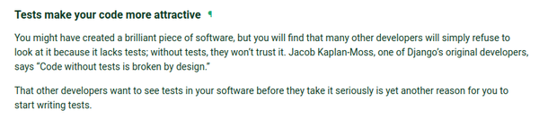

[./20170819-1303-cet-7-2.png](./20170819-1303-cet-7-2.png)

* "Code without tests is broken by design.", Jacob Kaplan - Moss one of Django original developers.

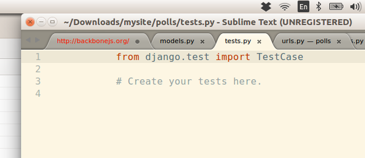

[./20170819-1303-cet-7-5.png](./20170819-1303-cet-7-5.png)

* `from django.test import TestCase` is used to import the Django unit test component into the codes.
* Everything that inherited from `TestCase` will be unit tested when the specific application is unit tested.

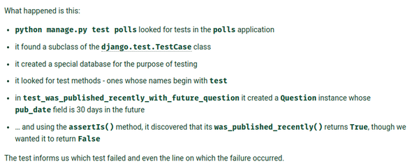

[./20170819-1303-cet-7-8.png](./20170819-1303-cet-7-8.png)

* What happened during Django specific unit test.
    * The command to launch Django unit test is from the manage.py, `python3 manage.py test application_name`.
    * When the unit test is ran it looks through any classes that inherited from `django.test.TestCase`.
    * The Django version of unit test goes with making its own exclusive database just for unit testing.
    * For the function, it looks for every methods and functions that begin with name `test...`.
    * There are a lot of assertion method that can be used to unit test the Django application.

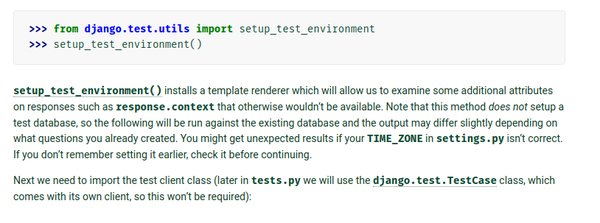

[./20170819-1303-cet-7-11.png](./20170819-1303-cet-7-11.png)

* There is this method `setup_test_environment()` from the `from django.test.utils import setup_test_environment` to automatically set a template render to help developer to unit test the view.
* By setting `setup_test_environment()` the `response.context` become available to test and play around the server - client data transfer.
* However, `setup_test_environment()` does not setup a test database.
* I am not sure if a database operation is included in the test with `setup_test_environment` whether the operation will be failed of the test is included in the default/used database.

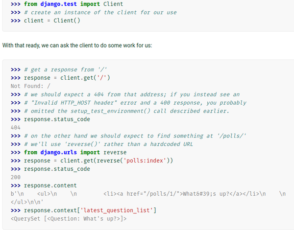

[./20170819-1303-cet-7-14.png](./20170819-1303-cet-7-14.png)

```markdown
>>> from django.test import Client
>>> # Create instance of client to simulate the front - end website headlessly.
>>> client = Client()
```

* And then use this codes to emulate a client visit one of the web page.

```markdown
>>> # The emulated client visits index page.
>>> response = client.get("/")
```

* Then, you can get response code with these codes (for example because the index page of the project is not made yet, accessing index page will return on 404 error).

```markdown
>>> response.status_code
404
```

* You can have the `client` get into other view with hard written the URL or using the `reverse()` function to look after the URL from the urls.py (the table of contents of the Django application).

```markdown
>>> from django.urls import reverse
>>> response = client.get(reverse("polls:index"))
>>> response.status_code
200
```

* Status code 200 is used if the web page loaded perfectly fine.
* These codes are used to view the HTML code from the client's loaded page.

```markdown
>>> response.content
>>> # `response.content` will return the HTML as a raw file.
```

* In other case, if you want to see what is the data received from the server, you can use these codes.

```markdown
>>> response.context
>>> response.context["latest_question_list"]
```

* The `"latest_question_list"` is there from the client request to server when accessing the index page of the polls application.
* The request is for the server to give 5 latest available questions.

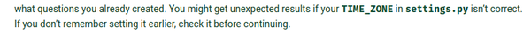

[./20170819-1303-cet-7-17.png](./20170819-1303-cet-7-17.png)

* The timezone is matter for every case where real - world time is involved.
* Hence, please do not forget to set the `TIME_ZONE` in the settings.py.

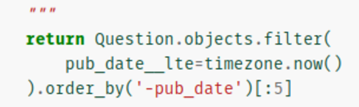

[./20170819-1303-cet-7-20.png](./20170819-1303-cet-7-20.png)

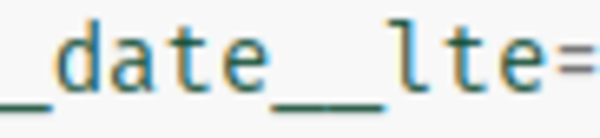

[./20170819-1303-cet-7-23.png](./20170819-1303-cet-7-23.png)

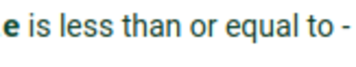

[./20170819-1303-cet-7-26.png](./20170819-1303-cet-7-26.png)

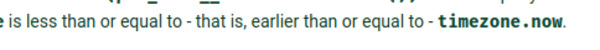

[./20170819-1303-cet-7-29.png](./20170819-1303-cet-7-29.png)

* The `__lte` is means for a conditional operator less than and equal.
* Be careful here because the "l" in `__lte` is "less". I thought the "l" was the abbreviation of "larger".

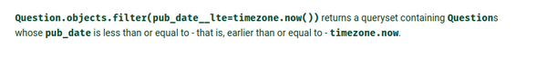

[./20170819-1303-cet-7-32.png](./20170819-1303-cet-7-32.png)

* The query `Question.objects.filter(pub_date__lte=timezone.now())` will return a query set containing every questions that is stored in the database whose `pub_date` is less than or equal/earlier than or equal to `timezone.now()`.

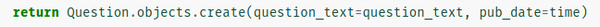

[./20170819-1303-cet-7-35.png](./20170819-1303-cet-7-35.png)

* I was wondering here.

```markdown
return Question.objects.create(...)
```

* Is different with these codes.

```markdown
return Question(pub_date=put_a_date_here, question_text="sample question?")
```

* The 1st codes means that we create and write a new `Question` object into the database.
* The latter one means that we only create the `Question` object but it is not written into the database yet.
* Further codes `question_object.save()` will save the object `question_object` into the corresponding database.

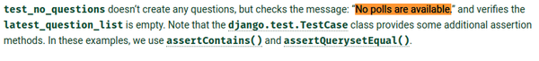

[./20170819-1303-cet-7-38.png](./20170819-1303-cet-7-38.png)

* The `self.assertContains(response, "No polls are available.")` in Django unit test means to look for a specific string in the HTML view.
* Hence in order for this test to return `True` in the rendered HTML in the web browser there should be `No polls are available.` listed there precisely.
* I was wondering why I was not able to pass this test, until I realize that the HTML view is different between the one in the tutorial and the one I wrote.
* Additionally to assert content at specific container (`<div>`) Django's unit testing module is not yet capable to do so. Hence, based on the StackOverflow discussion here, [https://stackoverflow.com/questions/2849457/django-unit-testing-html-tags-from-response-and-sessions](https://stackoverflow.com/questions/2849457/django-unit-testing-html-tags-from-response-and-sessions). The solution is to use Python web scrapping framework like BeautifulSoup.
* Here is the screenshot of the StackOverflow discussion.

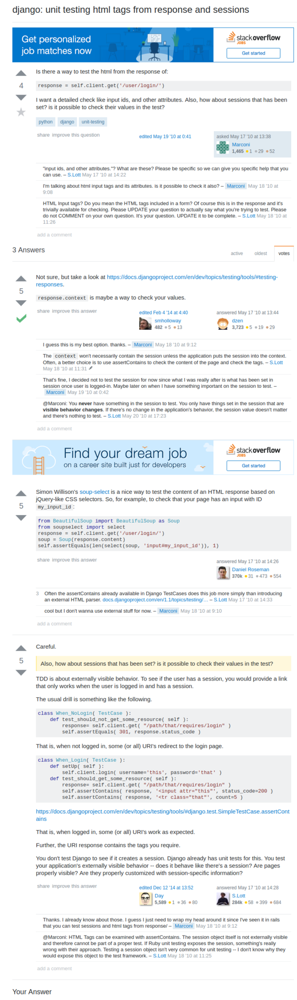

[./20170819-1303-cet-7-41.png](./20170819-1303-cet-7-41.png)

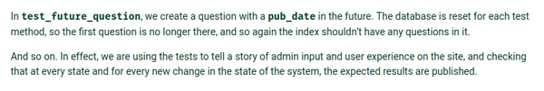

[./20170819-1303-cet-7-44.png](./20170819-1303-cet-7-44.png)

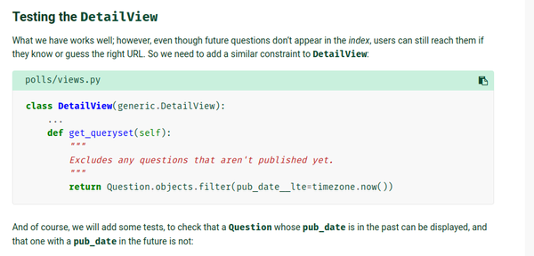

[./20170819-1303-cet-7-47.png](./20170819-1303-cet-7-47.png)

* Example of unit testing the view of the `DetailView` for the detail page when a user clicked at one of the question.
* The tutorial makes a bug when it supposed to list 5 newest questions, but the system also list questions from the future.

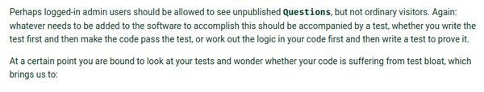

[./20170819-1303-cet-7-50.png](./20170819-1303-cet-7-50.png)

* Every codes in the program needs to be accompanied with a test.
* At some point the bigger the program will be the project will suffer from test bloat.

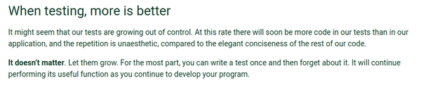

[./20170819-1303-cet-7-53.png](./20170819-1303-cet-7-53.png)

* When making codes the less the better.
* This process follows the Keep It Simple, Stupid (KISS) philosophy.
* But when making a unit test, it always better to keep as many as tests possible.
* The more test, the better it is.
* In test, having redundancy is no problem.

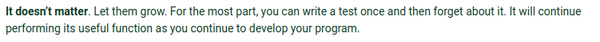

[./20170819-1303-cet-7-56.png](./20170819-1303-cet-7-56.png)

* Let the unit tests grow!
* Make the test once and then forget it.
* Every tests made will still performing its usefulness throughout the development.

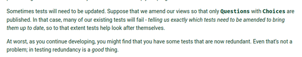

[./20170819-1303-cet-7-59.png](./20170819-1303-cet-7-59.png)

* Unit tests will only need to be amended/refactored when the test fail or the previous conditions does not fit with the current goals.

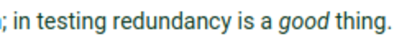

[./20170819-1303-cet-7-62.png](./20170819-1303-cet-7-62.png)

* In testing redundancy is a good thing.

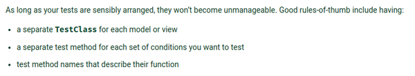

[./20170819-1303-cet-7-65.png](./20170819-1303-cet-7-65.png)

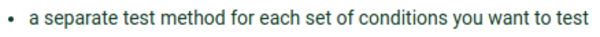

[./20170819-1303-cet-7-68.png](./20170819-1303-cet-7-68.png)

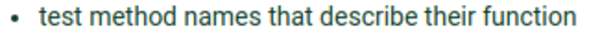

[./20170819-1303-cet-7-71.png](./20170819-1303-cet-7-71.png)

* Rules of thumb when designing/refactoring unit tests.
    * Separate the class and document/file between the test file and the non - test file.
    * Separate each test methods for each conditions you want to test. Last time I made a unit test I put it for 1 unit test function for a function I want to test. It should not be like that, per - case per function in unit test.
    * Explicitly descriptive function name. Additionally, function name needs to start with `test_...`
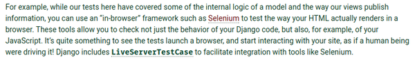

[./20170819-1303-cet-7-74.png](./20170819-1303-cet-7-74.png)

* There is no test framework provided within Django to unit test how the view is rendered.
* There is a mature open source project for that, Selenium.
* Selenium can be ran headlessly and then perform unit test on how the views rendered in the web browser.

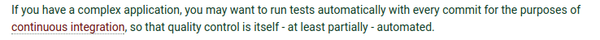

[./20170819-1303-cet-7-77.png](./20170819-1303-cet-7-77.png)

* There is Continuous Integration test that will perform for every commit you made into the repository.

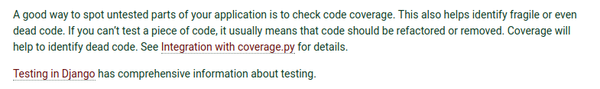

[./20170819-1303-cet-7-80.png](./20170819-1303-cet-7-80.png)

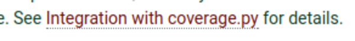

[./20170819-1303-cet-7-83.png](./20170819-1303-cet-7-83.png)

* The concept is that you always need to have a unit test for every codes in the application/program.
* However, the larger the program it is harder to know which codes have not yet tested.
* The manage.py in Django has `coverage` command to check which part of codes are not yet unit tested.
* The `coverage` command is not covered in this tutorial, but Django has a documentation about it.
* Here is the link to the tutorial, [https://docs.djangoproject.com/en/1.11/intro/tutorial05/](https://docs.djangoproject.com/en/1.11/intro/tutorial05/).
* Here is the screenshot of the tutorial.

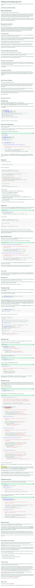

[./20170819-1303-cet-7-86.png](./20170819-1303-cet-7-86.png)