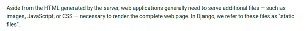

[./20170819-1303-cet-8-2.png](./20170819-1303-cet-8-2.png)

* Django offers a pleasant way to serve static files like CSS, JS, and other assets.

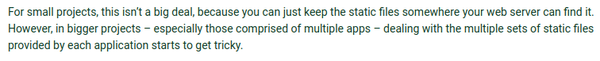

[./20170819-1303-cet-8-5.png](./20170819-1303-cet-8-5.png)

* For small project this would not be a problem.
* However, Django project itself consists of various applications with various assets (same or not).
* This can be tricky without proper framework to manage the static files.

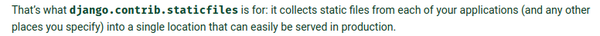

[./20170819-1303-cet-8-8.png](./20170819-1303-cet-8-8.png)

* Luckily `django.contrib.staticfiles` is there to make this is not a problem.

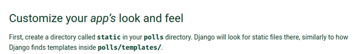

[./20170819-1303-cet-8-11.png](./20170819-1303-cet-8-11.png)

* Django will automatically search for "static" directory in the root of each application.
* This is similar on how Django finds the "templates" application.

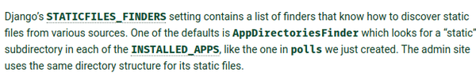

[./20170819-1303-cet-8-14.png](./20170819-1303-cet-8-14.png)

* In the settings.py, `STATIC_FILE_FINDERS` settings contain list of finders that know how to discover static file.
* One of the default finder is `AppDirectoriesFinder` which look for static files in directory in each of the ` INSTALLED_APPS`.

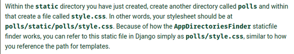

[./20170819-1303-cet-8-17.png](./20170819-1303-cet-8-17.png)

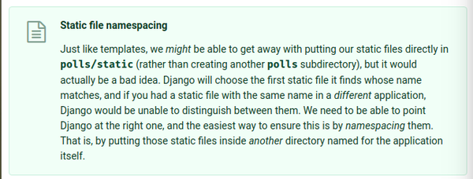

[./20170819-1303-cet-8-20.png](./20170819-1303-cet-8-20.png)

* Similar to template, namespacing is important. Hence inside the static directory there should be another directory named after the application's name.
* In this case, there should be another directory named "polls" inside the static directory.

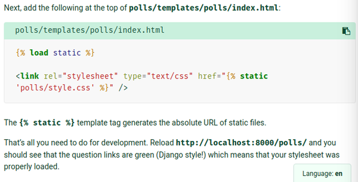

[./20170819-1303-cet-8-23.png](./20170819-1303-cet-8-23.png)

* The screenshot above is an example on how to load the static file.
* `` means that the `static` is active and it helps constructing an absolute path to the static files.
* Here are example codes to refer to a CSS.

```markdown
<link rel="stylesheet" type="text/css" href="">
```

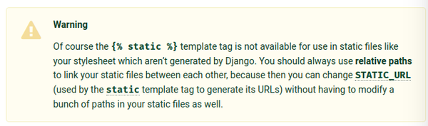

[./20170819-1303-cet-8-26.png](./20170819-1303-cet-8-26.png)

* The `static` in `` is not available in CSS and JavaScript. Because Django scripting language only for the HMTL file.

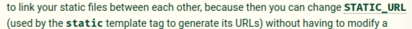

[./20170819-1303-cet-8-29.png](./20170819-1303-cet-8-29.png)

* The use of static file manager provided from Django makes it possible to share assets between applications.

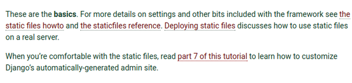

[./20170819-1303-cet-8-32.png](./20170819-1303-cet-8-32.png)

* This is the basic tutorial on how to manage static file. There are more advance tutorial available in the Django main website on how to manage static files.

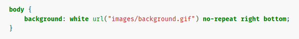

[./20170819-1303-cet-8-35.png](./20170819-1303-cet-8-35.png)

* I was wondering what is the `right bottom` in this CSS. Based from the informations I got from [https://www.w3schools.com/css/css_background.asp](https://www.w3schools.com/css/css_background.asp), the `right bottom` are meant for the position of the wallpaper.
* Here is the link to the tutorial, [https://docs.djangoproject.com/en/1.11/intro/tutorial06/](https://docs.djangoproject.com/en/1.11/intro/tutorial06/).
* Here is the screenshot of the tutorial.

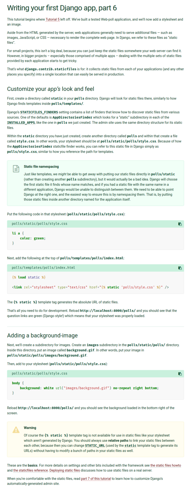

[./20170819-1303-cet-8-38.png](./20170819-1303-cet-8-38.png)