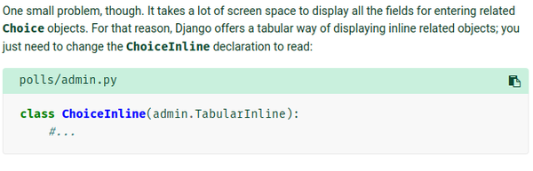

[./20170819-1303-cet-9-2.png](./20170819-1303-cet-9-2.png)

* In Django you are able to set and design your own administration form.
* The key here is to override the general template for administration form.


[./20170819-1303-cet-9-5.png](./20170819-1303-cet-9-5.png)

* In the example codes above the `fields = ["pub_date", "question_text"]` is meant to adjust the position of which input appeared first.
* The sample codes.

```markdown
class QuestionAdmin(admin.ModelAdmin):
    fields = ["pub_date", "question_text"]

admin.site.register(Question, QuestionAdmin)
```

* The last line is what makes the layout template change. So, do not forget to make sure to put `QuestionAdmin` as the second parameter.
* I am not sure if `QuestionAdmin()` should go with `ModelNameAdmin()` pattern.
* For safety I will just go follow with `ModelNameAdmin()` convention.


[./20170819-1303-cet-9-8.png](./20170819-1303-cet-9-8.png)

* The second parameter in `admin.site.register(Question, QuestionAdmin)`, the `QuestionAdmin` is named as model admin class in Django term.
* It is a function that is necessary to alter the layout of the model - administration page.


[./20170819-1303-cet-9-11.png](./20170819-1303-cet-9-11.png)

* Do not mistaken `fields` for `field`.
* I have a lot occasion when the web application is not as what I want because of missing of suffix "s".


[./20170819-1303-cet-9-14.png](./20170819-1303-cet-9-14.png)

* I had a mistake when I forgot to put `QuestionAdmin` as second parameter in `admin.site.register(Question, QuestionAdmin)`, while I expecting a change.


[./20170819-1303-cet-9-17.png](./20170819-1303-cet-9-17.png)

* The codes above is an example on how to add sub - title or sub - field in Django administration page.


[./20170819-1303-cet-9-20.png](./20170819-1303-cet-9-20.png)

* Here is the example rendered view with "Date information" as the sub - title.


[./20170819-1303-cet-9-23.png](./20170819-1303-cet-9-23.png)


[./20170819-1303-cet-9-26.png](./20170819-1303-cet-9-26.png)

* The simplest way to add another model is by using `admin.site.register(ModelNameHere)`.


[./20170819-1303-cet-9-29.png](./20170819-1303-cet-9-29.png)

* However, it is not convenient.
* It will be more convenient if you can add questions directly when we add or edit a document.


[./20170819-1303-cet-9-32.png](./20170819-1303-cet-9-32.png)

* What need to be done, firstly is to remove `admin.site.register(Choice)` and edit back the `QuestionAdmin()`.


[./20170819-1303-cet-9-35.png](./20170819-1303-cet-9-35.png)

* These is the codes used to tell Django to show 3 slots of `Choice` whenever `Question` is added or edited.

```markdown
class ChoiceInline(admin.StackedInline):
    model = Choice
    extra = 3


class QuestionAdmin(admin.ModelAdmin):
    fieldsets = [
        (None,               {'fields': ['question_text']}),
        ('Date information', {'fields': ['pub_date'], 'classes': ['collapse']}),
    ]
    inlines = [ChoiceInline]

admin.site.register(Question, QuestionAdmin)
```

* Unfortunately there is no way to order the `inlines` with the `fieldsets` aside from making custom administration template.


[./20170819-1303-cet-9-38.png](./20170819-1303-cet-9-38.png)


[./20170819-1303-cet-9-41.png](./20170819-1303-cet-9-41.png)

* I had the problem with "s" suffix again.
* I wrote it as `inline` when it is supposed to be `inlines`.


[./20170819-1303-cet-9-44.png](./20170819-1303-cet-9-44.png)


[./20170819-1303-cet-9-47.png](./20170819-1303-cet-9-47.png)

* The word `extra` is used to add additional slots every time a user added or edited a model.



[./20170819-1303-cet-9-50.png](./20170819-1303-cet-9-50.png)

* Using `admin.TabularInline` instead of `admin.StackedInline` to make every data displayed horizontally than vertically. This is good if each columns displayed has a binary informations.


[./20170819-1303-cet-9-53.png](./20170819-1303-cet-9-53.png)

* Add `was_published_recently` in the `list_display` as like this, `list_display = ("question_text", "pub_date", "was_published_recently")`.


[./20170819-1303-cet-9-56.png](./20170819-1303-cet-9-56.png)

* Example of the newly added column the "WAS PUBLISHED RECENTLY" column.


[./20170819-1303-cet-9-59.png](./20170819-1303-cet-9-59.png)

* We can sort the data on each column but not on "WAS PUBLISHED RECENTLY". Because "WAS PUBLISHED RECENTLY" is an arbitrary data type.
* With this codes we can add results of a function into the administration page.

```
was_published_recently.admin_order_field = "pub_date"
was_published_recently.boolean = True
was_published_recently.short_description = "Published recently?"
```


[./20170819-1303-cet-9-62.png](./20170819-1303-cet-9-62.png)

* Here is how to add additional search box for every document in the table.
* Additionally, you can add more than 1 column (aside from the `"question_text"` that has already put there) into the list.


[./20170819-1303-cet-9-65.png](./20170819-1303-cet-9-65.png)

* There are a lot of stuffs that still can be added to further customize the administration page.
* This is the link to the tutorial, [https://docs.djangoproject.com/en/1.11/intro/tutorial07/](https://docs.djangoproject.com/en/1.11/intro/tutorial07/).
* This is the screenshot of the tutorial.


[./20170819-1303-cet-9-68.png](./20170819-1303-cet-9-68.png)