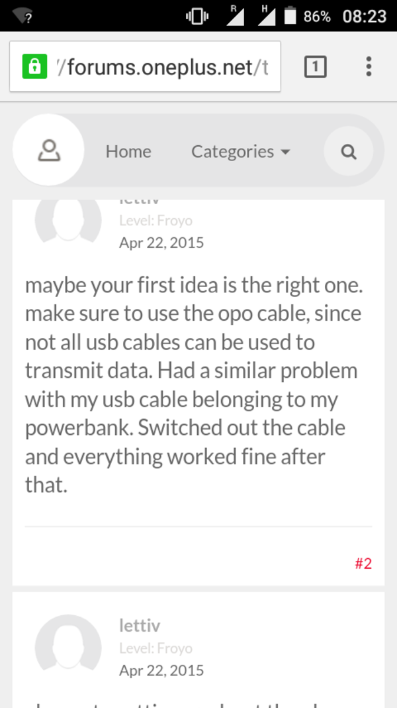

* There is often Android development problem when the Android connects to the computer but only able to charge and nothing else.
* As it was in my experience, the problem lies on the USB cable used.
* Cheap USB cable only able to transfer power, where as the more legit, expensive ones are able to both transfer power and data.

[./20170712-1430-cet-2-2.png](./20170712-1430-cet-2-2.png)

* In older target Android Studio, `import porterduff;` is changed into `import android.graphics.porterduff;`.

[./20170712-1430-cet-2-4.png](./20170712-1430-cet-2-4.png)