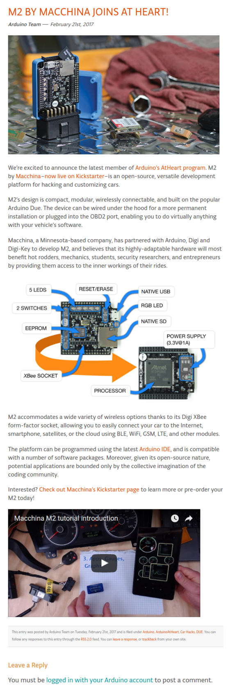

* There is this Arduino OBD development kit for developing physical car application.
* The project name is Arduino's ATHeart Program made by Macchina.
* Nevermind this tool name is actually M2.
* Its tagline it "Macchina: The Ultimate Tool for Taking Control of Your Car!".
* Link to the Arduino official blog post is here, [https://blog.arduino.cc/2017/02/21/m2-by-macchina-joins-at-heart/](https://blog.arduino.cc/2017/02/21/m2-by-macchina-joins-at-heart/).
* Link to its Kickstarter campaign, [https://www.kickstarter.com/projects/1029808658/macchina-the-ultimate-tool-for-taking-control-of-y?token=e40d156d](https://www.kickstarter.com/projects/1029808658/macchina-the-ultimate-tool-for-taking-control-of-y?token=e40d156d).
* Here is the screenshot from the Arduino blog post about M2.

