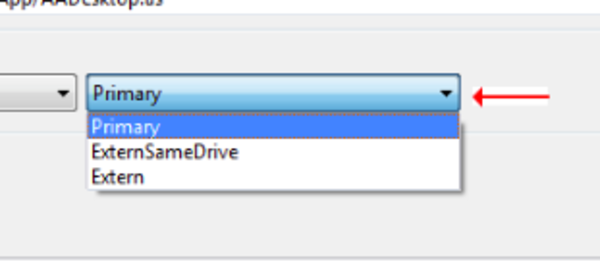
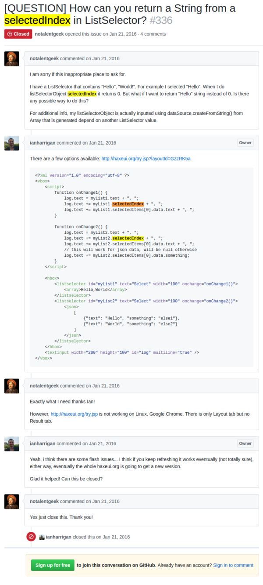

* Here is some links I have those are related to HaXe.
* There was this problem specifically for HaXeUI.
* I made a list selector. List selector is basically just a drop down list in any other user interface frameworks.
* In HaXeUI I can return the currently selected list.
* For example in this image (although this is Windows native and not from HaXeUI).



* The selected item is "Primary".
* And "Primary" is the first item in the list selector, hence its index value is 0.
* In HaXeUI I can use `selectedIndex` to return `0` (as it is the index of the current selected item, "Primary").
* However, from this GitHub issue I issued I want to ask if there is anyway on how to get the string name instead of the index.
* What I want is a properties, perhaps, called as `selectedItem` that returns `"Primary"` instead of its index.
* Here is the link to the GitHub issue I mentioned, [https://github.com/ianharrigan/haxeui/issues/336](https://github.com/ianharrigan/haxeui/issues/336).
* In HaXeUI you can use a markup language like XML to make the view of your application.
* Here is the solution that Ian Harrigan (the creator of HaXeUI) proposed to me.

```markdown
<?xml version="1.0" encoding="utf-8" ?>
<vbox>
    <script>
        function onChange1() { 
            log.text = myList1.text + ", ";
            log.text += myList1.selectedIndex + ", ";
            log.text += myList1.selectedItems[0].data.text + ", ";
        }

        function onChange2() { 
            log.text = myList2.text + ", ";
            log.text += myList2.selectedIndex + ", ";
            log.text += myList2.selectedItems[0].data.text + ", ";
            // this will work for json data, will be null otherwise
            log.text += myList2.selectedItems[0].data.something;
        }
    </script>

    <hbox>
        <listselector id="myList1" text="Select" width="100" onchange="onChange1()">
            <array>Hello,World</array>
        </listselector>
        <listselector id="myList2" text="Select" width="100" onchange="onChange2()">
            <json>
                [
                    {"text": "Hello", "something": "else1"},
                    {"text": "World", "something": "else2"}
                ]
            </json>
        </listselector>
    </hbox>
    <textinput width="200" height="100" id="log" multiline="true" />
</vbox>
```

* I will explain this solution as a brief as possible, the `log.text` here will return the `myList1.selectedItems[0].data.text` which contains the name of the selected index in the selector list. So, with my example the `log.text` will return `0, Primary`.
* However, since I only need the name of the selected index and not the index itself, I will just use `xxx.selectedItem[0].data.text` where the xxx is the variable that holds the list selector object reference.
* Another good thing to mention is that the function `onChange1()` and `onChange2()` will be put inside a list selector as a `onchange` property.
* This `onchange` property is a function that is called every time there is change in list selector value.
* So, whenever the user change the list selector there will be something printed in the console.
* Here is the full screenshot of the issue in the GitHub.



* In HaXe there is a low level access control.
* Low level access control is used to access variables and functions (I think) from another class without explicitly creating or referencing the existing object in the run - time.
* The keyword here is `@:access(ClassName.ClassFunctionName)` and `@:allow(ClassName.ClassFunctionName)`.
* In later version of HaXe if either of these keywords referencing an `Interface` then every low level access control also applied into any possible class that inherit/implements from that `Interface.`
* Here is the link to HaXe API documentation of low level access control, [http://haxe.org/manual/lf-access-control.html](http://haxe.org/manual/lf-access-control.html).