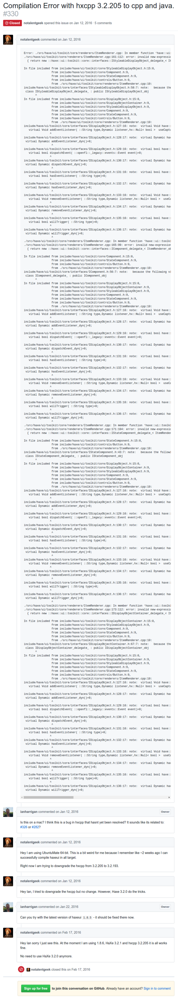

* There was a compilation error when using HaXeUI.
* The problem was actually because dependency hell.
* I suppose that there would not be a problem like this anymore in recent version.
* Link to the GitHub issue, [https://github.com/ianharrigan/haxeui/issues/330](https://github.com/ianharrigan/haxeui/issues/330).
* Screenshot.

