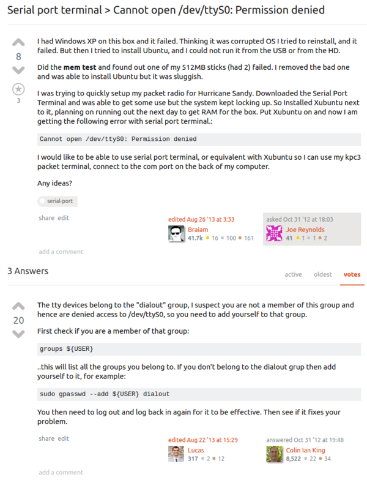

* If there is ever permission problem when uploading codes for Arduino when using Linux.
* The problem might be becase the permission to accessing serial connection is not set properly.
* The solution then to include the current user into "dialout" group. Check the screenshot in bottomost of this note for the explanation and the solution.
* Here is the link of the discussion from Ubuntu StackOverflow, [http://askubuntu.com/questions/210177/serial-port-terminal-cannot-open-dev-ttys0-permission-denied](http://askubuntu.com/questions/210177/serial-port-terminal-cannot-open-dev-ttys0-permission-denied).
* Here is the screenshot to the discussion.

