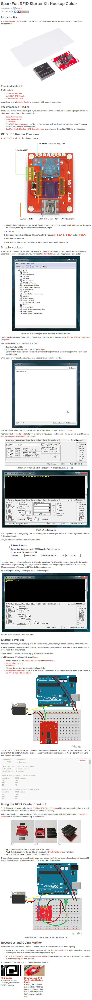

* When I was using ID - 12 as my RFID receiver I used this breakout board from SparkFun.
* You could, obviously, wire it by yourself. But, I wanted to save time.
* Here is the tutorial for connecting ID - 12 RFID reader with Arduino via SparkFun breakout board, [https://learn.sparkfun.com/tutorials/sparkfun-rfid-starter-kit-hookup-guide](https://learn.sparkfun.com/tutorials/sparkfun-rfid-starter-kit-hookup-guide).
* Here is the full screenshot of the tutorial.

