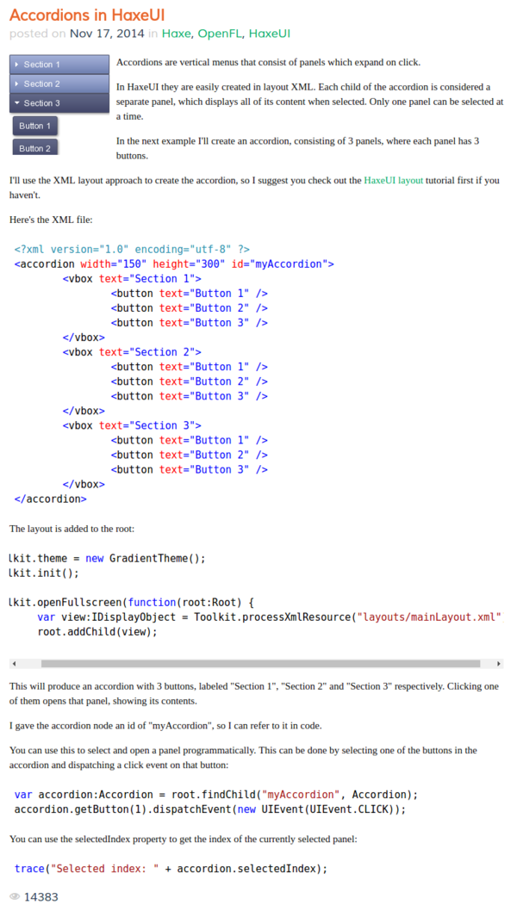

* This is a simple tutorial on how to make accordion menu in HaXeUI.
* I think this tutorial is for version 1.0 of HaXeUI, whereas the recent version is 2.0.
* So this tutorial is definitely outdated, but there is still something to learn from this tutorial.
* Here is the link to the tutorial, [http://haxecoder.com/post.php?id=76](http://haxecoder.com/post.php?id=76).
* Here is the full screenshot of the tutorial.

