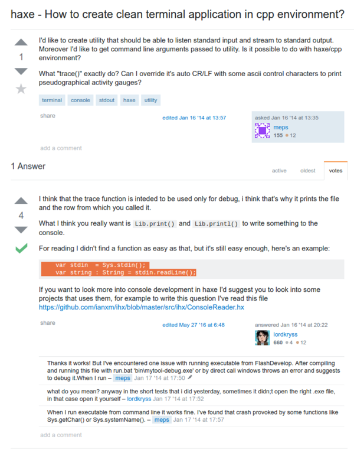

* There is this question on how to make clean terminal application using HaXe that targets C++.
* The problem was that HaXe introduce new programmer with `trace()` to show message to the console.
* However, `trace()` is actually quite high - level. Hence, the operating system does not know any messages that come from `trace()`.
* In HaXe everything that can target to native function from the operating system has `Lib.print()` and `Lib.printf()` to write something into console.
* And for writing inputs into console, there are these codes.

```markdown
var stdin         = Sys.stdin();
var string:String = stdin.readLine();
```

* From this point, I know that when you can see from which line your error come from, that message is in higher level and has no access into computer operating system level.
* Here is the link to the StackOverflow discussion, [http://stackoverflow.com/questions/21163292/haxe-how-to-create-clean-terminal-application-in-cpp-environment](http://stackoverflow.com/questions/21163292/haxe-how-to-create-clean-terminal-application-in-cpp-environment).

