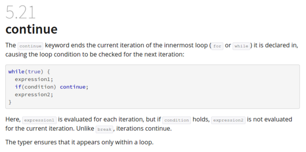

* In most programming language there is often `continue` statement.
* `continue` statement is used to end loop prematurely and then go to the next loop iteration.
* Per - contra, if `break` used instead, the loop will quit.
* Here is a documentation about `continue` for HaXe, [http://haxe.org/manual/expression-continue.html](http://haxe.org/manual/expression-continue.html).
* Here is the full screenshot.

