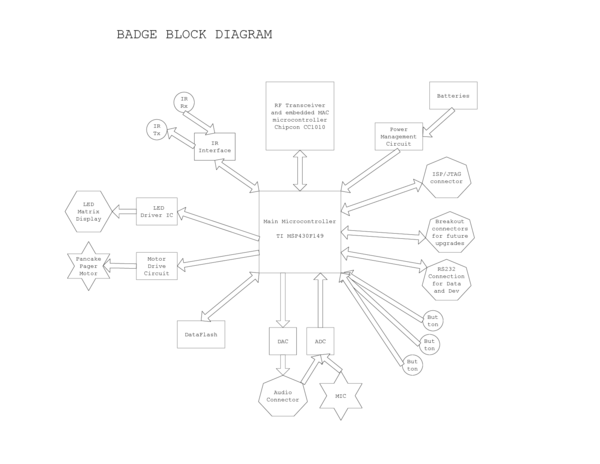
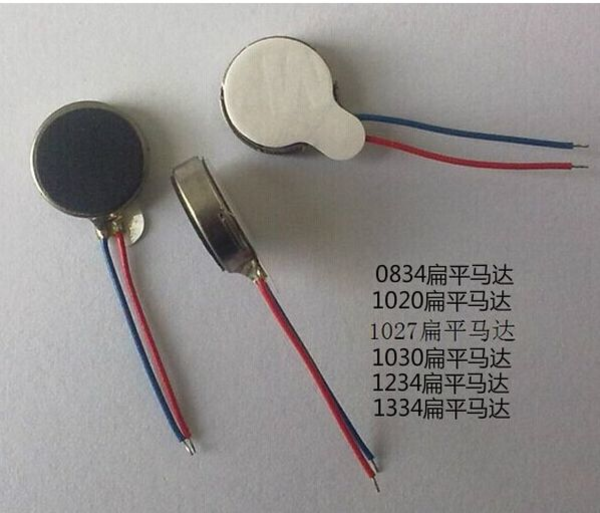

* Here is system requirement for the UbER Badge.

* I was wondering what is pancake pager motor. It is somewhat like vibration motor and also commonly called coin vibration motor. Here is the image of pancake pager motor.

