* This is my review from the main UbER Badge paper.
* Especially for the hardware part, there are a lot of specifications that I do not understand.
* So this review is all about everything that I can understand from the paper.
* There are left a lot of things that is not mentioned here from the paper.

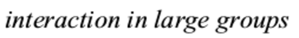

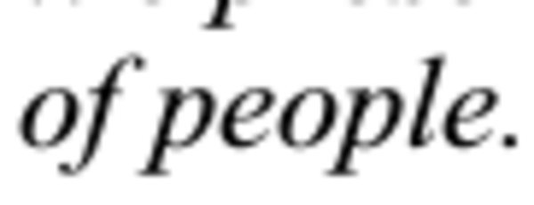

* There are a lot of project in MIT Media Art about defining and manipulating people interaction in large group.

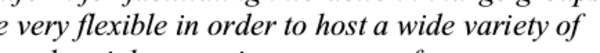

* UbER Badge is made specifically to be as flexible as possible.
* Thus, it can be made to manage as many situation as possible.
* This is the main quality that my project is also aims on.
* However, there is no information that shows on how extensible it was. Or, how can you extend the UbER Badge.
* As far as I see the circuitry is pretty static and there are no input - output pins left for extension like it is in Arduino or Raspberry PI.

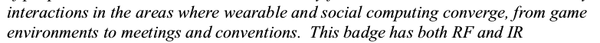

* UbER Badge is made as a social sensor in areas where wearable and social computing converge.
* From social game, meeting, convention, and later office environment.
* Especially the term "social computing" hits me here.
* I think the term "social computing" is also bent into "social computing" as it is in social networking or blogging. There is no mean anymore on "social computing" as it is in physically social.
* What I found in "social computing" Wikipedia ([https://en.wikipedia.org/wiki/Social_computing](https://en.wikipedia.org/wiki/Social_computing)) entry is this.
	* Social computing is an area of computer science that is concerned with the intersection of social behavior and computational systems. It is based on creating or recreating social conventions and social contexts through the use of software and technology. Thus, blogs, email, instant messaging, social network services, wikis, social bookmarking and other instances of what is often called social software illustrate ideas from social computing, but also other kinds of software applications where people interact socially.
* So, yeah the term is not anymore about "social computing" as it is physically social.

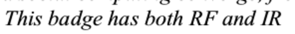

* This badge has RF and IR.
* The RF is mostly used as a local positioning system (perhaps, also as a distance/proximity detection).
* The IR is used for face - to - face detection as well, in some cases, as local positioning system.
* So, in most cases the environment should matter. However, in my project the environment is not matter (I even do not do anything about the environment where the badge is in).
* The environment is used as a place to place beacon for local positioning system.

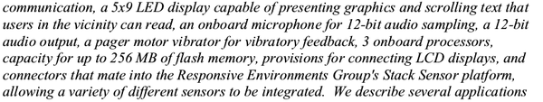

* So here is the hardware specification.
* The audio input and output is at 12 - bit resolution. Which is decent.
* There are 3 on - boards processor that I do not know what are the usage of these.
* There is 256 MB flash memory for UbER Badge main storage.

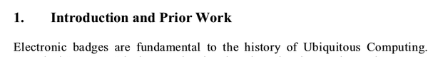

* Electronics badge is part of ubiquitous computing.
* What is ubiquitous computing?
	* Based on Wikipedia, ubiquitous computing (or "ubicomp") is a concept in software engineering and computer science where computing is made to appear anytime and everywhere. In contrast to desktop computing, ubiquitous computing can occur using any device, in any location, and in any format.
	* The most important thing is the latest part, "... ubiquitous computing can occur using any device, in any location, and in any format.".

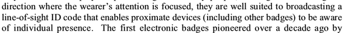

* Line of sight ID code enables to proximate devices to be aware of individual presence.
	* In Sociometer they use more like low powered infrared device to capture only close person - to - person interaction.

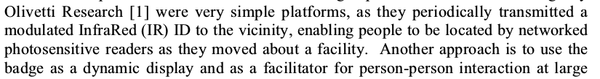

* Olivetti Research Active Badge using infrared transceiver to map people around specific area.

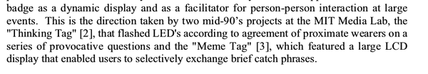

* The dynamic display take inspiration from the other 2 similar project which are Thinking Tag and Meme Tag.
* I think they switched up here.
	* In here they said that Meme Tag uses large display LCD to display users selectively phrases.
	* Where as Meme Tag is actually uses 16 X 2 LCD display that is not that big.

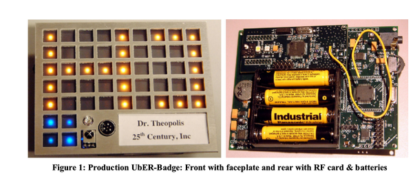

* Example of UbER Badge.
* As you can see there are a lot of embedded device.
* Moreover, I cannot see if there are any room for modular attachment like Arduino shield or Raspberry PI hat.

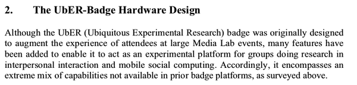

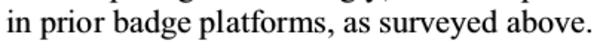

* There are some features those are not in the previous badge (I think they meant Meme Tag and Thinking Tag) but exists in UbER Badge.

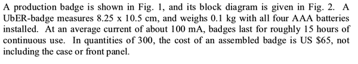

* The average current flow of this badge is 100 mA with 4 AAA batteries powered up this badge, this badge can last longer for 15 hours.
* However, the price is quite steep, it cost 65 US Dollars without the front display panel.
* Nearly twice the price of full blown Raspberry PI.
* I still need to check the inflation rate at the point they made UbER Badge though.

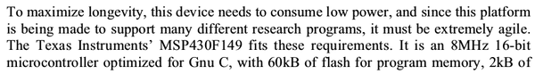

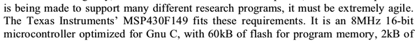

* I think I should have used low - powered micro - controller.
* There are 2 main requirements for choosing the micro - controller.
	* Fast.
	* Low powered.
* The main aspects are these.
	* For flexibility.
	* For longevity.
	* For speed.

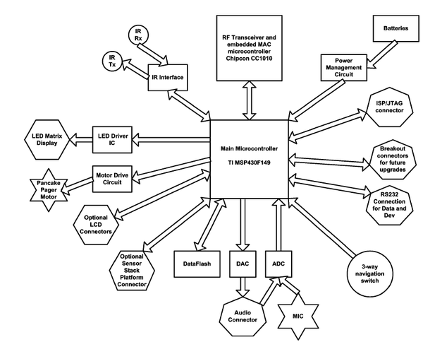

* Good example of system architecture diagram.
* There supposed to be a meaning for each shapes used in this diagram. However, I do not know what purpose each shape has.

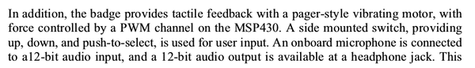

* PWM channels.
* There are button as well to interface with the device.
* There are audio input and audio output (headphone jack) both works with 12 - bit sample rate.

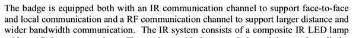

* IR communication to detect face - to - face detection and local communication.
* So, IR transceiver is used for these matters.
	* Face - to - face detection.
	* Local communication.
* The RF is used for larger distance and wider bandwidth communication.
	* The term "communication" used here is rather vague in my opinion.

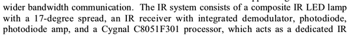

* These are the IR transceiver details.
	* IR transmitter with 17 - degree spread.
	* IR receiver with these.
		* Demodulator.
		* Photodiode.
		* Photodiode Amplifier.
		* Processor (why it is necessary to have processor in IR receiver? filter?).

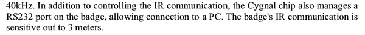

* The IR communication is active in 3 meters.
* The processor used in the IR receiver has a RS232 port that I assume it is a Serial communication chip to connect to household computer.

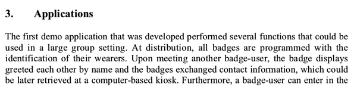

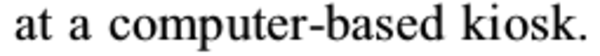

* Applications of this badge should be used in larger group settings.
* At basic there is some identification in their badge with respect to the wearer.
* The data is not real time as it is manual transfer from the badge to kiosk based computer.

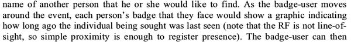

* Other social feature of this badge.
* You can have "last seen..." as it is in WhatsApp or Facebook integrated into this badge.

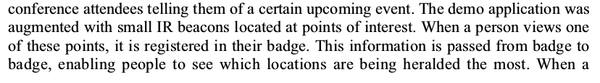

* There was something like treasure hunt games where people hunt clues in the city.

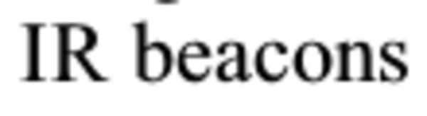

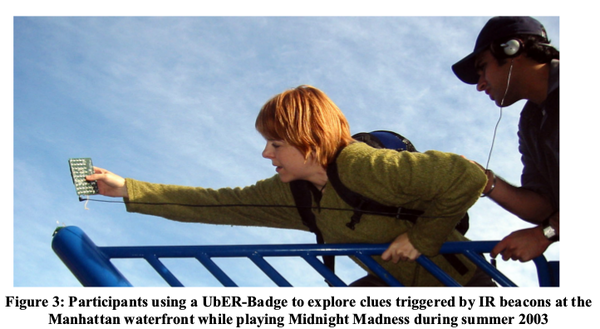

* Example of local positioning system using IR beacon.

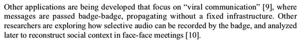

* The context of face - to - face meeting can be known by exploring and selecting which audio features should be recorded by the UbER Badge.

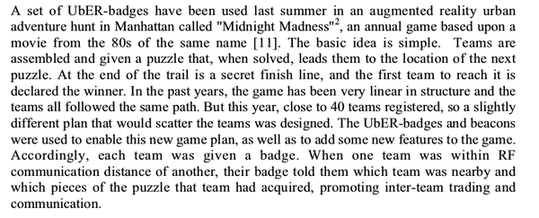

* Example of the Treasure Hunt game I mentioned several points above.

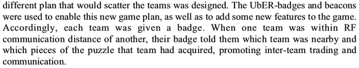

* As you can see here, the local positioning system is actually always there for this kind of electronics badge.
* It is used to data which people is on which room.

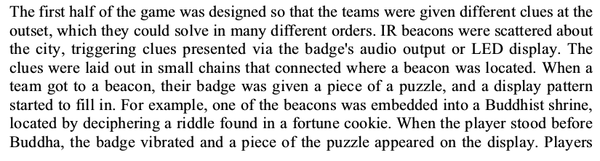

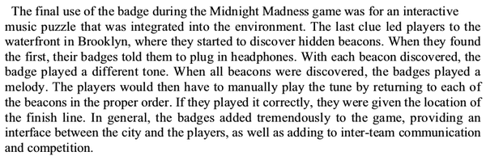

* The example of Midnight Madness physical game in Manhattan in 2003.
* It is real - life Pokemon Go.

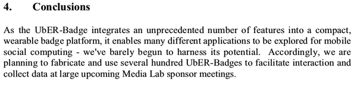

* UbER Badge packs a whole lot features into compact form factor.
* There are many different application to be explored.