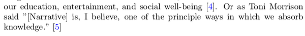
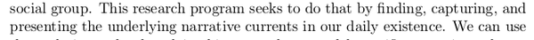
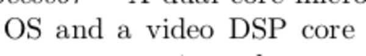
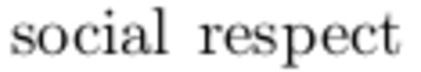

* This is the main research paper for Spinner. Spinner is a network those are wearable sensors, environment sensors, as well as simple video recording camera.
* The main idea of this project is to create automatic video journal through the day of its wearer.
* The wearer can choose a plot pattern (for example from Kung - Fu Kids or Star Wars) for the video the Spinner will generate.
* So, in the end the video produced will have the same social tension as the pattern, but featuring the wearer of Spinner.

* So this paper is basically just a project proposal.
* But this paper is as structured as it is research paper though.
* What is the different between research paper and project proposal in this project?

* "Doctor Of Philosophy" is this what you get from graduating from MIT Media Arts?

* This Alex "Sandy" Pentland guy again. He is everywhere on my project actually.

* Spinner is designed as a novel network system.
* What is novel?
    * Based from Dictionary.com ([http://www.dictionary.com/browse/novel?s=t](http://www.dictionary.com/browse/novel?s=t)), "novel" is a a new kind, different from anything or known before.
    * So basically, "novel" is a word I can use to describe something that is new or an innovation.

* The video capturing feature is to capture fragmented events of human behavior(, that, I think will be according to the pattern that the user choose).

* The video capture will be then arranged and gave cohesive narrative to make larger meaning.
* The "larger meaning" meant so that the resultant video can be understood by anyone and not just an abstract collage of videos.

* This project will consists of these.
    * Wearable sensors.
    * Environmental sensors.
    * Video sensors to identify and then record events.

* Instead of choosing from the pre - made narrative patterns, user could also make their own narrative patterns.
* These patterns, then, can be uploaded and shared to the online community.
* The overall goal of this project is to investigate, a method to do these into large amount and arbitrary data.
    * Understanding.
    * Reducing.
    * Presenting.

* In this paper the state of the art is actually in later chapter 5.
* This is probably because this is not research paper but more as research proposal.
* Then, this is actually a really good research proposal.

* This project also take care the concern of privacy, security, as well as the use of human being as a subject.

* This project is meant to make a sensors network to identify disjoint - events.
* The "disjoin - events" meant that anything those the camera capture is an independent event to each other events.
* However, these events will contribute, directly or not, to the bigger storyline that is according to the pattern choose.

* The hardest part of this project, I think, is that the system need to be context aware.
* The patterns are necessary to be built with the sensors those are used within this project.
* So, using the value received from sensors, then, pattern can be created.
* This means that the whole is system will not be scalable, in term of, when there are new sensors, all existing patterns will not have these new sensors considered.

* As far as I was reading this paper, I know that I miles away from him, lol.
* In this paper the parameters are these.
    * Conflict and agreement.
    * Social respect.
    * Distance of each users.
    * If the goals of each users is the same.
* With these parameters, then, the story pattern can be made.
* A pattern and then feed back into the network to further detect if there are any similar pattern currently happen.
* The user can tweak the pattern manually as well.

* At basic this sensors network will be able to detect these.
    * Attention level.
    * Conflict level.
    * Contextual change within activities.
    * Location.
    * Gestures.
* These values will be then feed to undermine higher level to create the narrative parameters (honestly, I might not understand this sentence really well, if so, I am sorry :().

* As if there is a real - world pattern that fit the mapping they can be captured by imaging and audio sensors.
* The features then will be extracted to see where they fit the pattern supplied by the user.
* The result will be a complete story that follows the dynamic according to the pattern.
* The values from the parameters will be still as it was captured by the sensors.

* So, the people and the specifics of the relationships are maintained. Honestly, I am not sure what this meant.

* The problem with video capturing is that not all the whole length of the video is important.
* Processing and trying to understand the whole video are lengthy activity.
* This project solve this problem with sensing the narrative dynamics of an event.
* So there is like an automation that automatically sort which clips are more important than the most as well as each of their timestamps.
* The developer/user can also search for a clip with certain characteristic.

* The main implementation of this project is a new type of entertainment.
* Where the participants, the users, of Spinner will watch their life video summarized into smaller watch - able video according the pattern that they use.
* This can provide new perspective into everyday metaphorically linking real activities from activities that the participant were not aware before.
* The result of this project is like a journal or video blog with the story model similar to the pattern choose.

* Participants, then, can share their stories as well as their custom pattern into a website platform.
* The writer of this project proposal, hoped that this (the point above) can lead into the creation of community.

* The main principle of narrative is to absorb knowledge.

* Narrative/story is a tool to extract and communicate meaning.
* The narratives that someone develop for their life provide insight into their life and world around them.
* These are essentials to one's education, entertainment, and social well - being.

* There was this Russian Formalist School began to study narratology in 1920.
* Narrative is divided into two.
    * Fabula, which is story themes, characters, and main point.
    * Syuzhet, which is the structures of the whole story.
* There was this guy named, Vladimir Propp that worked on Russian folktales.

* Vladimir Propp suggested that fabula is made from a set of available pattern like the traditional "hero saves a damsel", ....

* Narrative requires very specific basic elements to convey its moral.
* I think this is based on basic human virtue.

* If the system can be modeled (Dynamical System), we can know, extract, more cohesive and effective narrative out of big stream of data.

* The system provides detailed and often visually observable view from the user.
* The goal then is to use the (above point's) information as an input to a variety monitoring application to detect patterns and predict future events.
* I think what he meant here by monitoring application is actually a machine learning.
* Back at the time this project proposal was written the term "machine learning" is not yet grasped in the public.

* This project started by sensors gathering simple states.
* Usually qualitative data, like "yes" or "no" or whether a person in a certain room or not as well as the name of the room.
* This is the most important thing that gasped me, the most important question to answer is not actually "what..." or "when..." but more towards "why...".
* "Why..." matters more because in any interaction the context should be known. More so, this project wants to joint independent events together, so the context of each events need to be known (inferred manually from the system).

* Distributed camera network was booming when the time this project proposal was written.

* There was a foot print problem.
* Video sensors, caused the system to be power hungry.
* Sometimes not all features from a captured video are necessary to get the qualities/quantities that the system needs to, then, matches it to the supplied pattern.
* So, in order to keep the video small and as necessary as possible, the video need to be filtered, take only the most important parts as well as only take the necessary features.

* The video filters should be able to filter the fed videos based on the content and make sure to us only the clips those are relevant and convey something important to the end user.

* The filtering can be done using the value from other sensors.

* The sensors filter all the videos over their duration and return only clips those are relevant.

* Human - centric project to create new perspectives in our lives and identify each self in a larger social group.
* This paper's project is meant to capture, find, and to present narrative from daily life of its users.

* Using the image sensors, this whole sensors network is capable to tell the desired story (I do not know what does this means by "desired story") and then present it to the participant (is the participant is the user/wearer of the Spinner bracelet or anyone else that look into the resultant video?).

* This whole sensor network needs to be able to chunk down large videos and re - construct it back into cohesive narrative.
* It hoped to bring previously unmemorable and unnoticed events of one's life.

* The major goal of this project is to create a new form of entertainment.
* For example, YouTube has the biggest repository of user created content.
* From this narrative - aware system everyone can automatically create video from clips that follows the pattern the was supplied.

* Example of user scenario, I think I should have made something like this for my current project as well.
* This gives you and the reader expectation on what to see from your project.

* So, the resultant of this project is to create a networked sensors that able to know the context of recorded video of its user, based on the previously supplied pattern by the user.
* There will be a lot, long, videos recorded by the video camera.
* In order to keep the foot print low, this project needs to chunk the video into smaller pieces and only re - construct the most meaningful ones.
* However, looking for which contents/videos those are relevant through many users and videos is not an easy tag.
* Database is necessary.
* Or, another solution would be to tag everything that is ever inputed to the system.
* Then tagging convention need to be determine.
* I, personally, think that the good qualities of tagging are there.
    * Can be identify by others easily.
    * Name should be the most basic name ever (preferably like 2 words).
    * Scalable to future additional tags.
* From this paper these qualities are these.
    * Each chunks need to be easily.
        * Retrieved.
        * Sorted.
        * Used.
    * Organized into meaningful categories.
    * Respect to the these detection parameters.
        * Attention level.
        * Conflict level.
        * Contextual change within activities.
        * Location.
        * Gestures.
    * Understandable by the system (I think this is more into coding wise).

* Human centric social network, will be deployed. This will capable to evaluating sensed events with respect to the pattern as well as to the detection parameter.

* Effective narrative needs to be developed and mapped into the capability of the sensor networks.
* There are 3 dimensions in this project.
    * User interface.
    * Internal mappings are the logic and programming, I suppose.
    * The hardware.
* All of these cycled back to the user interface as the main media of human to machine interaction.

* The sensors can detect something that happens in real life that contributes to something in the overall final resultant video.
* The pattern supplied in the beginning (for example the Kung - Fu Kids or Star Wars) contribute to the sensors detection with respect to the 170 parameters those are in the pattern.

* Story energy is an effect that the current situation in the narrative has on the characters as well as the real life audience.
* It can further explained by polarity of (positive, negative, and neutral) and the intensity of the situation.
* For example, an event of the death of important character means negative polarity with high intensity.

* Example of interactive drama based on the real life physical action of the watcher.
* When there are tension in the narrative and the watcher tries to type or speak something, the narrative will adjust the storyline based on that action from the watcher.

* Concept of ticking clock.
* When the characters nearly or reached their goal the narrative becomes more intensive.
* Up until the goal is achieved the conflict level will keep raising.

* Prototype of the image nodes.

* Its components are these.
    * ARM Processor for running an operating system.
    * CMOS Camera.
    * Flash storage device.
    * Microphone.

* The image nodes uses RF as the main connection to wireless data.
* This RF connects from the user worn sensor node to the image nodes.
* This RF communicate to the image node of when they need to start capturing for a video clip.
* The sensors module's position is not fixed. It will be worn and move along its wearer.
* The image module's position is fixed. Unless, if a movable drone is implemented.

* This device uses WiFi as well, as the back - end infrastructure for the whole image network.

* I guess the main idea here is for the image module to be versatile and can be equipped with plethora of sensors as the developer wanted to.

* This is the picture of the sensors module.
* I think this is the wearable technology that will be worn by the user.
* There are some features those need to be exists for the sensors module.
    * The sensors module needs to be wearable.
        * It says to have the best access to the human subject.
        * Something like this might as well be in embedded object or in loose environment.
    * Locateable, this sensors module need to be able to locate themselves within the network it is in. As well as to communicate to stationary modules if this wearable sensors module is nearby.

* Alright, so these are the sensors itself.
    * Inertia.
    * Gesture.
    * Aural.
    * Optical.
* These sensor are used to determine these.
    * Activity.
    * Affect.
    * Social condition.

* Try to understand events that make up lives.
* Mapping from the sensor value into qualitative parameter is hard.
* Especially if you deal with more social aspect of human being.

* So, based from this paragraph the real cue here is that the sensors network that this project trying to make is all about mapping from the sensor values match it with the supplied pattern then stitch together the video clips back.

* I think these below are the similar projects or at least projects those are inspired this project by Mathew Laibowitz.
* These projects are about sensing human behavior.
    * Nathan Eagle's Reality Mining Project. This is actually more like a book from MIT Press. The book store link is here, [https://mitpress.mit.edu/books/reality-mining](https://mitpress.mit.edu/books/reality-mining).
    * Singh's LifeNet, from searching from Google the only information I can know is that this project is about health care.
    * The famous UbER Badge Project.
    * Weld's work in personalized user interface. I think here is the project's paper, [http://www.eecs.harvard.edu/~kgajos/research/supple/](http://www.eecs.harvard.edu/~kgajos/research/supple/).
    * Wolf's work on understanding the purpose of travel data from GPS. I think the paper is here, [https://www.fhwa.dot.gov/ohim/trb/wolf.pdf](https://www.fhwa.dot.gov/ohim/trb/wolf.pdf).

* This is the first parameter discussed within this paper, which is conflict.
* There is no exact, sure, way to define conflict.
* However, conflict level can be determined by using these parameters.
    * Activity level.
    * Body movement.
    * Engagement.
    * Gesture.
* The first thing that can easily be detected is a matching gesture.
* If people in conversation nodding (or at least have the same gesture) then it is safe to say that the conflict level is low.
* In general sympathetic agreement can denote sign of agreement.
* In general contentious agreement can denote sign of conflict.
* If both party is talking in similar volume it can indicate sign of agreement as well.
* The interesting part is about the distance between the speaker.
    * If the distance between speaker is rather far than how far it is in average conversation, the conversation denote lack of interest between the participant.
    * If the distance to close it can denote that there is a problem within the conversation or means that there is a superiority among the participant.
* However, I am not sure on how can this system know if the participant is not currently sitting in the table.
    * Sitting in the table means every participants have a fixed distance to each other, until they leave the table.
* To sum up, people in agreement find a rhythm of communication both verbally and body language (if the quality of verbal communication and body language are in sync then it save to assume that people within the conversation are in agreement).

* The thing is that there are a lot of specific gesture that denote agreement or conflict, although the qualities above are not met.
* For example.
    * Handshake is a clear sign of agreement.
    * Clenched fist can be inferred as a conflict.
* It says here as well that relative body position can denote agreement or conflict.
    * Hug denote agreement.
    * Facing someone face denote that there is a conflict.

* If people are highly engaged steadily for decent length of time, this can denote high level agreement.

* If there is no rhythm in the conversation (people engage and disengage rapidly), this can indicate that there is a conflict within the conversation.

* However, to contra to the previous point.
* If the participants in a conversation are disengaged, it could imply that there is not enough information given the conversation topic.
* In this case this interaction could not be used to determine whether there is a conflict or agreement.
* So, to sum up, if participants is not in the same level of knowledge, agreement or conflict could not be determined from their conversation.

* The second aspect mentioned here is social respect.
* This means about the social standing of each participant in the conversation (for example if someone is a boss or parent to the other participant).
* This can be inferred from these aspect.
    * Face to face time.
    * Body language.
    * Conversational dynamics (this is what the "rhythm" I mentioned in several points above).
* Unlike agreement or conflict, social respect can only be determined by aggregating all parameters together. So the longer the interaction happens the more accurate social respect value that this system gets.

* Oh, actually it is stated here that social respect can be mapped as fast as possible according to the level of the engagement between the participant.
* There are two different kind of engagement.
    * Engagement due to social respect.
    * Engagement due to situational content.

* Engagement in social interaction could happen in 2 ways.
    * The first is engagement that happens gradually. So the engagement level started out low and then process to high.
    * The second type of engagement is engagement that directly start at higher value.

* The next qualities that this project are looking for is what is the goals of the interaction.
* There are 2 theories those have been mentioned before in this notes I made.
    * The first theory is about how "why" is more important to know than other wh - based questions.
    * The later is about the time ticking theory. This theory describes that as the character delve more into their goals the engagement level as well as the conflict level (usually) become higher (as the situation becoming more intense).
* In this paragraph, it explains how every characters have their own goal curve.
* This goal curve indicates how far away this certain character to achieve their goal.
* For example, if the narrative contains goals such that the characters has a consecutive goals over another, the graph will be like sawtooth.

* The goal curve can be mapped according to a parameters that indicating a "search".
    * I am not sure what they meant by "search" here.
* Oh, later it is explained in this paragraph that "search" means a rapid changes in location as well as in physical state.
* Constant change in curve can mean that the attention of the user changing faster than usual, for example when this user is talking into more people than usual and happens more frequently.

* Also, if a person increase their use of certain tools, for example from the Internet into their cellphone, tablet, ..., these can indicate a larger distance from reaching the corresponding user's goal.

* Social interaction can happen in one way for example eavesdropping or stalking.
* Although there is no direct interaction as a feedback, this kind of social interaction affect on how someone would behave to the object.
* This can relate as well to the object's objective (for pun purposes, although "goal" would be clearer).

* The next parameter is story energy.
* Story energy means the current impact of the situation to the audiences.
* As this was described before, this can be inferred as a positive or negative.
* I think in some previous point these mentioned as a polarity of the narrative. Whether at a point in a narrative it can be positive, negative, or neutral.
* In simplest story energy meant how happy or how sad the narrative make the audience feel.

* I think after several test, the researcher of this paper (Mathew Laibowitz) infer that there was a case that a happy scene detected, although it is supposed to be negative (exact opposite from what it was detected).
* It is possible to determine happiness through body motion and/or speech qualities.
* However, facial and speech recognition need more sophisticated analysis to get a bare decent information to make conclusion.

* It said in this paragraph that if the character in the story has a connection to someone else in real world, it is possible to train the system to determine story energy.
* I assume this is using machine learning.
* However, in this paper there is nothing mentioned about how or even the starting point to determine the story energy.
* In general, people has these indications to determine happiness.
    * Breathing.
    * Gait. What is gait?
        * Based from Google, gait means the manner of a person when walking.
    * Hand position.
    * Posture.
* As for this paper, I think the researcher make a general assumption on how to determine happiness or sadness.

* The easier solution would be to train the system, feed it with known example, and provide the valuation manually.
* For example, we feed the pattern of when Han Solo killed in Episode 7 (SPOILER shitters hahaha). The system cannot infer anything from this. However, human could just give the sadness value into this particular scene.
* Hence, if later this system found similar pattern, it knows, that, this is more - or - less in similar sadness as when Han Solo died.
* Designing valuation is hard when every parameter is qualitative.
* So far I know that this system as well as Sociometer uses machine learning.
* Sociometer uses Hidden Markov Model (HMM) to detect if conversation happens.

* Example solution for machine learning at that time is NeuroSolution, [http://www.neurosolutions.com/](http://www.neurosolutions.com/).
* I think I can use Microsoft Azure for this matter as well.
* This paper was written in 2007, there were less option on established machine learning platform.
* Although Azure is from Microsoft, it is the most user friendly option available for machine learning we currently have (this note is written in 2017).

* This research proposal define a fail - able condition. To sum up, this condition is to make sure that the system is able to capture, collect, and make the resultant video make sense to the commonalty watcher.
* The resultant video need to be cohesive as well.
* I think what this paper meant by cohesive is that the resultant video has little to no footprint.
* Footprint means that every elements is useful and not even a single thing is left unused.
* I think at basic, the user understand the content of the resultant video.
* I think at more advance, anyone understand the content of the resultant video.

* The point before this and this point is actually trying to convey the fail - able conditions by defining some quality questions.
    * Is the video resultant cohesive?
    * Is the video resultant consider the pattern supplied?
    * Will the resultant video similar if the settings are different (I do not get about this point actually)?
* Other testing would be manually doing the automatic process of the system.
* This system automatically stitch together video fragments from bigger video into 1 bigger cohesive video.
* If this is done by human, will the resultant video the same or similar to the resultant video that is generated from the system?

* In more ideal case, events can be overwritten by the system if it is considered as inappropriate or can be overwritten by manual human hand.
* The system can be trained in more specific environment.
* For higher success rate manual control could be instantiated somewhere during the process of this system.

* If the resultant video is understandable then the whole system is valid.

* This project proposal listed some contributions as well.
* This section is like why this project is important.
* Although, as you can see here, they are mostly about entertainment and community.

* Some example of completed work.
* These were something those had been done by the researcher of this paper prior this project.

* So, in this project, this researcher can easily ask for sponsorship for his project.
* I think this is one benefit of having high education degree.

* Security is actually a concern in this project.
* Although, this project is just for experimental, since this project's subject is human personal life then privacy is matter.

* Example of time line.
* Should I implement something like this as well in my paper?

* This paper also listed in resources those are necessary for this on - going project.

* This project proposal put the state of the art in the end of the document.

* To sum up this project is about distributed sensors network on human and social interaction.

* The problem for the sensor node is the size as well as option to have the controller to be in low power.
* There was SenseCam from Microsoft that brought image gathering to a small, low power node.
* This is the website of SenseCam, [https://www.microsoft.com/en-us/research/project/sensecam/](https://www.microsoft.com/en-us/research/project/sensecam/).
* SenseCam mentioned as personal black box.
* However, I think the project was never reached into consumer level.
* I definitely need to look at this project since it is similar to my first prototype.

* The Panoptes System developed at OHSU shows the problem in high foot - print video camera.
* The main problem was when sending data even when there is no network coverage.
* This is the related link to download The Panoptes research paper, [http://dl.acm.org/citation.cfm?doid=957013.957132](http://dl.acm.org/citation.cfm?doid=957013.957132).

* Sociometer and UbER Badge are one of the state of the art for this project.

* "Collaborative Knowledge Building By Smart Sensor" by Bove and Mallet's paper.
* The link to download paper, [https://link.springer.com/article/10.1023/B:BTTJ.0000047582.30576.7e](https://link.springer.com/article/10.1023/B:BTTJ.0000047582.30576.7e).
* This paper is about decentralizing data gathering from sensory devices.

* There is StoryNet that is collection of story pattern.
* This can be used to predict what happened next in any story.
* Think what the researcher meant here is that there is an API or something for him to take data to predict what will happen next within any story.
* Link to StoryNet, [http://www.storynet.org/](http://www.storynet.org/).

* The final proposed specifications.

* So the node is actually using Real Time OS from Windows CE kernel.
* Why not using FreeRTOS though? Open source is awesome.
* Simple answer why operating system is necessary is because operating system enables multi - tasking.
* Moreover, operating system will enable any node to access data from different protocol easily. For example, like HTTPS, HTTP, Samba, SSH.
* Device drivers to fasten up the development process.
* Standard file indexing in its native file system.
* Remote administration for automation.