* Article titled, "Wearable Cameras Provide New Insight Into Lifestyle Behaviors And Health".
* The article is from this website, [https://www.elsevier.com/about/press-releases/research-and-journals/wearable-cameras-provide-new-insight-into-lifestyle-behaviors-and-health](https://www.elsevier.com/about/press-releases/research-and-journals/wearable-cameras-provide-new-insight-into-lifestyle-behaviors-and-health).
* I know this article from the Microsoft SenseCam website here, [https://www.microsoft.com/en-us/research/project/sensecam/](https://www.microsoft.com/en-us/research/project/sensecam/).
* Here are scraps from this article.

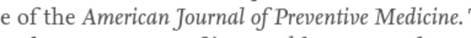

* So there is actually an organization about preventive medicine.
* In the USA the organization journal name is American Journal Of Preventive Medicine.
* I think, from the name, this suggests about a medical foundation that research a method to prevent disease and illness.

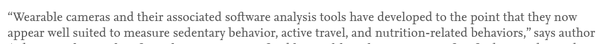

* Wearable cameras and additional software analysis tools can be used to measure sedentary behavior.
* Here is the definition of the sedentary behavior.
    * Sedentary behavior refers to any waking activity characterized by an energy expenditure less and equal then 1.5 metabolic equivalents and a sitting or reclining posture. In general this means that any time a person is sitting or lying down, they are engaging in sedentary behavior.
    * This definition is taken from this website, [http://www.sedentarybehaviour.org/what-is-sedentary-behaviour/](http://www.sedentarybehaviour.org/what-is-sedentary-behaviour/).
* So, I think wearable camera can be used as measurement from what they are usually multiple sensor.
* Measurement then will be given by the software analysis tools.
* I suggest that this software analysis tool is like a "state of the art" computer vision program to sort the video based on events that the user wants to know.

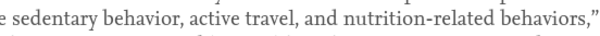

* Wearable camera can be used to detect these kind of behaviors.
    * Active travel behavior (walking, ...).
    * Nutrition related behavior (diet, ...).
    * Sedentary behavior.

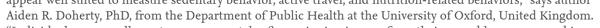

* There is this person named Aiden R. Doherty from Department Of Public Health from University Of Oxford.
* I am not sure is he will be relevant in my project or not.

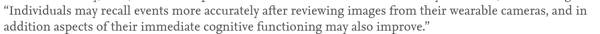

* The idea of using camera is to make the wearer to be able to recall events precisely after reviewing images back from the camera.
* Additionally, immediate cognitive function might also improve.
* I am not sure what is immediate cognitive function?
    * The closest Google search query result in Wikipedia entry about working memory.
    * Working memory is a cognitive system with a limited capacity that is responsible for temporarily holding information available for processing.
    * Basically the short - term memory as it is mentioned in my course about learning on how to learn.
    * Here is the link to the Wikipedia page, [https://en.wikipedia.org/wiki/Working_memory](https://en.wikipedia.org/wiki/Working_memory).

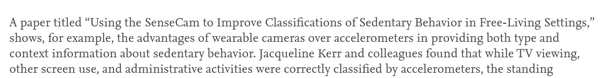

* There is this paper titled, "Using The SenseCam To Improve Classifications Of Sedentary Behavior In Free - Living Settings".
* In this paper there will be defined what is the advantage of using camera compared to use any sensor like accelerometer.
* The thing here is that, when studying about human interaction there should be context for every value input from sensor.
* With accelerometer context agent is necessary.
* So why not using whole video instead.
* In the end there would be context agent that would likely to be human.
* There is this woman named Jacqueline Kerr that found TV and screen based human activity can be traced correctly by using accelerometer.

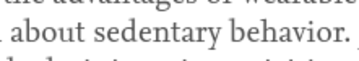

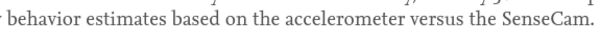

* In the end the resultant behavior will be summarized by human.
* So in term of step, using accelerometer and video camera should not matter that much.
* However, information contained in accelerometer is limited.
* Where when using camera, there could be limitless amount of thing those can be inferred.

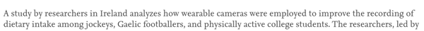

* Study research from Ireland use video based wearable sensor to manage diet of athlete or any physically active student.

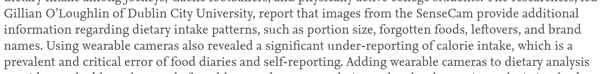

* SenseCam provides more information regarding dietary intake patterns.
* The informations here are such as these.
    * Dietary intake patterns.
    * Food's brand name.
    * Forgotten foods.
    * Leftovers.
    * Portion size.
* This eliminates error on self - reporting on food diaries.

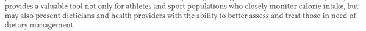

* These videos also provide the professionals (doctor or nutritionist) on how to give correct and proper feedback to the SenseCam wearer.

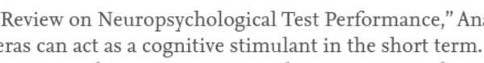

* The overall effect of using SenseCam and doing self - evaluation is cognitive stimulant in short term.

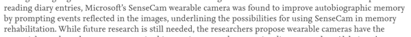

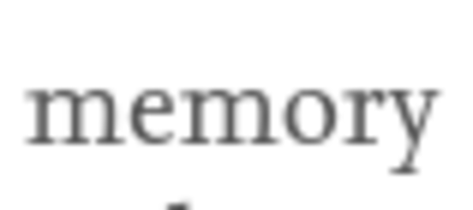

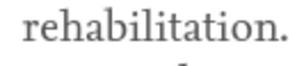

* Reading the diary entries from SenseCam was found to improve autobiographic memory by prompting events into the images.
* There was a hypotheses about using SenseCam for memory rehabilitation.

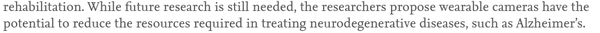

* However, for using SenseCam for memory rehabilitation further researches are still necessary.
* There was also suggestion that wearable camera sensor like SenseCam could be use to treating neurodegenerative diseases like Alzheimer.

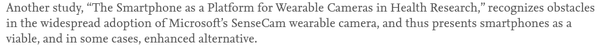

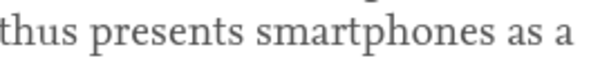

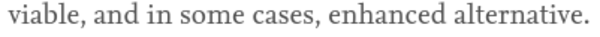

* Smart phone was also suggested as a possible tool to mimic and replace the functionality of SenseCam.

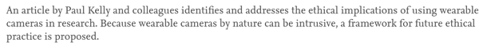

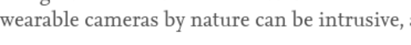

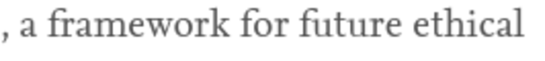

* There is an article by Paul Kelly about ethics on using intrusive camera based wearable sensor in public spaces.
* There should be an ethical research about this going on the background.
* Here is the full screenshot of the full article.

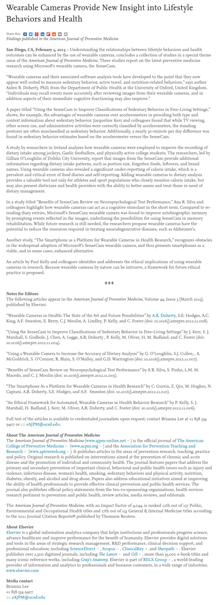