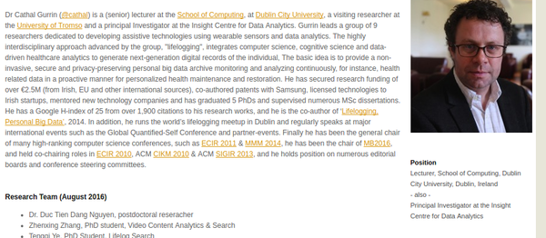
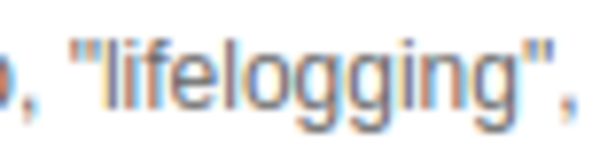
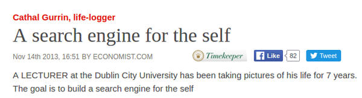

* Meet this man that worn Microsoft SenseCam for the last 10 years.

* The homepage of Microsoft SenseCam here, [https://www.microsoft.com/en-us/research/project/sensecam/](https://www.microsoft.com/en-us/research/project/sensecam/) refers to 2 web pages.
    * [http://www.computing.dcu.ie/~cgurrin/index.html](http://www.computing.dcu.ie/~cgurrin/index.html), the first web page is the personal bio of the researcher.
    * [http://www.economist.com/blogs/babbage/2013/11/cathal-gurrin-life-logger](http://www.economist.com/blogs/babbage/2013/11/cathal-gurrin-life-logger), the second web page is a dead link with Flash based video from Economist.com.
* Here are my summarization for both web pages.

* The bio page of Dr. Cathal Gurrin.

* His and his team is working on assistive technologies using wearable sensors and data analytics.

* His group is an interdisciplinary group that work in a project about automatic "lifelogging".

* This "lifelogging" project combines these discipline together.
    * Cognitive science.
    * Computer science.
    * Data science.

* There are a lot of area that can be explored with "lifelogging".
* The 2 examples would be these.
    * Healthcare.
    * Self - depression control.

* The main idea for this "lifelogging" project is to have pro - active personalized data for health maintenance and restoration.

* There is this article from the Economist.com (link is somewhere at upper points of this note).
* However, there are only this information and dead video link due to it still uses Flash.
* The goal of Dr. Cathal Gurrin is to build a personalized search engine via "lifelogging".
* At the early of this project Dr. Cathal Gurrin used Microsoft SenseCam to capture data.