[./20170404-0144-cet-state-of-the-art-23-lifelogging-presentation-personal-big-data-1.pdf](./20170404-0144-cet-state-of-the-art-23-lifelogging-presentation-personal-big-data-1.pdf)

* Above is the attached .pdf of the presentation.
* Here is the link to the presentation, [https://www.slideshare.net/cgurrin/personal-big-data](https://www.slideshare.net/cgurrin/personal-big-data).

* The title for this presentation is "Lifelogging A New Big Data Challenge".

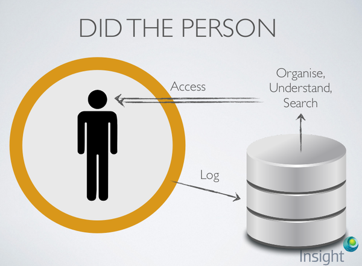

* Sample workflow of this project.
* I think mine is similar, but I would like to put sensors between the human and log.

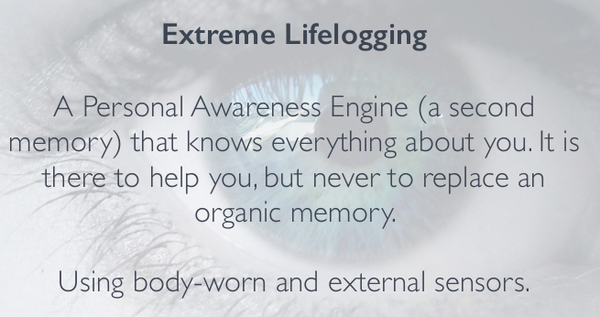

* Extreme Lifelogging.
* This is like creating log (blog, vlog, ...) but done automatically.
* The lifelogging term means to capture real - life activities.
* The principle here is to use fitting wearable sensors.
* The result would be a personal awareness search engine that knows anything about you.
* However, this search engine is not intended to replace your organic memory.

* There is a slide that shows about the result of one year lifelogging.

* There is an assumption made here that the data captured from the lifelogging activities are all useful.
* I think this where machine learning could take in.

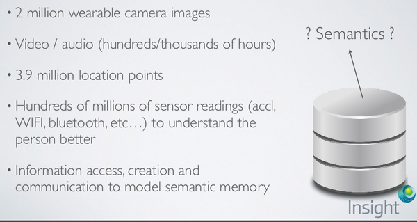

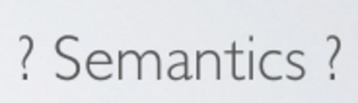

* This project is really about big data.
* There should be management mechanism somewhere.
* I think that management mechanism could be machine learning.
* At this point manual human editing is not feasible anymore.
* What is semantics?
    * Semantics is a branch of languages that gives meaning.
    * There are 2 main areas of semantics.
        * Logical semantics, the implicit semantics that inferred from human senses.
        * Lexical semantics, the explicit semantics.

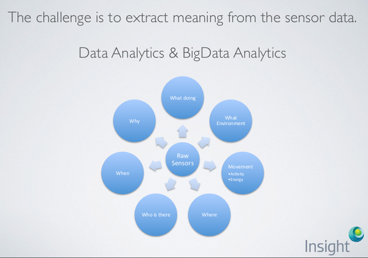

* This is what I meant by context agent.
* Context agent answers all possible wh - based questions from values received from sensors.

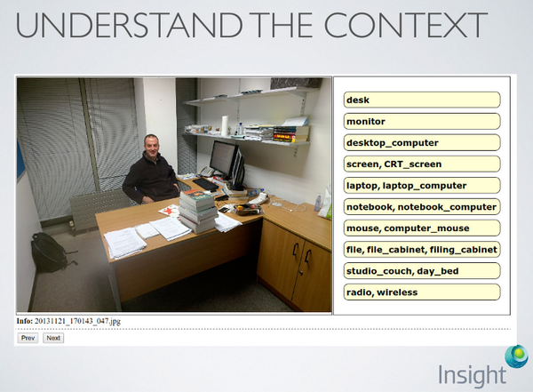

* Example of application interface.
* I think the panel in the right shows you some usage of computer vision.
* However, I am not sure if computer vision can be that accurate.
* Perhaps, it is manual input by human.

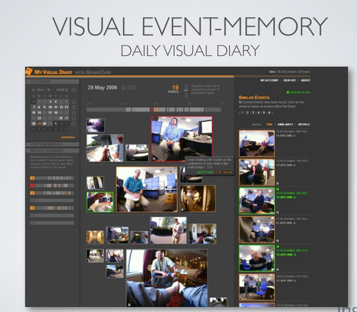

* There is an example application developed within this "lifelogging" project titled My Visual Diary.
* This application shows images capture from the wide angle lens of the video sensor.

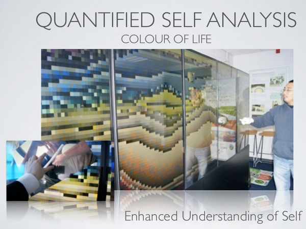

* 1 purpose of this "lifelogging" process is to have quantified self - analysis of one's personal life.

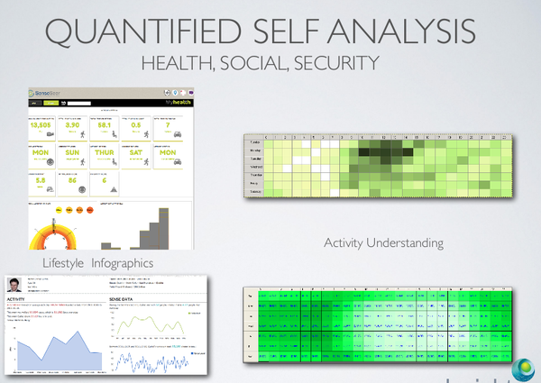

* Aside from personal use of traditional logging activities.
* There are other areas as well that could be benefited by having proper "lifelogging" tools. These are for examples.
    * Depression management, Wittgenstein - esque.
    * Healthcare.
    * Lifestyle.

* The other purpose is to enhancing productivity.
* There should be a point in your life about "I know I have read that notion somewhere, somewhen.".
    * This actually happens a lot to me during this project.

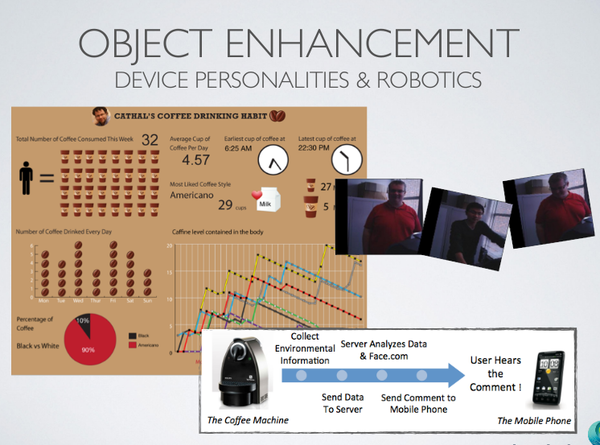

* "Lifelogging" could works both ways.
* It could works by logging 1 user.
* It could works by logging people.
    * For example logging used by coffee robot to automatically determine which coffee each possible users would like.

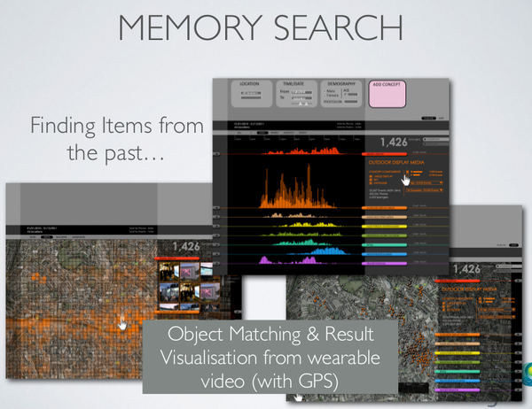

* Example of personal memory search engine.
* There should be context and the agent to determine the relevancy of quantitative data.

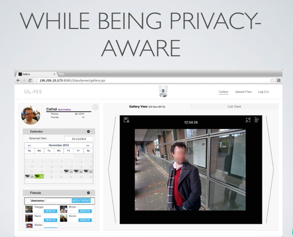

* The concern is as usual, privacy.
* In this example third party face will be blurred.