[./20170404-0144-cet-state-of-the-art-24-lifelogging-presentation-play-pause-rewind-1.pdf](./20170404-0144-cet-state-of-the-art-24-lifelogging-presentation-play-pause-rewind-1.pdf)

* Above is the presentation.
* This presentation is about archived lifetimes.
* This the link to the presentation, [https://www.slideshare.net/cgurrin/mayo2040](https://www.slideshare.net/cgurrin/mayo2040).

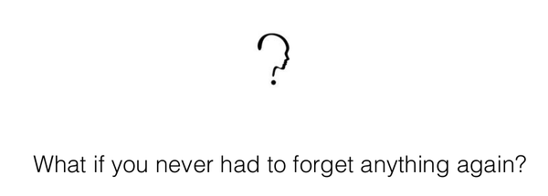

* This presentation started with a provoking question.
* The question is "what if you never had to forget anything again?".
* Sounds to ideal to be true though.

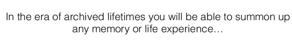

* The ideal expectation is to archive someone life memories.
* And then the user is able to search on whatever had been stored in the database that is related to their own experiences.

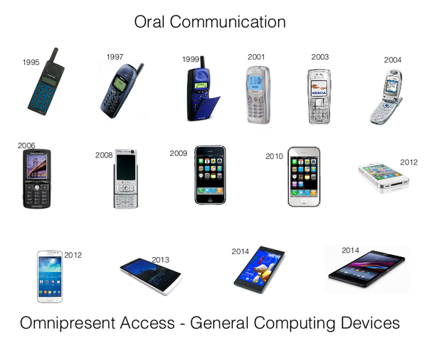

* Cellphone is an example of omnipresent access.
* Cellphone is a general computing device.
* It packed with a lot of sensors as well as output methods.

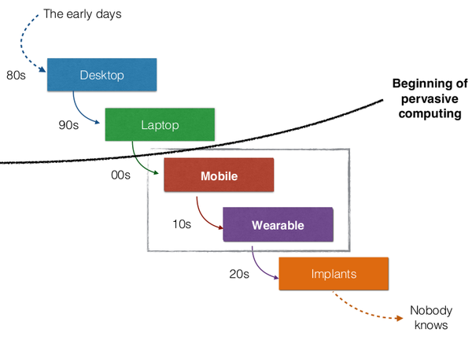

* This graph could be useful in my presentation and paper later on.
* In summary.
    * ~1980 desktop computing.
    * ~1990 portable computing.
    * ~2000 mobile computing.
    * ~2010 wearable computing.
    * ~2020 implants computing.
* Pervasive computing happened between the portable computing and mobile computing.
* What is pervasive computing?
    * Pervasive computing is an emerging trend associated with embedding microprocessors in day-to-day objects.
    * This is more into ubiquitous computing.
    * This definition is taken from, [https://www.techopedia.com/definition/667/pervasive-computing](https://www.techopedia.com/definition/667/pervasive-computing).

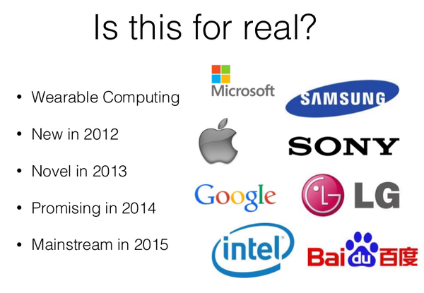

* Wearable computing is expected to be mainstream in 2015.
* However, I think it is not yet there.
* We need more streamlined hardware to application to pack very specific needs.
* Consumer would not buy anything physical for just very specific need.
* I think the ideal case would be to use smartphone.
* I think would be better for use to have an electronics development platform that uses resource from consumer existing computing power.
    * Laptop.
    * Smart phone.

* This project thinks for smart phone to be an omni directional sensors.

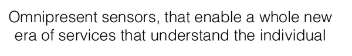

* Omnipresent sensors enables new era of service that understand individual.
* Omnipresent sensors means that sensor that can answer into so many questions.

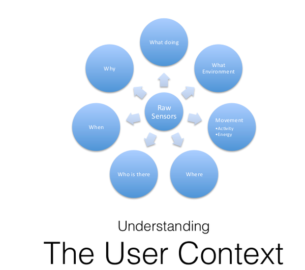

* Example table of omnipresent sensors.

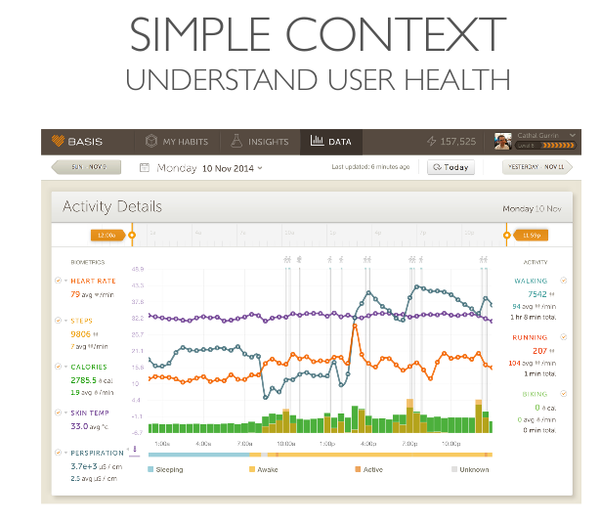

* An example of implementation would be in health care.

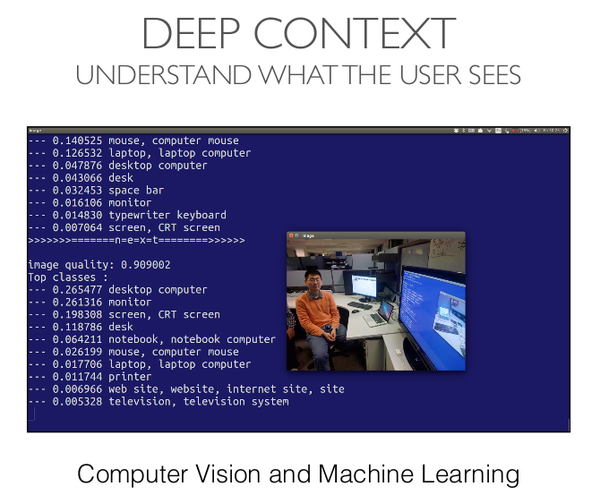

* As I have mentioned before, context need to be given or build.
* 1 example of context agent is machine learning.

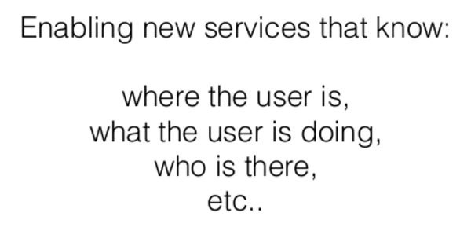

* As whole, this "lifelogging" project aims to know the context of the user.

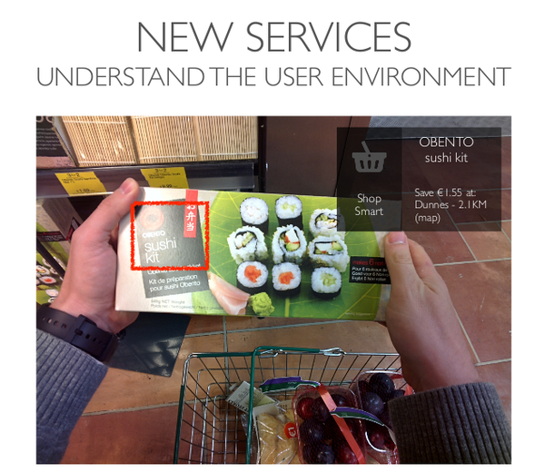

* Another example will be an augmented display.
* Like Google Glass but we need a device that is more powerful.

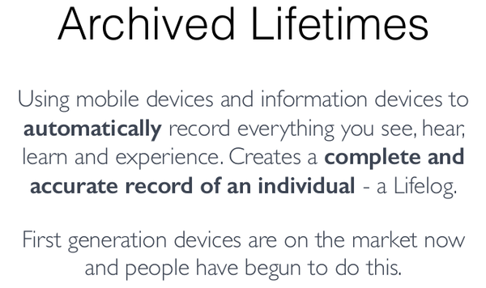

* The principle of archived lifetimes or lifelogging.
* Using mobile devices that automatically records everything.
* And then a system that sort things out. I suggest that this is a machine learning ecosystem.
* It says in this slide that there is some device to achieve something like this, that is already in the market.

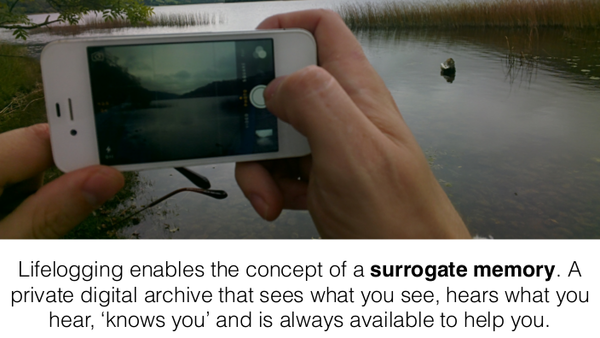

* Lifelogging enables a surrogate memory.
* What is "surrogate"?
    * Based on the definition found here, [http://www.dictionary.com/browse/surrogate](http://www.dictionary.com/browse/surrogate).
    * Surrogate means a substitution on human role.
    * For example a woman carry out pregnancy of other woman.

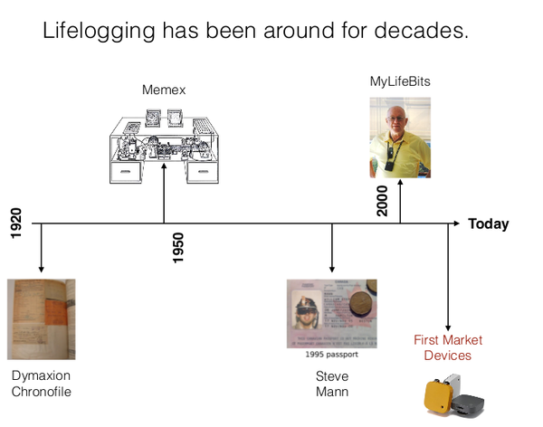

* State of the art of lifelogging.
* There is Memex in 1950.
    * [https://en.wikipedia.org/wiki/Memex](https://en.wikipedia.org/wiki/Memex).
* There is MyLifeBits in 2000.
    * [https://www.microsoft.com/en-us/research/project/mylifebits/](https://www.microsoft.com/en-us/research/project/mylifebits/).

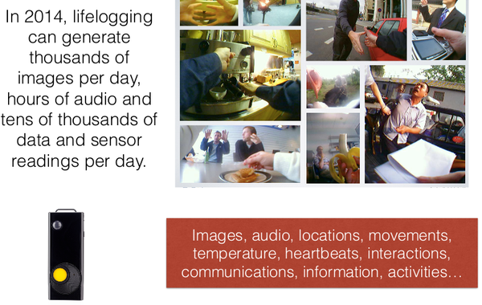

* In 2014, lifelogging can generate thousands of images per day.
* As well as other media as well like audio and tons of data from sensors.
* This means that we are dealing with big data.
* Even worse, a personal big data.

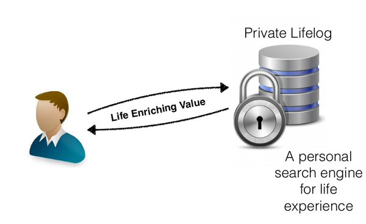

* Life enriching value.
* One person, one machine learning agent.
* Personal search engine for life experience.

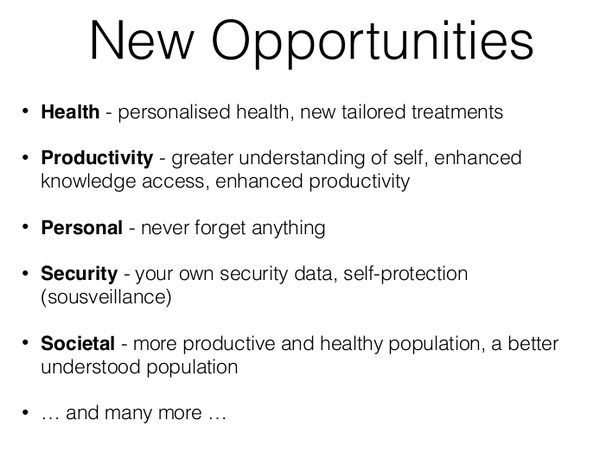

* There are a lot of opportunity in many areas.
    * Health.
        * Personalized diet.
        * Personalized treatment.
    * Productivity.
        * Enhancing knowledge access.
        * Enhancing productivity.
        * Greater understanding of self.
        * Sociometric Badge.
    * Personal.
        * Never to forget anything.
    * Security.
        * Alibi.
        * Personal black box.
        * Self protection.
        * Your own security data.
    * Society.
        * Healthy population in general.
        * Machine learned specific population.
        * Sociometric Badge.

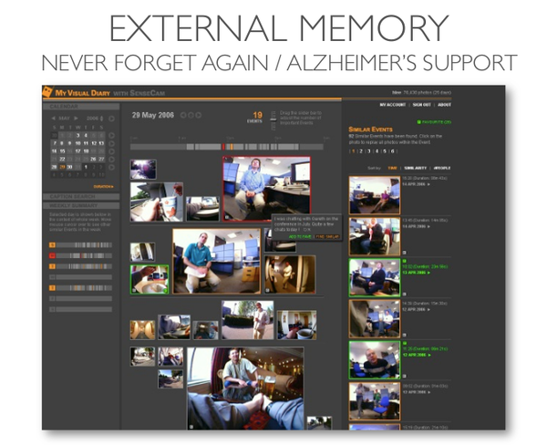

* The example of personal automatic diaries from lifelogging activities.

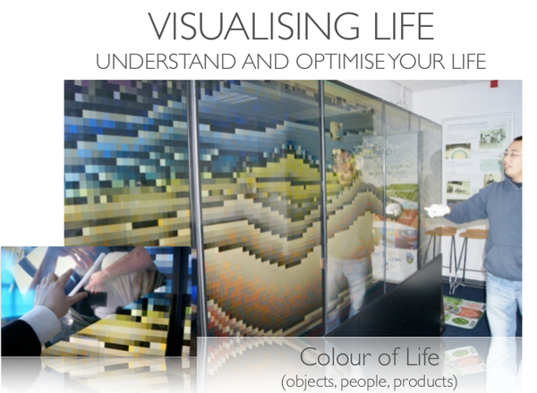

* Color of Life implementation.

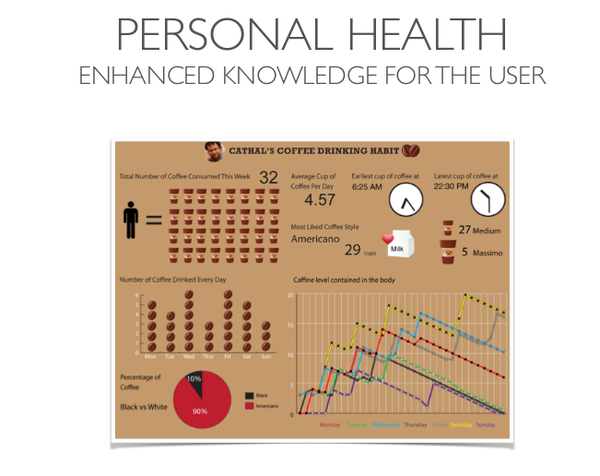

* Personal health.
* Personal robot that understand its users.
    * In this example is coffee robotics.

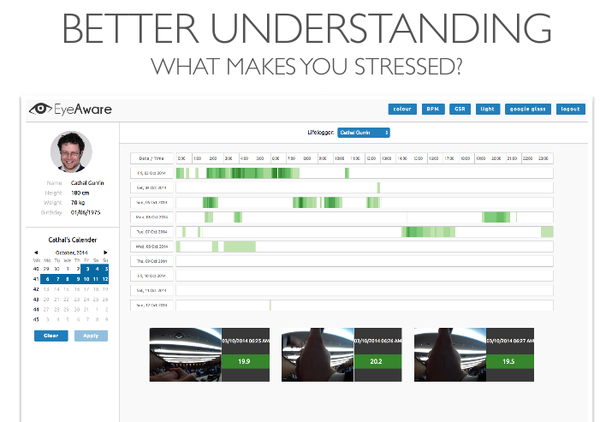

* Better understanding on what makes one depressed.

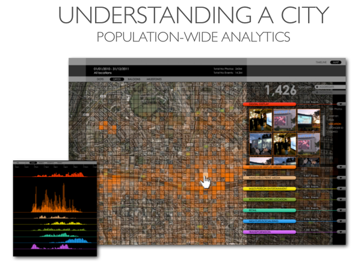

* Machine learned on population.

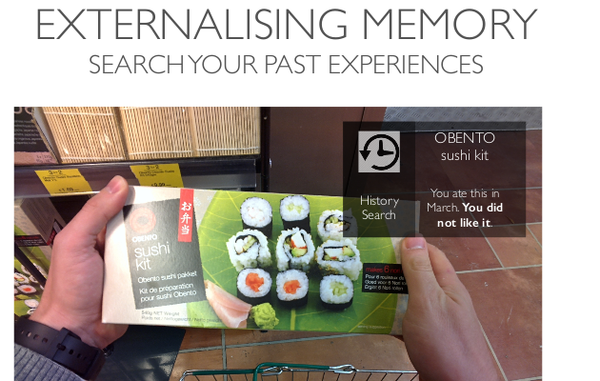

* Augmented reality.
* Like Google Glass, but we definitely needs more processing power and use of Google Glass.

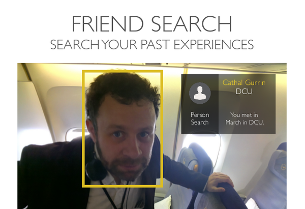

* Physical addressbook.
* Physical Facebook.