* This is still a presentation about lifelogging.
* This is link to the presentation, [https://www.slideshare.net/cgurrin/qs2015](https://www.slideshare.net/cgurrin/qs2015).
* Here is the .pdf.

[./20170404-0144-cet-state-of-the-art-25-lifelogging-presentation-a-15-millions-image-lifelog-1.pdf](./20170404-0144-cet-state-of-the-art-25-lifelogging-presentation-a-15-millions-image-lifelog-1.pdf)

* My summarization.

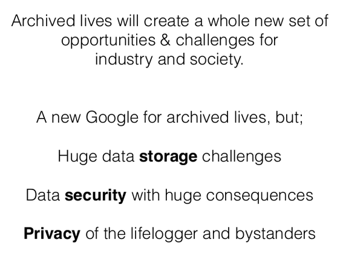

* This research creates whole new area for consumers and industries.
* A search engine that archives your life but there are problems.
    * Data security with always a possibility to be breached.
    * Privacy of the lifelogger and their surroundings.
    * Where to store the big data.

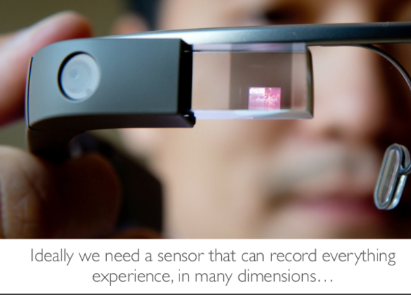

* Ideally we need a set of sensor that can record anything.
* Human experience is very complicated.

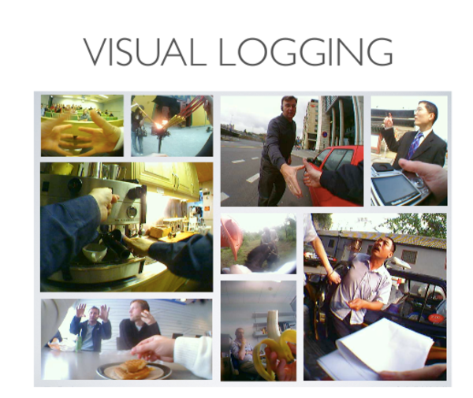

* Example of visual lifelogging with video sensor.

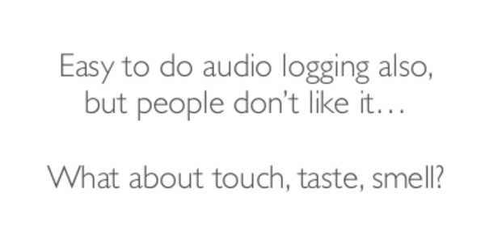

* Easy to do audio logging.
* Easy to do video logging.
* However there are some dimensions those are not easily measurable.
    * Feeling.
    * Taste.
    * Touch.

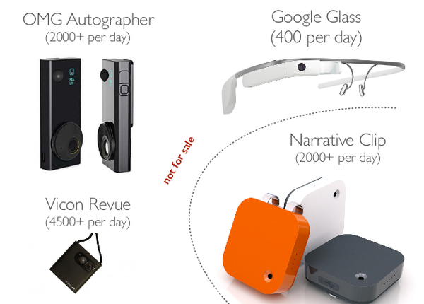

* There are some "badges" those can be (primarily) used to lifelogging.
    * Google Glass (experiment from Google, I think this is never get into consumer hand).
    * Narrative Clip (is a casual Go Pro camera, this is the only solution to buy at this moment).
    * OMG Autographer (the company closed).
    * Vicon Revue (Microsoft SenseCam, however, this is not on sale).

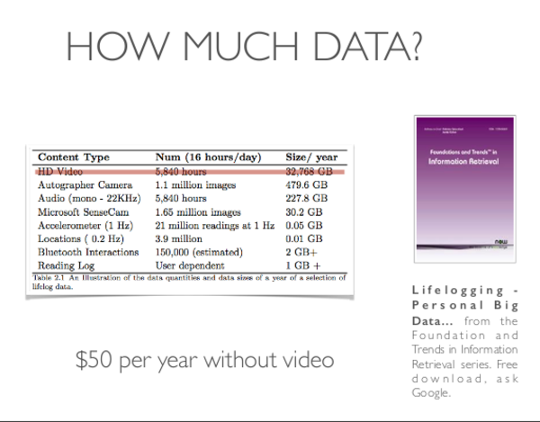

* Data storage is important.
    * HD video takes so many spaces.
    * Accelerometers and location beacons take less data but also less information.
* There is this book titled "Lifelogging Personal Big Data".
* This book is basically a very big research paper about lifelogging.
* It is worth the read to help me for this project.

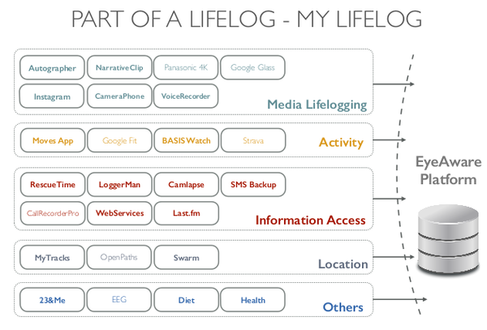

* Example data from logging.
* For example.
    * Media lifelogging.
        * Instagram.
        * YouTube.
        * ....
    * Activity.
        * FitBit.
        * Nike Run.
        * ....
    * Information access.
        * LoggerMan.
        * Rescue Time.
    * Location.
        * Google Maps.
        * GPS.
        * Swarm.
    * Others.
        * Diet.
        * EEG (brainwaves).
        * Gene (23&Me).
        * Health.
* The platform made for this project is called "EyeWare".

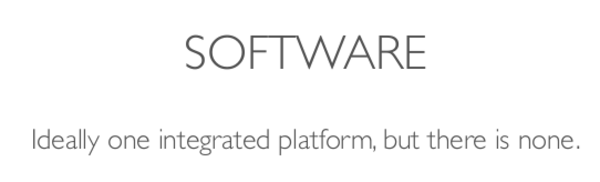

* For software, ideally there would be an integrated platform for all values.
* However, there is none just yet.

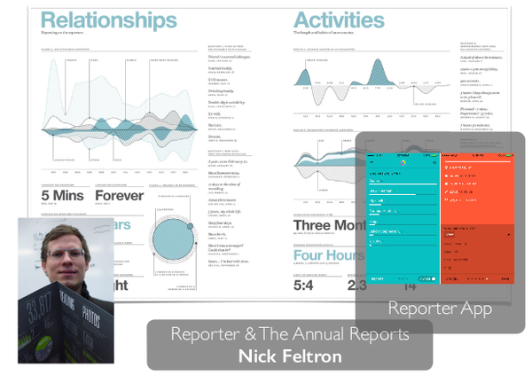

* Example implementation of application that aggregated all sensors values.

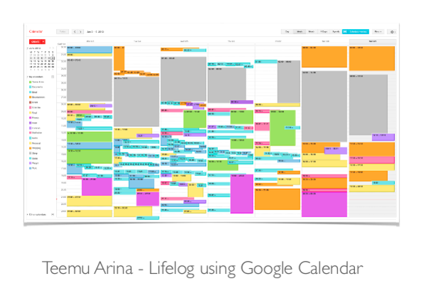

* There is Teemu Arina.
* A Google Calendar plug - in for tracking.
* Nevermind, Teemu Arina is a actually a person.
* His is her Twitter, [https://twitter.com/tar1na](https://twitter.com/tar1na).

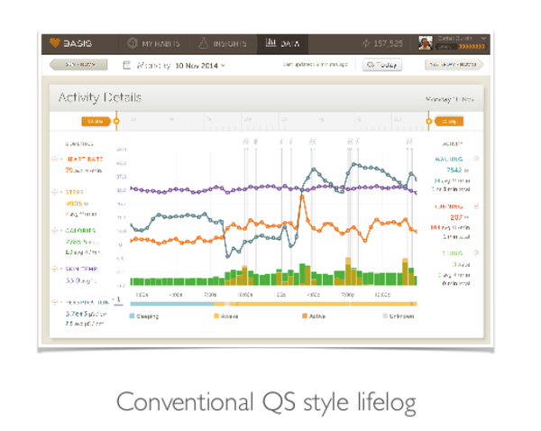

* Conventional QS style lifelog.

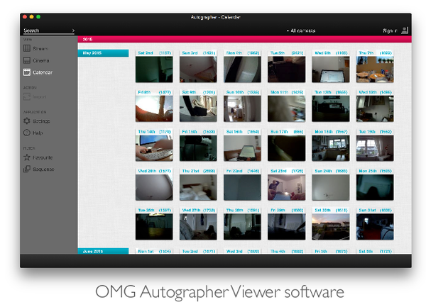

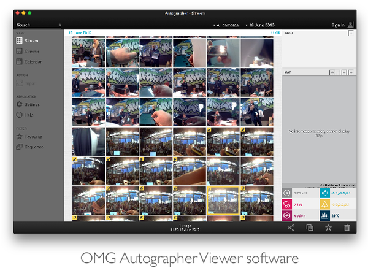

* OMG Autographer has its own application to manage videos.
* However, now the company behind OMG Autographer is closed.

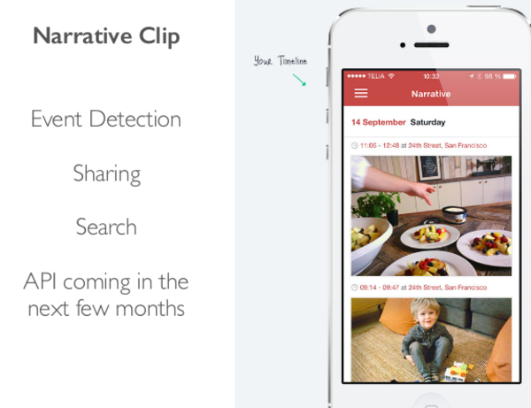

* Mobile application from the Narrative Clip.

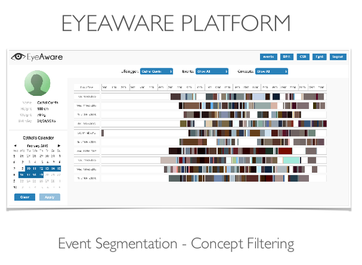

* The EyeWare platform.
* Looking through Google, there is no information on this EyeWare platform.

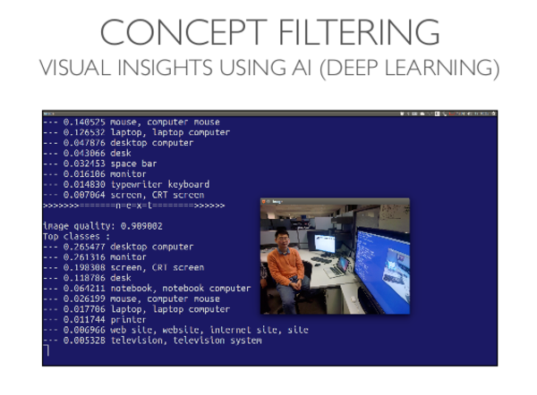

* The use machine learning and AI as a context agent.

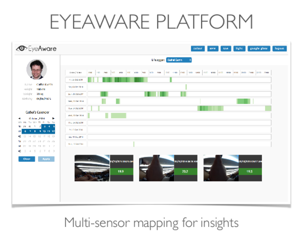

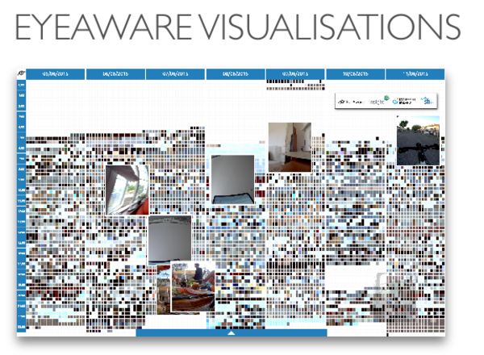

* Another screenshot of EyeWare platform.
* The later part is about EyeWare visualization.
    * I think the bigger image indicates stronger events?

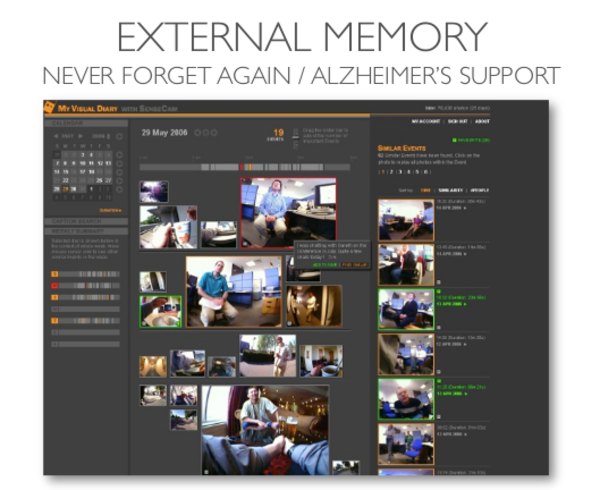

* The automatic visual diaries.

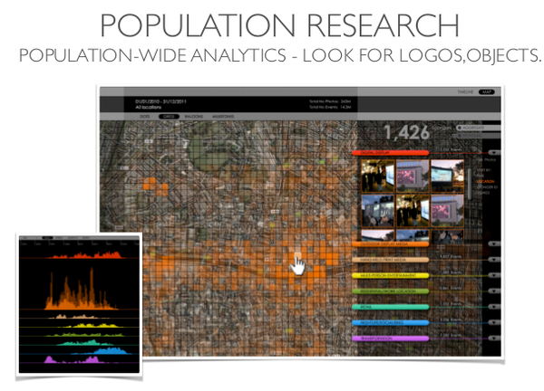

* Lifelogging as population studies.

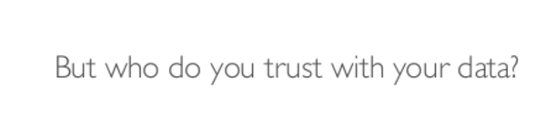

* The problem is now on who you would trust your data?
* Will personal server be a thing in the upcoming future?

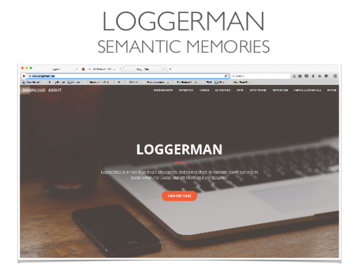

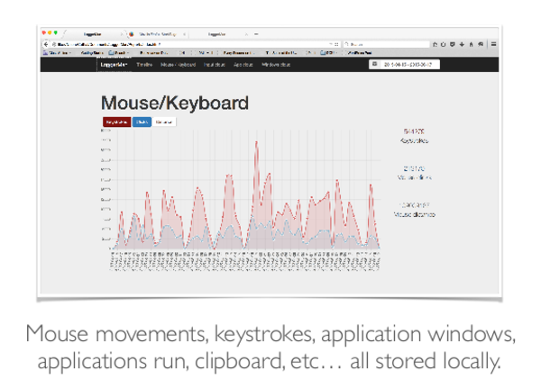

* There is Loggerman.
* Loggerman is a personal keylogger.
* It tracks its user and giver a report and screenshot, on, for example which application that the user mostly used, time, habit, ....
* This is lifelogging for your computer activities.

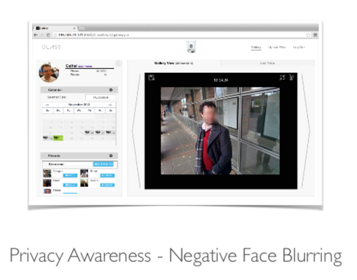

* Samples of privacy awareness.

* The focus of this project is to make a personal search engine.

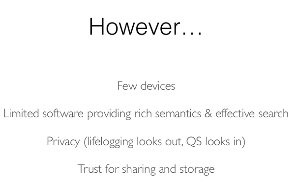

* The current problems for this project.
    * Few devices to test.
    * Limited software.
    * Privacy.
    * Trust on sharing storage.

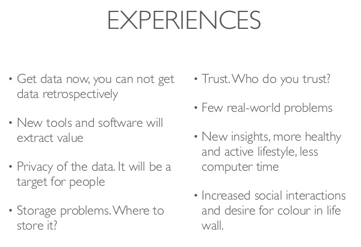

* Experiences (I am not sure on what is this slide want to tell about).
    * Get data now. This means realtime data transfer and processing as fast as possible I think.
    * Who will the user trust for personal data?
    * Few real - world problems. I think that there is no apparent need for a personal search engine just yet.
    * New tools to extract value.
    * Introduce people into insight of themselves.
    * Storage problem. This project is about personal big data.
* Increasing social interactions.