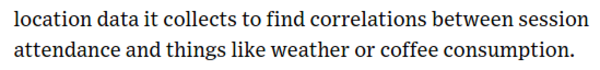
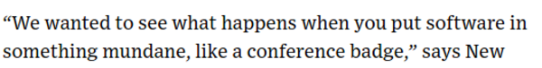

* There is this article about New Relic' Future Stack Badge.
* New Relic is a company in data analytics.
* Here is the link to the Wired article, [https://www.wired.com/2013/10/conference-badges/](https://www.wired.com/2013/10/conference-badges/).

* Based from this article it just promoted their first conference ever in data analytics.
* In that conference, instead given a normal conference badge, every participants were given Future Stack Badge.
* Future Stack badge behave similar to nTag. However it is just more hackable.

* There is this IoT platform called Electric Imp.
* It promises to connect all hardware into the Internet.
* Here is the link to buy Electric Imp, [https://store.electricimp.com/collections/featured-products/products/imp001?variant=31282791826](https://store.electricimp.com/collections/featured-products/products/imp001?variant=31282791826).
* Electric Imp is formed to be similar to SD Card.
* What unique is the pairing system.
* You can setup your Electric Imp with a smart phone. You need to download a specific setup application. And then your smart phone will blink some codes. While blinking you need to tap the Electric Imp into your phone screen to transfer the setup into the Electric Imp.
* This is pretty convenient than having to setup manually using mainstream personal computer.

* It has NFC antenna.
* So, wireless communication can happen if there are two badges nearby to each others.

* It mentioned here that New Relic's Future Stack Badge can be connected to "conference" specific application like in Android or in iOS.
* I am not particularly sure about which application exactly. However, Electric Imp itself can be setup using its own 1st smart phone application.
* So, I think the mentioned application is that Electric Imp 1st party application.
* It is nice to mention that Electric Imp has an accompanying web administrator interface as well. It is similar like Microsoft Azure.

* The badge was used to gather statistic during the conference.

* There is actually a positional sensor.
* I think in my word this would likely to be a local positioning system.

* With big data there are a lot can be connected. For example the connection between weather and coffee consumption to movement of participants in the conference.

* Ubiquitous computing.
* Put computer in anything.

* The question here is (also my question as well, actually), many attendances usually has owned a smart phone, why it is necessary to give them another electronics device?

* The thing is that phone is a personal device.
* An conference is not thing that people attend gradually. Hence, not all people willing to install an application that only be used for several days.

* And the smart phone specifications are not homogeneous. For example Apple still refuse to put NFC in their iPhone.
* Hence, developing a stand - alone embedded device is the way to go since everything is standardized.

* The nice part is that after the Future Stack conference, the hardware badge will be unlocked.
* So the Electric Imp can be hacked as the user's needs.
* Here is the screenshot for the article.

