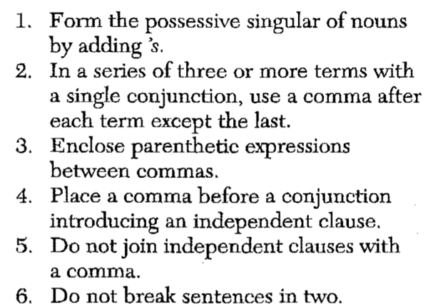

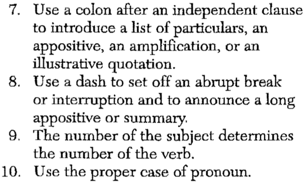

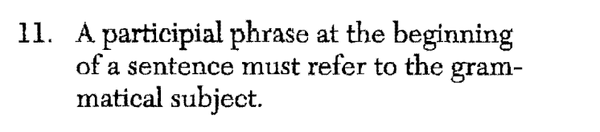

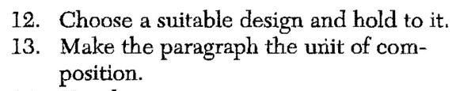

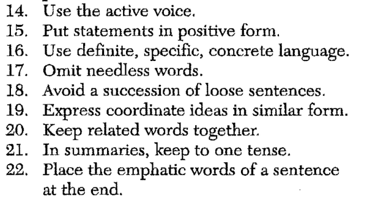

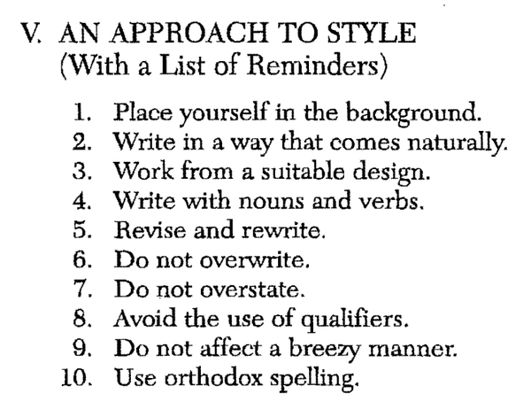

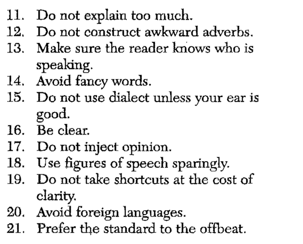

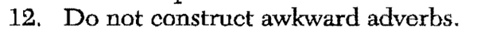

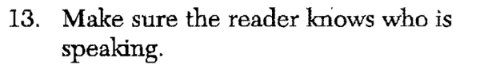

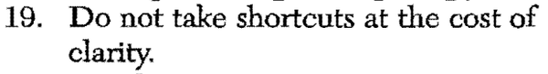

* The table of contents itself already show a lot of informations.

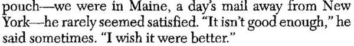

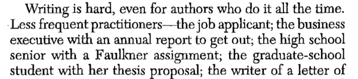

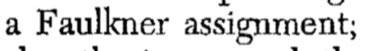

* Faulkner assignment is a writing assignment two write about subject's feeling.

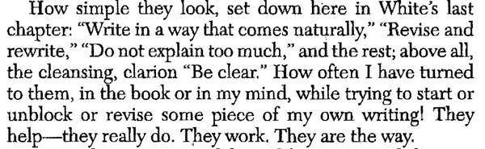

* Some rule of thumbs. There are a lot more explained in this book.
	* Be clear.
	* Do not explain too much.
	* Write in a way that is comes naturally.

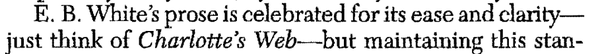

* E.B. White made a popular children book title "Charlotte's Web".

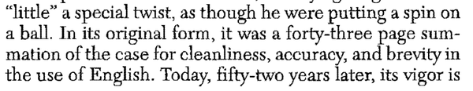