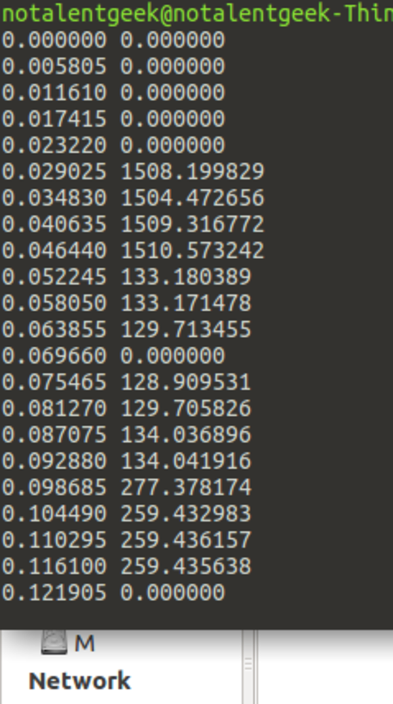
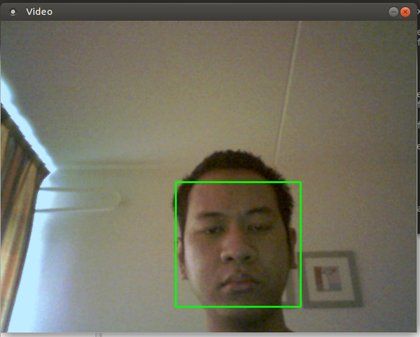
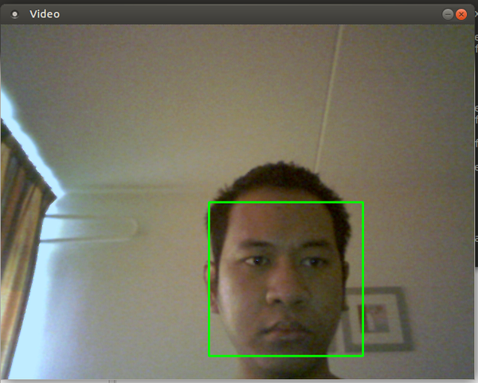
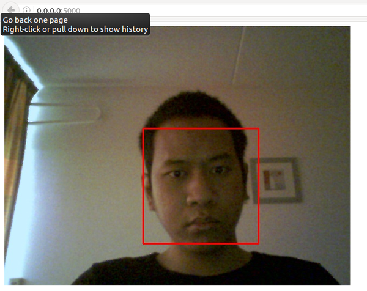

* Second report.

[./20161112-1033-cet-17-report-1.odt](./20161112-1033-cet-17-report-1.odt)

[./20161112-1033-cet-17-report-2.pdf](./20161112-1033-cet-17-report-2.pdf)

* `abio` Python pitch and volume detection.

* Example of face detection using OpenCV Python in desktop native application.

* Example of face detection using OpenCV Python in desktop web application.