* Images I used for my State Of The Art.
* Active Badge, [http://cyborganthropology.com/wiki/images/thumb/0/04/Olivetti-research-active-badge-wearable-computing.jpg/500px-Olivetti-research-active-badge-wearable-computing.jpg](http://cyborganthropology.com/wiki/images/thumb/0/04/Olivetti-research-active-badge-wearable-computing.jpg/500px-Olivetti-research-active-badge-wearable-computing.jpg).

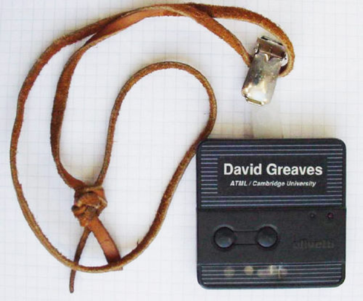

[./20170410-1012-cet-39-image-chapter-2-state-of-the-art-2.jpg](./20170410-1012-cet-39-image-chapter-2-state-of-the-art-2.jpg)

* DEFCON Unofficial AND!XOR Badge, [https://hackadaycom.files.wordpress.com/2016/07/hands-on-andnotxor-defcon-badge-featured.jpg?w=800](https://hackadaycom.files.wordpress.com/2016/07/hands-on-andnotxor-defcon-badge-featured.jpg?w=800).

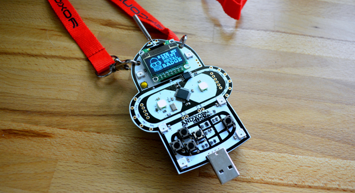

[./20170410-1012-cet-39-image-chapter-2-state-of-the-art-4.jpg](./20170410-1012-cet-39-image-chapter-2-state-of-the-art-4.jpg)

* Hackaday Belgrade/Supercon Badge, [https://hackadaycom.files.wordpress.com/2016/04/mike-harrison-grayscale-belgrade-badge.gif?w=250](https://hackadaycom.files.wordpress.com/2016/04/mike-harrison-grayscale-belgrade-badge.gif?w=250).

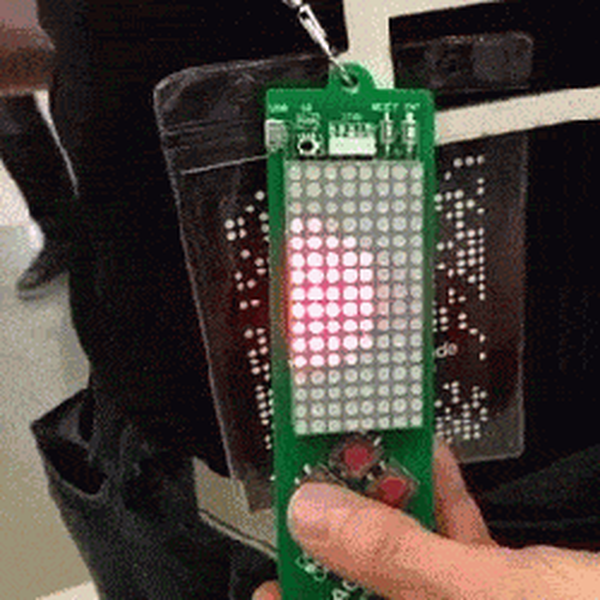

[./20170410-1012-cet-39-image-chapter-2-state-of-the-art-6.gif](./20170410-1012-cet-39-image-chapter-2-state-of-the-art-6.gif)

* Meme/Thinking Tag, [http://www.cs.uml.edu/~fredm/medialab/memetag/mtside.jpg](http://www.cs.uml.edu/~fredm/medialab/memetag/mtside.jpg).

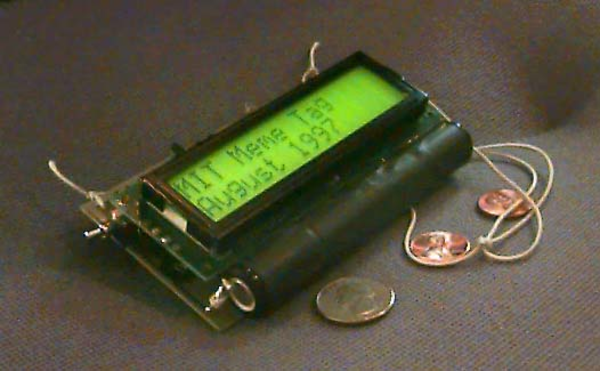

[./20170410-1012-cet-39-image-chapter-2-state-of-the-art-8.jpg](./20170410-1012-cet-39-image-chapter-2-state-of-the-art-8.jpg)

* Memoto/Narrative Clip, [https://thenextweb.com/wp-content/blogs.dir/1/files/2014/02/The-Narrative-Clip.png](https://thenextweb.com/wp-content/blogs.dir/1/files/2014/02/The-Narrative-Clip.png).

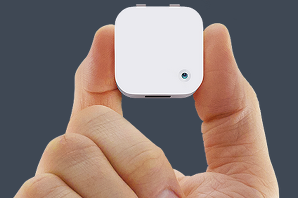

[./20170410-1012-cet-39-image-chapter-2-state-of-the-art-10.png](./20170410-1012-cet-39-image-chapter-2-state-of-the-art-10.png)

* Microsoft SenseCam, [http://img-2.newatlas.com/viconrevue-3.jpg?auto=format%2Ccompress&ch=Width%2CDPR&crop=entropy&fit=crop&h=347&q=60&w=616&s=4d66700cec0d9e8cdb7fcd2e14127d58](http://img-2.newatlas.com/viconrevue-3.jpg?auto=format%2Ccompress&ch=Width%2CDPR&crop=entropy&fit=crop&h=347&q=60&w=616&s=4d66700cec0d9e8cdb7fcd2e14127d58).

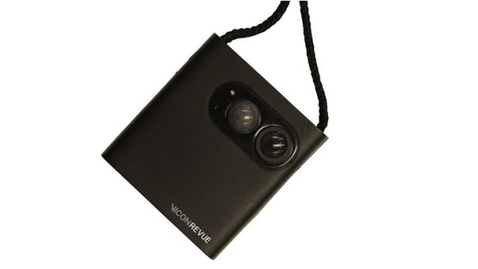

[./20170410-1012-cet-39-image-chapter-2-state-of-the-art-12.jpg](./20170410-1012-cet-39-image-chapter-2-state-of-the-art-12.jpg)

* New Relic Future Stack Badge, [https://www.wired.com/wp-content/uploads/blogs/wiredenterprise/wp-content/uploads/2013/10/PA172725-e1382570588687-660x495.jpg](https://www.wired.com/wp-content/uploads/blogs/wiredenterprise/wp-content/uploads/2013/10/PA172725-e1382570588687-660x495.jpg).

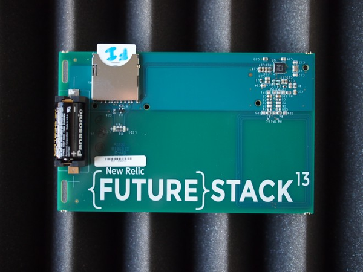

[./20170410-1012-cet-39-image-chapter-2-state-of-the-art-14.jpg](./20170410-1012-cet-39-image-chapter-2-state-of-the-art-14.jpg)

* nTag, [http://img-1.newatlas.com/2543_main.jpg?auto=format%2Ccompress&fit=max&h=670&q=60&w=1000&s=d48339b3a571784b2cb88b8bd7705a6c](http://img-1.newatlas.com/2543_main.jpg?auto=format%2Ccompress&fit=max&h=670&q=60&w=1000&s=d48339b3a571784b2cb88b8bd7705a6c).

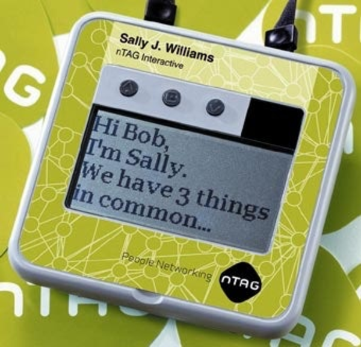

[./20170410-1012-cet-39-image-chapter-2-state-of-the-art-16.jpg](./20170410-1012-cet-39-image-chapter-2-state-of-the-art-16.jpg)

* OMG Autographer, [http://crunchwear.com/wp-content/uploads/autographer-omg-1.jpeg](http://crunchwear.com/wp-content/uploads/autographer-omg-1.jpeg).

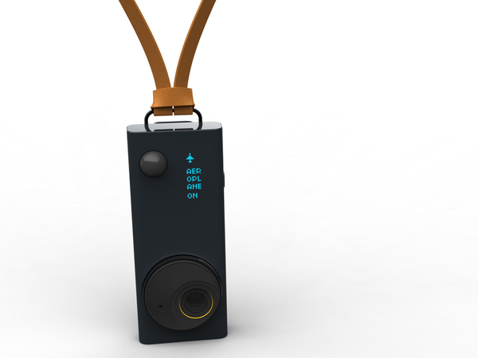

[./20170410-1012-cet-39-image-chapter-2-state-of-the-art-18.jpg](./20170410-1012-cet-39-image-chapter-2-state-of-the-art-18.jpg)

* Queercon Badge, https://blinkylightsninja.files.wordpress.com/2016/08/qc20160015.jpg](https://blinkylightsninja.files.wordpress.com/2016/08/qc20160015.jpg).

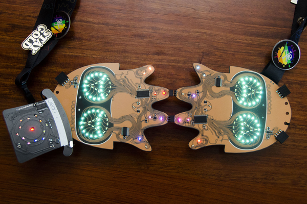

[./20170410-1012-cet-39-image-chapter-2-state-of-the-art-20.jpg](./20170410-1012-cet-39-image-chapter-2-state-of-the-art-20.jpg)

* Rhythm Open Badge, [https://static1.squarespace.com/static/55f61de9e4b0794fbe211cb5/t/5874260029687f7cd5e07541/1484006916888/](https://static1.squarespace.com/static/55f61de9e4b0794fbe211cb5/t/5874260029687f7cd5e07541/1484006916888/).

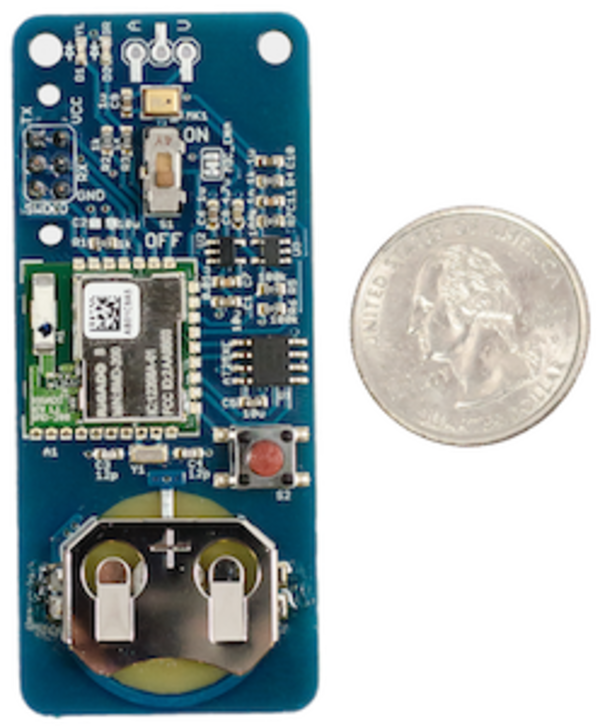

[./20170410-1012-cet-39-image-chapter-2-state-of-the-art-22.png](./20170410-1012-cet-39-image-chapter-2-state-of-the-art-22.png)

* Sociometer, [http://alumni.media.mit.edu/~tanzeem/shortcuts/sociometer_6sm.jpg](http://alumni.media.mit.edu/~tanzeem/shortcuts/sociometer_6sm.jpg).

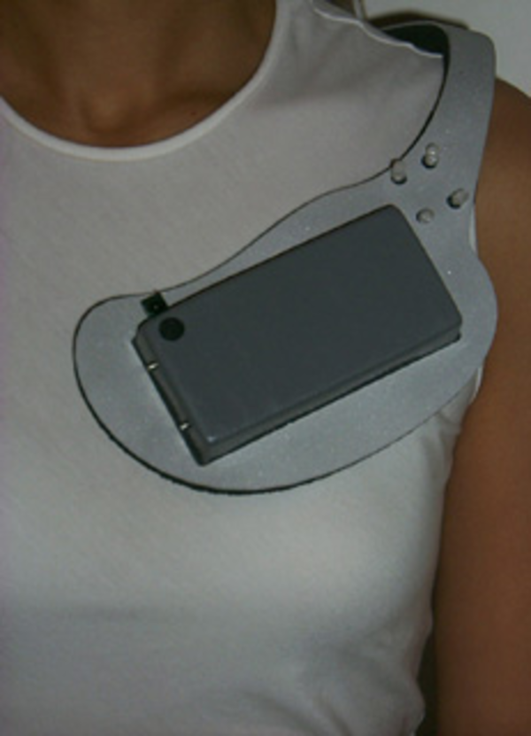

[./20170410-1012-cet-39-image-chapter-2-state-of-the-art-24.jpg](./20170410-1012-cet-39-image-chapter-2-state-of-the-art-24.jpg)

* Sociometric Badge, [http://hd.media.mit.edu/badges/Sociometric%20Badge.jpg](http://hd.media.mit.edu/badges/Sociometric%20Badge.jpg).

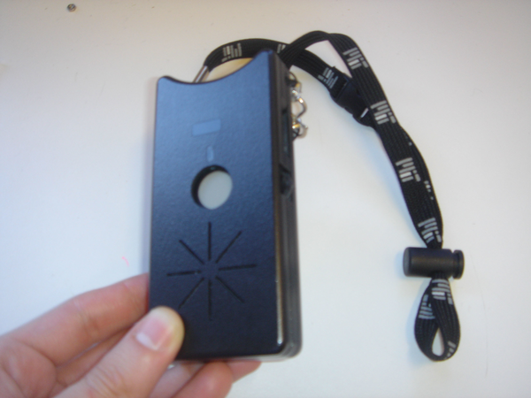

[./20170410-1012-cet-39-image-chapter-2-state-of-the-art-26.jpg](./20170410-1012-cet-39-image-chapter-2-state-of-the-art-26.jpg)

* Spinner, [http://cdn.makezine.com/uploads/2010/04/spinner2.jpg]http://cdn.makezine.com/uploads/2010/04/spinner2.jpg).

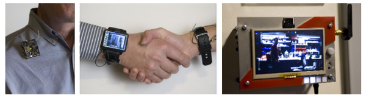

[./20170410-1012-cet-39-image-chapter-2-state-of-the-art-28.jpg](./20170410-1012-cet-39-image-chapter-2-state-of-the-art-28.jpg)

[./20170410-1012-cet-39-image-chapter-2-state-of-the-art-29.png](./20170410-1012-cet-39-image-chapter-2-state-of-the-art-29.png)

* UbER Badge, [https://www.researchgate.net/profile/Joseph_Paradiso/publication/244445686/viewer/AS:119635777167360@1405534800559/background/2.png](https://www.researchgate.net/profile/Joseph_Paradiso/publication/244445686/viewer/AS:119635777167360@1405534800559/background/2.png).

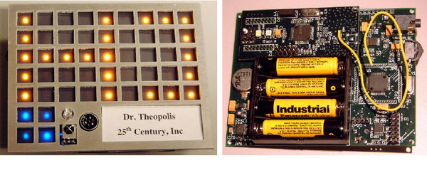

[./20170410-1012-cet-39-image-chapter-2-state-of-the-art-31.png](./20170410-1012-cet-39-image-chapter-2-state-of-the-art-31.png)

[./20170410-1012-cet-39-image-chapter-2-state-of-the-art-32.png](./20170410-1012-cet-39-image-chapter-2-state-of-the-art-32.png)

* Vocera Communication Badge, [http://vertassets.blob.core.windows.net/image/76d9176a/76d9176a-f73f-4e85-86e8-6ef02642d56f/b3000nwhitefrontscreens_nursecall_jpg.jpeg](http://vertassets.blob.core.windows.net/image/76d9176a/76d9176a-f73f-4e85-86e8-6ef02642d56f/b3000nwhitefrontscreens_nursecall_jpg.jpeg).

[./20170410-1012-cet-39-image-chapter-2-state-of-the-art-34.jpg](./20170410-1012-cet-39-image-chapter-2-state-of-the-art-34.jpg)