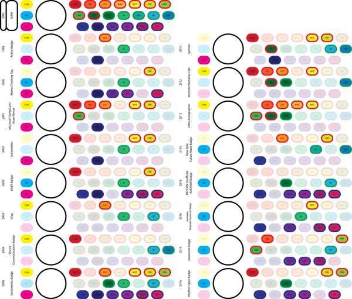
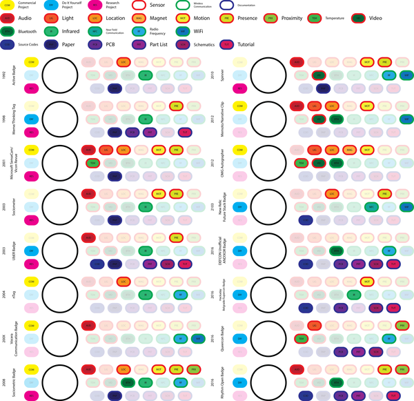
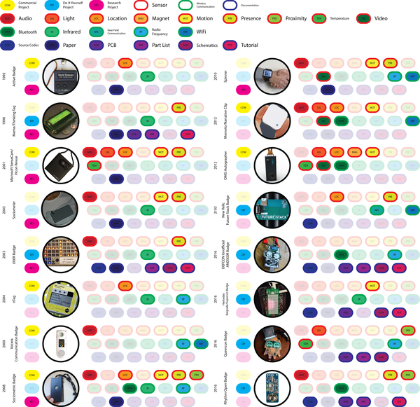
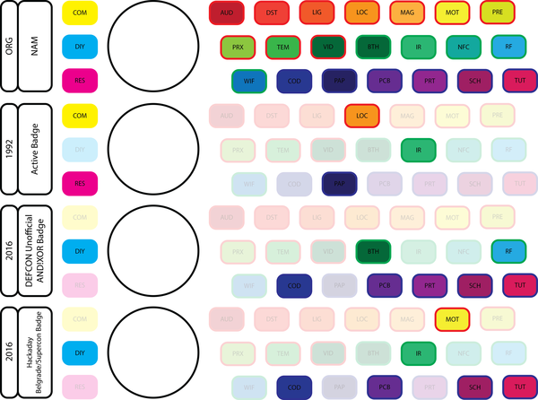

* Above images are the finished version.
* Windows 10 messed up alphabetical order, so `15.png` < `4.png`.

[./20170410-1012-cet-40-paper-draft-chapter-2-state-of-the-art-table-6.ai](./20170410-1012-cet-40-paper-draft-chapter-2-state-of-the-art-table-6.ai)

[./20170410-1012-cet-40-paper-draft-chapter-2-state-of-the-art-table-7.ai](./20170410-1012-cet-40-paper-draft-chapter-2-state-of-the-art-table-7.ai)

[./20170410-1012-cet-40-paper-draft-chapter-2-state-of-the-art-table-8.png](./20170410-1012-cet-40-paper-draft-chapter-2-state-of-the-art-table-8.png)

[./20170410-1012-cet-40-paper-draft-chapter-2-state-of-the-art-table-9.ai](./20170410-1012-cet-40-paper-draft-chapter-2-state-of-the-art-table-9.ai)

[./20170410-1012-cet-40-paper-draft-chapter-2-state-of-the-art-table-10.png](./20170410-1012-cet-40-paper-draft-chapter-2-state-of-the-art-table-10.png)

[./20170410-1012-cet-40-paper-draft-chapter-2-state-of-the-art-table-11.ai](./20170410-1012-cet-40-paper-draft-chapter-2-state-of-the-art-table-11.ai)

[./20170410-1012-cet-40-paper-draft-chapter-2-state-of-the-art-table-12.ai](./20170410-1012-cet-40-paper-draft-chapter-2-state-of-the-art-table-12.ai)

[./20170410-1012-cet-40-paper-draft-chapter-2-state-of-the-art-table-13.png](./20170410-1012-cet-40-paper-draft-chapter-2-state-of-the-art-table-13.png)

[./20170410-1012-cet-40-paper-draft-chapter-2-state-of-the-art-table-14.ai](./20170410-1012-cet-40-paper-draft-chapter-2-state-of-the-art-table-14.ai)

[./20170410-1012-cet-40-paper-draft-chapter-2-state-of-the-art-table-15.ai](./20170410-1012-cet-40-paper-draft-chapter-2-state-of-the-art-table-15.ai)

[./20170410-1012-cet-40-paper-draft-chapter-2-state-of-the-art-table-16.png](./20170410-1012-cet-40-paper-draft-chapter-2-state-of-the-art-table-16.png)

[./20170410-1012-cet-40-paper-draft-chapter-2-state-of-the-art-table-17.ai](./20170410-1012-cet-40-paper-draft-chapter-2-state-of-the-art-table-17.ai)

[./20170410-1012-cet-40-paper-draft-chapter-2-state-of-the-art-table-18.ai](./20170410-1012-cet-40-paper-draft-chapter-2-state-of-the-art-table-18.ai)

[./20170410-1012-cet-40-paper-draft-chapter-2-state-of-the-art-table-19.ai](./20170410-1012-cet-40-paper-draft-chapter-2-state-of-the-art-table-19.ai)

[./20170410-1012-cet-40-paper-draft-chapter-2-state-of-the-art-table-20.png](./20170410-1012-cet-40-paper-draft-chapter-2-state-of-the-art-table-20.png)

[./20170410-1012-cet-40-paper-draft-chapter-2-state-of-the-art-table-21.ai](./20170410-1012-cet-40-paper-draft-chapter-2-state-of-the-art-table-21.ai)

[./20170410-1012-cet-40-paper-draft-chapter-2-state-of-the-art-table-22.ai](./20170410-1012-cet-40-paper-draft-chapter-2-state-of-the-art-table-22.ai)

[./20170410-1012-cet-40-paper-draft-chapter-2-state-of-the-art-table-23.ai](./20170410-1012-cet-40-paper-draft-chapter-2-state-of-the-art-table-23.ai)

[./20170410-1012-cet-40-paper-draft-chapter-2-state-of-the-art-table-24.ai](./20170410-1012-cet-40-paper-draft-chapter-2-state-of-the-art-table-24.ai)

[./20170410-1012-cet-40-paper-draft-chapter-2-state-of-the-art-table-25.ai](./20170410-1012-cet-40-paper-draft-chapter-2-state-of-the-art-table-25.ai)