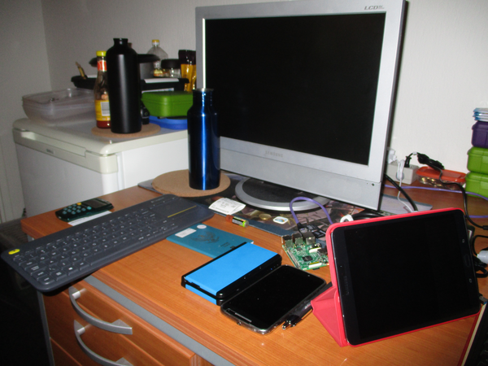
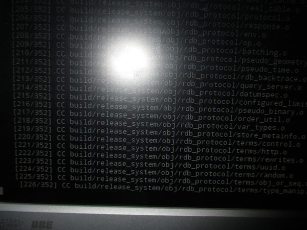

* This was my setup around November 2016.

* Fully fledged keyboard to help me type faster.
* Android tablet in case I am bored (YouTube, NetFlix, Reddit, ...).

* Behind my Android tablet there are my 3DS to play Pokemon or MonsterHunter and phone.
* I use my tablet as a time tracker as well and Pomodoro.

* Stupid me compiling RethinkDB from source where I can just download it from adding 3rd party PPA.
* Took it like 4 hours to compile everything using Raspberry PI 3.

* Basic setup for sociometric badge.

* Still compiling.