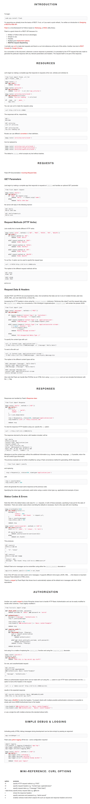
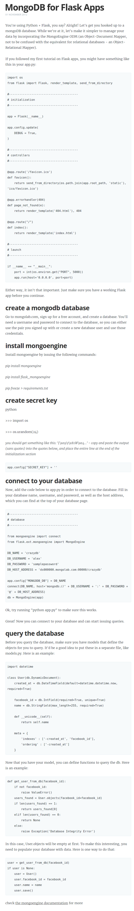

* This is a getting started tutorial on how to implement REST API with Flask, [http://blog.luisrei.com/articles/flaskrest.html](http://blog.luisrei.com/articles/flaskrest.html).
* Here is the screenshot of the tutorial.

* Here is a tutorial on how to use MongoDB with Flask based web application, [http://blog.shea.io/mongodb-for-flask-apps/](http://blog.shea.io/mongodb-for-flask-apps/).
* Here is the full screenshot of the tutorial.

