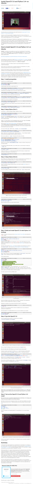

* Here is a tutorial on how to install OpenCV 3.0 in Ubuntu, [http://www.pyimagesearch.com/2015/07/20/install-opencv-3-0-and-python-3-4-on-ubuntu/](http://www.pyimagesearch.com/2015/07/20/install-opencv-3-0-and-python-3-4-on-ubuntu/).
* Here is the screenshot of the tutorial.



* This tutorial shown these compilation settings.

```markdown
cmake -D CMAKE_BUILD_TYPE=RELEASE \
    -D CMAKE_INSTALL_PREFIX=/usr/local \
    -D INSTALL_C_EXAMPLES=ON \
    -D INSTALL_PYTHON_EXAMPLES=ON \
    -D OPENCV_EXTRA_MODULES_PATH=~/opencv_contrib/modules \
    -D BUILD_EXAMPLES=ON ..
```

* However since I want to use the version 3.1.0. I go with this compilation settings.

```markdown
cmake -D CMAKE_BUILD_TYPE=RELEASE \
    -D CMAKE_INSTALL_PREFIX=/usr/local \
    -D INSTALL_C_EXAMPLES=OFF \
    -D INSTALL_PYTHON_EXAMPLES=ON \
    -D OPENCV_EXTRA_MODULES_PATH=~/opencv_contrib/modules \
    -D BUILD_EXAMPLES=ON ..
```

* Notice the difference in `-D INSTALL_C_EXAMPLES=OFF`.
* And for creating sym link into my virtual environment or my Python project folder, I use this terminal codes.

```markdown
cd /cd/to/the/project/folder/or/login/into/virtualenv
ln -s /usr/local/lib/python3.5/dist-packages/cv2.cpython-35m-x86_64-linux-gnu.so cv2.so
```

* The `/usr/local/lib/python3.5/dist-packages/cv2.cpython-35m-x86_64-linux-gnu.so` location will depend on operating each operating system. In my case I use Ubuntu Mate 16.04.
* In the new OpenCV (3.0.0 >) the `cv2.cv.CV_HAAR_SCALE_IMAGE` is replaced with `cv2.CASCADE_SCALE_IMAGE` since the `cv` namespace is deprecated in later version of OpenCV.
* I opened OpenCV StackOverflow question here, [http://stackoverflow.com/questions/41341409/where-is-cv-haar-scale-image-in-opencv-3-1-0-with-python-3-5](http://stackoverflow.com/questions/41341409/where-is-cv-haar-scale-image-in-opencv-3-1-0-with-python-3-5).
* Here is a Git terminal command to revert last commit (basically undo the previous commit), `git reset HEAD~`. After use this command make sure to add and commit back. Here is the StackOverflow discussion, [http://stackoverflow.com/questions/927358/how-to-undo-last-commits-in-git](http://stackoverflow.com/questions/927358/how-to-undo-last-commits-in-git).
* In this program there are like 4 variables that I need to set.
* First is the client name. Perhaps, I can make the terminal command to be like this.

```markdown
python -B main.py -u mikaelPratama #Or.
python -B main.py --username mikaelPratama # Or.
```