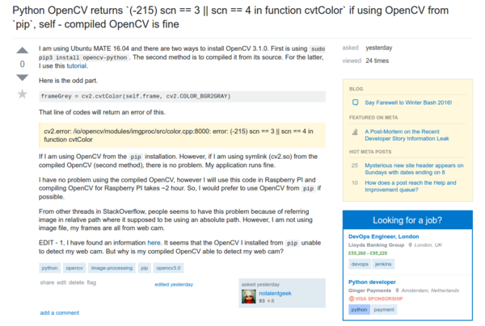
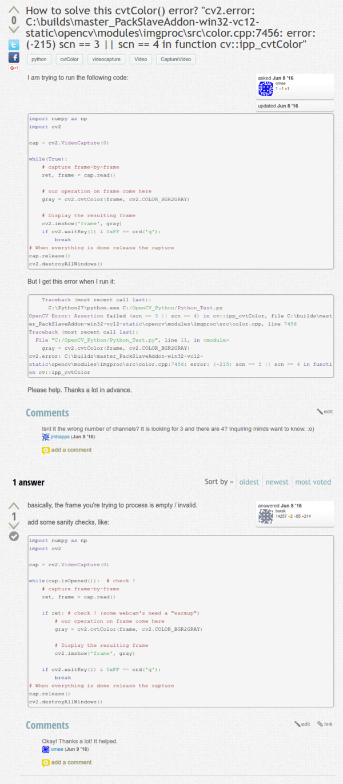

* Example of non - blocking PythonLIRC, when waiting for incoming IR input.

```markdown
sockid = lirc.init("python3", ".lircrc". blocking=False)
```

* The default method will halt the whole terminal in case `lirc.nextcode()` issued.
* With `blocking=False`, `lirc.nextcode()` will not halt the whole program.
* I got this information from here, [https://github.com/tompreston/python-lirc/issues/2](https://github.com/tompreston/python-lirc/issues/2).
* Here is an example of `requirement.txt` for `pip`. This is similar to `package.json` in NPM.

```markdown
# Requirements without version specifiers.
beautifulsoup4
nose
nose-cov
# Requirements with version specifiers.
coverage != 3.5             # Version exclusion. Anything except version 3.5.
docopt == 0.6.1             # Version matching. Must be version 0.6.1.
keyring >= 4.1.1            # Minimum version 4.1.1.
Mopidy-Dirble ~= 1.1        # Compatible release. Same as >= 1.1, == 1.*.
# Refer to other requirements files.
-r other-requirements.txt
# A particular file.
./downloads/numpy-1.9.2-cp34-none-win32.whl
http://wxpython.org/Phoenix/snapshot-builds/wxPython_Phoenix-3.0.3.dev1820+49a8884-cp34-none-win_amd64.whl
# Additional requirements without version specifiers.
# Same as 1st section, just here to show that you can
# put things in any order.
green
rejected
```

* The command for installing Python libraries within a virtual environment is `pip install -r requirement.txt` or `pip3 install -r requirement.txt`.
* There is this command to list all used Python dependencies automatically, `pip freeze > requirements.txt` or `pip3 freeze > requirements.txt`. However, if you are not in virtual environment, this command will list all installed Python libraries system wide.
* There is actually pre - compiled OpenCV 3.1.0 in PyPI. It is listed as `opencv-python`. However, using this breaks my program for some reason that I do not know yet.
* For this case, I opened a StackOverflow thread over here, [http://stackoverflow.com/questions/41539595/python-opencv-returns-215-scn-3-scn-4-in-function-cvtcolor-if-usin](http://stackoverflow.com/questions/41539595/python-opencv-returns-215-scn-3-scn-4-in-function-cvtcolor-if-usin).
* But nothing in that thread just yet, sadly. Here is the screenshot of my thread in StackOverflow.



* From OpenCV's own "StackOverflow" I got this information, [http://answers.opencv.org/question/95889/how-to-solve-this-cvtcolor-error-cv2error-cbuildsmaster_packslaveaddon-win32-vc12-staticopencvmodulesimgprocsrccolorcpp7456-error-215-scn-3-scn-4-in/](http://answers.opencv.org/question/95889/how-to-solve-this-cvtcolor-error-cv2error-cbuildsmaster_packslaveaddon-win32-vc12-staticopencvmodulesimgprocsrccolorcpp7456-error-215-scn-3-scn-4-in/).
* Basically the installed OpenCV from `pip3` could not access web cam. However, for some reason the compiled OpenCV works fine and is able to detect my web cam.
* Here is the screenshot from the [http://answers.opencv.org/question/95889/how-to-solve-this-cvtcolor-error-cv2error-cbuildsmaster_packslaveaddon-win32-vc12-staticopencvmodulesimgprocsrccolorcpp7456-error-215-scn-3-scn-4-in/](http://answers.opencv.org/question/95889/how-to-solve-this-cvtcolor-error-cv2error-cbuildsmaster_packslaveaddon-win32-vc12-staticopencvmodulesimgprocsrccolorcpp7456-error-215-scn-3-scn-4-in/).



* There is a problem when using LIRC in my main application for this project that says along this line, "LIRC, unable to read module.".
* This usually happens because of these.
    * At this moment my programming threads are never closed properly. Hence, sometimes the LIRC is still "listening" to previous run and not prepared for the current run.
    * Did not use `sudo` when launching the program. For the current release I did everything in `sudo` for the Raspbian. I do not know yet on how to properly assign user permission in Linux.
    * Halted by blocking `lirc.nextcode()`. So please use, `sockid = lirc.init("python3", ".lircrc". blocking=False)`.
* Example on how to sort an array/list of string in Python.

```markdown
mylist = ["b", "C", "A"]
mylist.sort()
```

* Example on deleting elements in an array/list in Python, [http://stackoverflow.com/questions/14465279/delete-all-objects-in-a-list](http://stackoverflow.com/questions/14465279/delete-all-objects-in-a-list).

```markdown
del exampleList[0]      # Deleting element at index 0 `exampleList`.
del exampleList[:-2]    # Deleting the last 2 elements in `exampleList`.
del exampleList[:2]     # Deleting the first 2 elements in `exampleList`.
del exampleList[:]      # Deleting all elements in `exampleList`.
```

* I use this `pip show pyton-package-name` or `pip3 show pyton-package-name` to show the installed version of a Python package I installed using `pip` or `pip3`.
* Example on removing 2 final characters in Python's string, [http://stackoverflow.com/questions/15478127/remove-final-character-from-string-python](http://stackoverflow.com/questions/15478127/remove-final-character-from-string-python).

```markdown
exampleString =  "abcdefghij"
exampleString = exampleString[:-2]
```

* I think I can use the same operation for deleting element(s) in an array/list in Python for string as well.