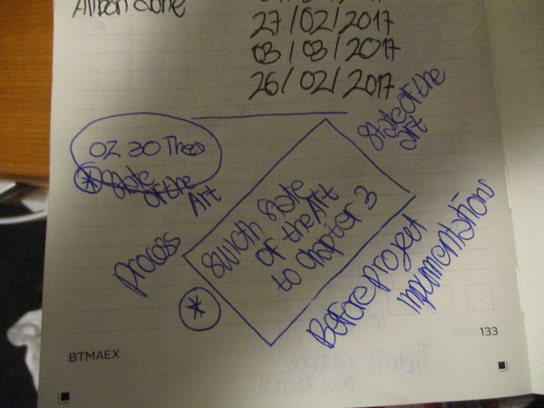
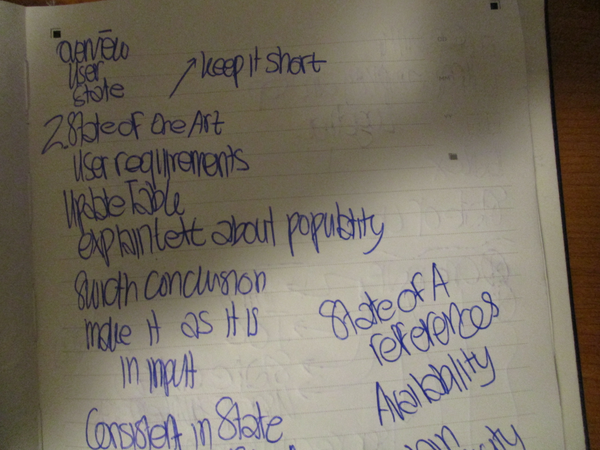
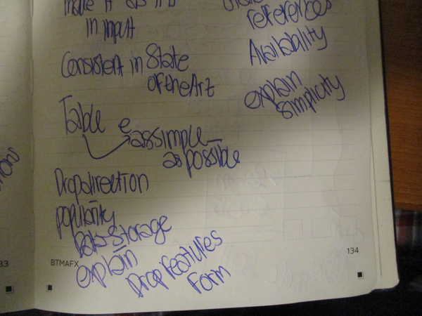
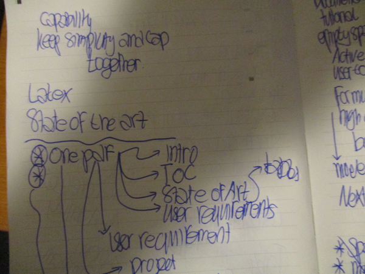
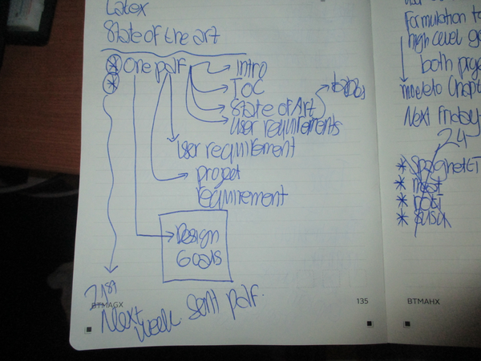
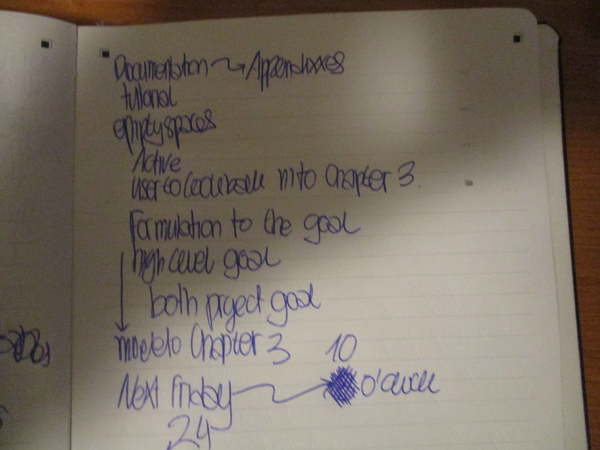

* This is meeting to - do list from my last week meeting with Khiet.
* These are things that I need to do for this week.

* There are a lot of things those still need to be fixed from the Chapter 2: State Of The Art.
* There was a concept to move/switch the Chapter 2: State Of The Art with Chapter 3: User Groups And Design Goals.
* The main thing is to have State Of The Art, User And Design Goals, as well as Project Requirements before Project Implementations.
* However, after this meeting it is concluded to have these.
	* Keep State Of The Art as Chapter 2.
	* Keep User Groups as Chpater 3.
	* However, move the Design Goals as a separate chapter, right before a chapter about Project Implementations.
	* So as proposed during this meeting.
		* Chapter 2: State Of The Art.
		* Chapter 3: User Groups.
		* Chapter 4: Project Requirements.
		* Chapter 5: Design Goals.
		* Chapter 6: Project Implementations.
* I would like to change Chapter 4: Project Requirements into Chapter 4: Project Limitations and Requirements. This is to fit its purposes.
  

* In the chapter about user, the contents are mainly about these.
	* Overview and general discussion about what and who the user group is.
	* Check a lot of description from the previous documentation about user group as well.
		* Use the bullet points from there.
		* And make sure to have everything the same for each user groups.
* The introduction for the Chapter 2: State Of The Art needs to be short.
* Do not mention the user groups yet within this chapter.
* Just put everything as brief and as it is.
* And then later in the Chapter 3: User Groups, I need to explain the connection within each user group to the State Of The Art analysis from the previous chapter.
* I need to update the table.
	* Erase everything that is more or less the same.
	* I think the consensus was to make the table just for input, connection, and description.
	* The rest would be explanained within the paragraph.
* In the paragraph, make sure to mention the availability of the documentation.
* And then there would be special appendix page to mention where the documentation is related. The documentation would be something related to these.
	* Documentation website (something similar like Wiki).
	* How - To Tutorial (a la Instructables). 
	* PCB design.
	* Schematics.
	* Source code.
* Re - make the State Of The Art conclusion to be as general and to be as basic as possible.
* Make the input column to be more simple.
* Later in the chapter about design goals please compare back the table with additional row about the proposed solution.

* Drop the connection direction column in the State Of The Art table.
* However, I would prefer to make it simpler.
* So the State Of The Art table would be input, connectivity, and data storage.
* The table should be as brief as possible as well so that it can be compared to the solutions offered by my project.
* Also remove column about features and form and just explain it in the paragraph.
* I would suggest to make something like user interaction column or user feedback. Or just make both!

* Try to make this in LaTex.

* Make everything in one .pdf file.
* Try to make everything until the design goals.

* These was from meeting with Elze.
* Make simple prototype for appendices.
* In table remove question marks with just empty cell.
* Try to explain everything with active sentence as possible.
* Formulation of the goal is to create higher level goal.
* And mention what is the goal of each user grops within the chapter about user. The chapter about design goals should be just solely mention about the design goals itself and nothing else.