* Here are things that I need to change in my research paper.

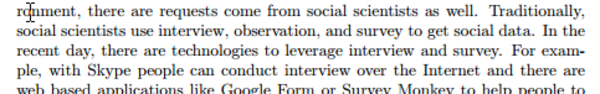

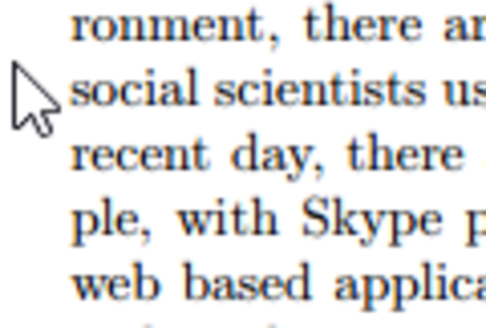

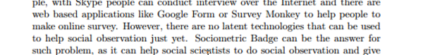

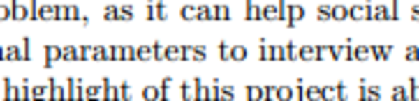

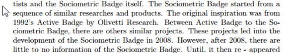

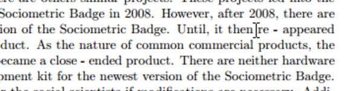

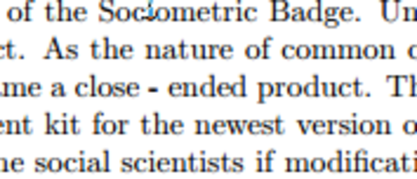

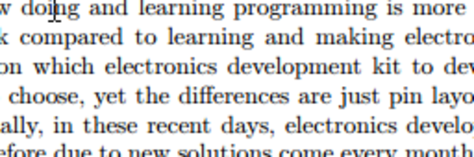

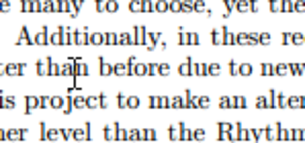

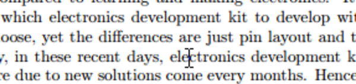

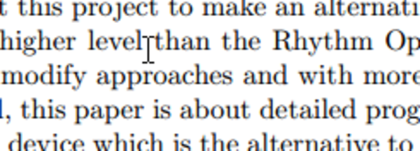

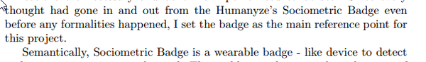

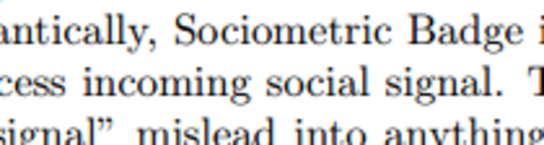

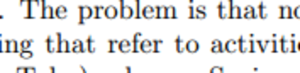

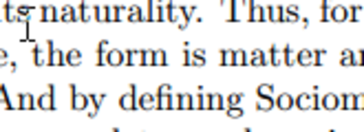

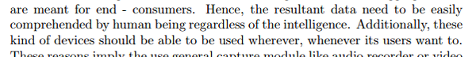

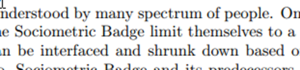

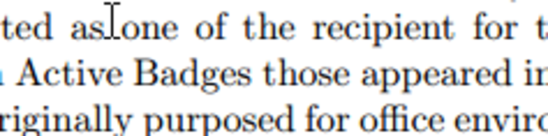

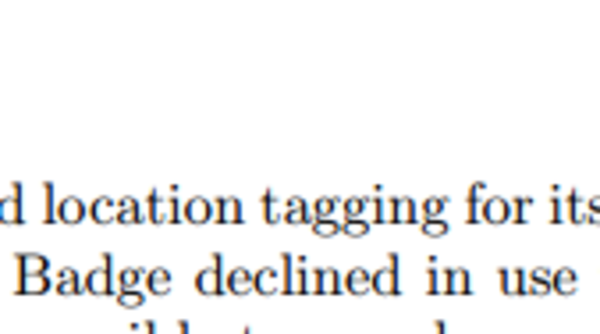

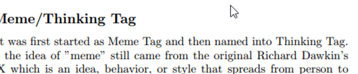

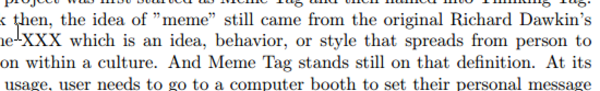

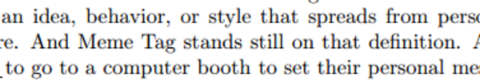

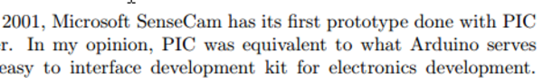

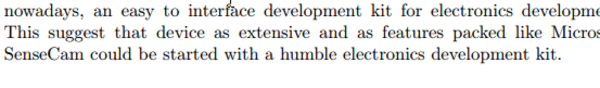

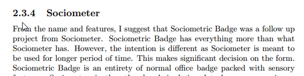

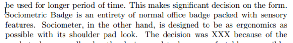

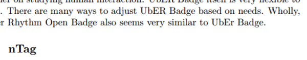

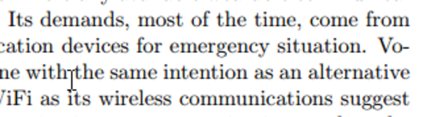

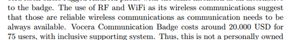

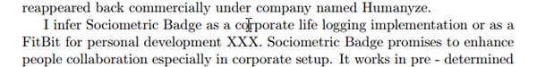

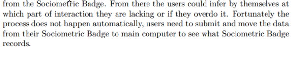

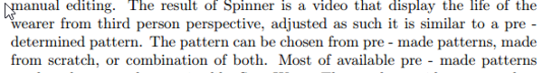

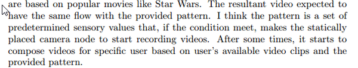

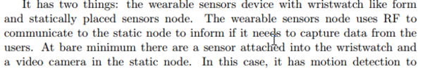

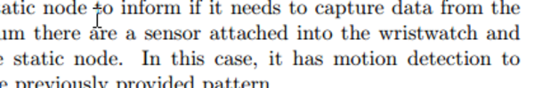

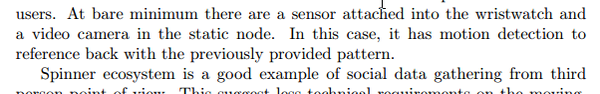

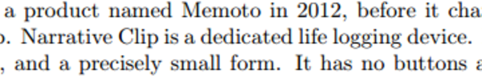

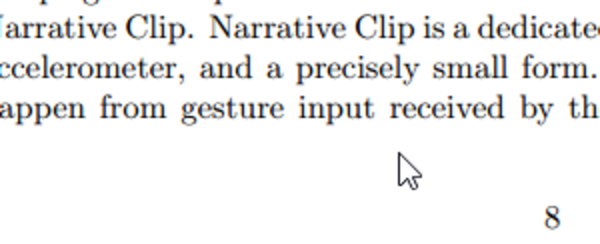

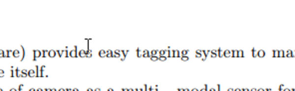

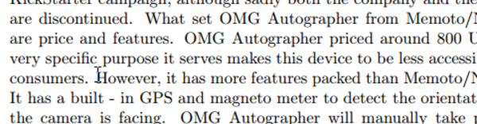

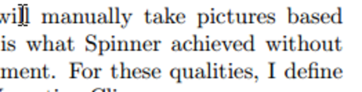

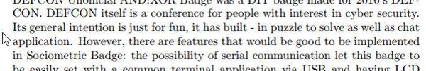

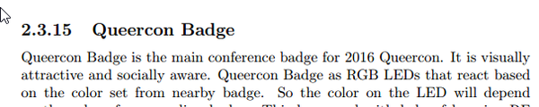

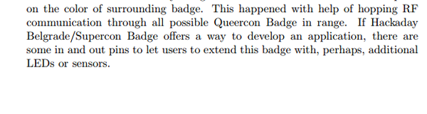

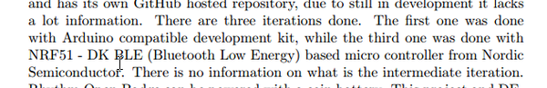

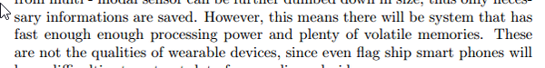

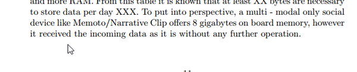

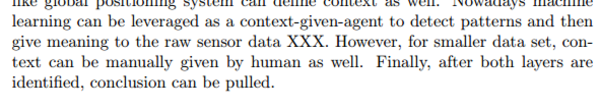
* Attached document.

[./20170526-2040-cet-48-49.pdf](./20170526-2040-cet-48-49.pdf)

* Draft....
    * Between Active Badge to the Sociometric Badge, there others similar projects that iterate through into the development of Sociometric Badge in 2008.
    * As the nature of commercial products....
    * I do not like the term "close - ended" project.
    * Change it into, "classified and shut".
    * As the nature of commercial product, Sociometric Badge became classified and shut product.
    * Electronics development platform.
    * Electronics development platform depreciate faster than before, due to new alternatives comes every months.
    * It is hard to make choice on which development platform to develop with. There are a lot of options, yet the differences are unnoticeable. These means that every options can be tweaked as such it behaves and similar to the others.
    * ..., and with more about programming and less electronics.
    * The next paragraph is subject to change.
    * Next I need to deal with Chapter 2.
    * There are many ideas of social data gathering those an be looked into, thus the criteria can go up infinitely.
    * I set the Humanyze's Sociometric Badge as the main reference for this project.
    * ...incoming social signals.
    * ...those refer to social activities over the Internet.
    * ...the physical form is matter.
    * ...whenever their users want to.
    * ...Sociometric Badge need to limit themselves.
    * Aside from Active Badge those were appeared....
    * ...infrared local position system....
    * The project was started as Meme Tag, but there was a project about Thinking Tag that showed exact features, although with different name and uses.
    * Or, as I defined myself Dawkin's meme as cultural gene.
    * Meme Tag stands still on that definition.
    * Back then, PIC was equivalent to what Arduino serves nowadays, ....
    * ...a humble electronics development platform.
    * From the features and name suggest, Sociometer is a follow up project to Sociometric Badge.
    * ...packed with sensors and wireless communication protocols.
    * Wholly, the later Rhythm Open Badge shares similar trait with UbER Badge.
    * ...for emergency situations.
    * ...as communication is the main selling point of Vocera Communication Badge.
    * Separate the paragraph about price.
    * Or as XXX article suggests it is a FitBit for personal development.
    * Make into another paragraph and set it into 2 separate sentences.
    * ..., adjusted as such to meet the conditions of the pre - determined pattern.
    * I think, ....
    * to capture data for the nearby users.
    * ...there is a sensor....
    * In this case, it has a motion detection to be referred back to the previously supplied pattern.
    * Erase the sentence about, "Narrative Clip is a dedicated life logging device.".
    * ...from gesture inputs....
    * ...provides an automated tagging system....
    * ...due to very specific purposes it serves, makes this device to be less accessible....
    * To some senses, this is what Spinner achieved, without ....
    * For these qualities, OMG Autographer is a smarter version of Narrative Clip.
    * This suggest that people would not mind to be recorded if they are aware in the first place.
    * Its general intention is just for fun. It has....
    * Remove the paragraph about using NRF development kit up until Rhythm Open Badge introduced.
    * It is a socially aware and visually active wearable device.
    * Queercon Badge has....
    * So, the color....
    * If Hackaday Belgrade/Supercon Badge offers a way to modify its software. Queercon Badge lets its user to plug - in hardware extensions via in - out pins in the top most part of it.
* ... uses NRF51 - DK BLE based micro - controller from Nordic Semiconductor. Perhaps, the same variant used in Hackaday Belgrade/Supercon Badge. Goes to next paragraph about the importance of having low powered wireless communication.s to next paragraph about the importance of having low powered wireless communication.