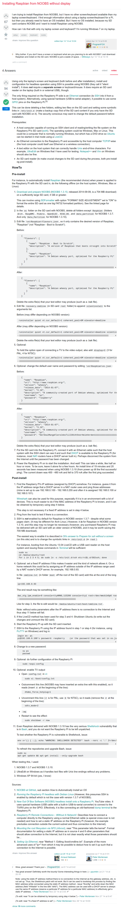

* Here is a tutorial on how to install Raspbian from NOOBS without computer display/monitor, [http://raspberrypi.stackexchange.com/questions/15192/installing-raspbian-from-noobs-without-display/19928](http://raspberrypi.stackexchange.com/questions/15192/installing-raspbian-from-noobs-without-display/19928).
* Here is the screenshot of the important parts.

