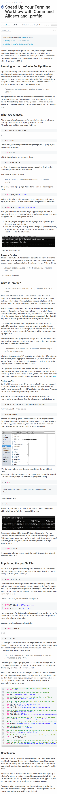

* Tutorial on how to make terminal command shorter in Linux, [https://computers.tutsplus.com/tutorials/speed-up-your-terminal-workflow-with-command-aliases-and-profile--mac-30515](https://computers.tutsplus.com/tutorials/speed-up-your-terminal-workflow-with-command-aliases-and-profile--mac-30515).
* Full page screenshot.

