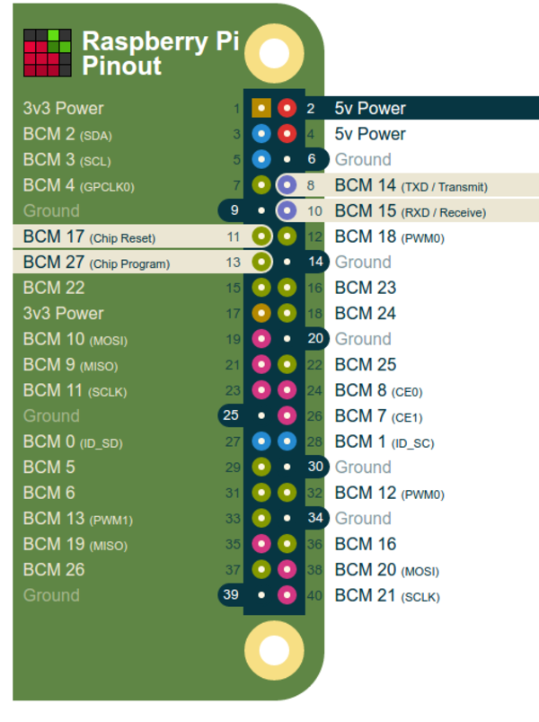
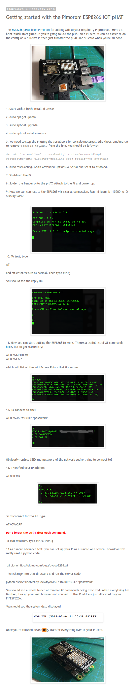

* Tutorial on getting started with ESP8266 Raspberry PI PiHat, [http://richardhayler.blogspot.nl/2016/02/getting-started-with-esp8266-iot-phat.html](http://richardhayler.blogspot.nl/2016/02/getting-started-with-esp8266-iot-phat.html).
* This PiHat can be used to give WiFi connection into Raspberry PI Zero.
* This is he pin mapping, [https://pinout.xyz/pinout/esp_iot_phat](https://pinout.xyz/pinout/esp_iot_phat).

* This is the screenshot of the tutorial.

