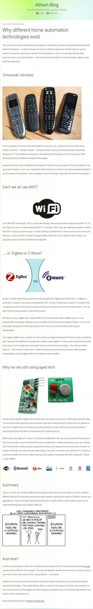

* In this article there will be discussed some options on wireless communication. Especially for home automation device.
* The first option is infrared. This is bad because it needs proper line of sight.
* The second option is Wifi. But there is no low powered WiFi device around.
* ZigBee and ZWAVE are somewhat low powered WiFi but I think they both are proprietary technology.
* The article stated that ZigBee offers more flexibility and freedom over ZWAVE.
* The ZigBee and ZWAVE has longer development time and necessity for startup to keep in contact with the provider.
* The current solution for home automation is (according to this article) RF. It is cheap and easy to develop. Additionally, its operating range is suitable for home automation.
* Here is the link to the article, [https://blog.athom.com/2017/03/10/different-home-automation-technologies-exist/](https://blog.athom.com/2017/03/10/different-home-automation-technologies-exist/).
* Here is the screenshot.

