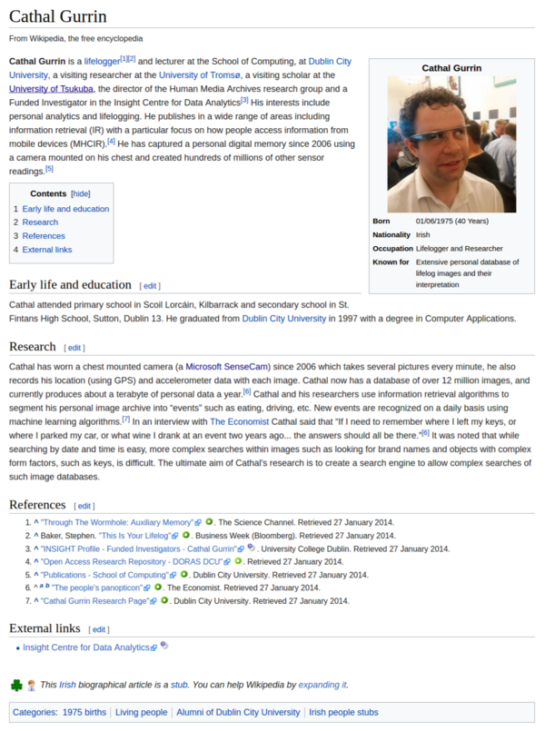

* Wikipedia article about Cathal Gurrin, [https://en.wikipedia.org/wiki/Cathal_Gurrin](https://en.wikipedia.org/wiki/Cathal_Gurrin).
* I see this name mentioned a lot when I was searching information about Microsoft SenseCam.
* I think he was the one who had been using Microsoft SenseCam for 10 years straight to experience himself how could lifelogging be introduced into commonality.
* Here are some scraps from this Wikipedia article.

* Mr. Gurrin now has 12 millions of images with size around 1 TB annually.
* This is the amount of capacity that one produces with general lifelogging devices like Microsoft SenseCam.

* The information retrieval is based on the events.

* Personal search engine.
* At simplest people would never forget where they had put their keys, ....

* The current goal is to build complex search engine that can go look through the results those come from multi - modal sensor (audio, image, and video).

* Here is the whole screenshot of th Wikipedia article.

