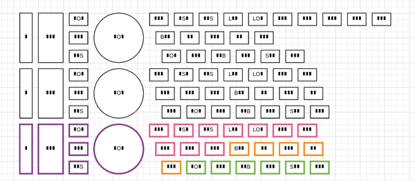

* I was experiencing an error when I was working with my visualization for my State Of The Art.
* The error (this is more as into visualization error than anything) was like this.

* The solution was actually to refresh the page or close the document and then re - opened it back.