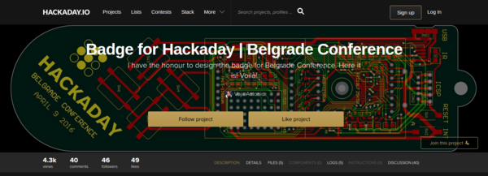
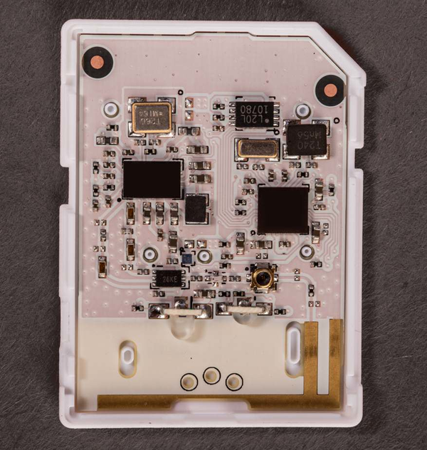
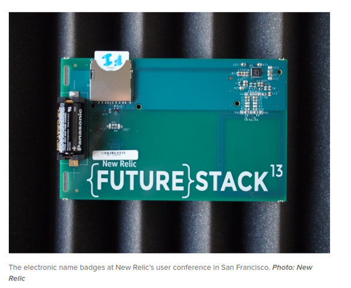
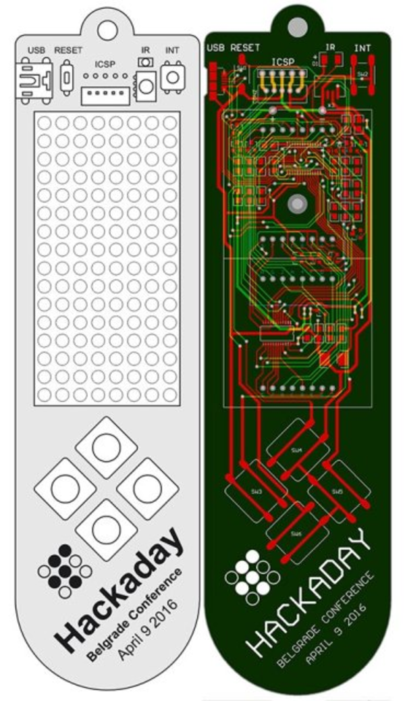
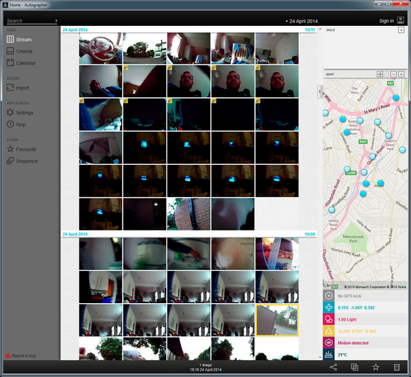
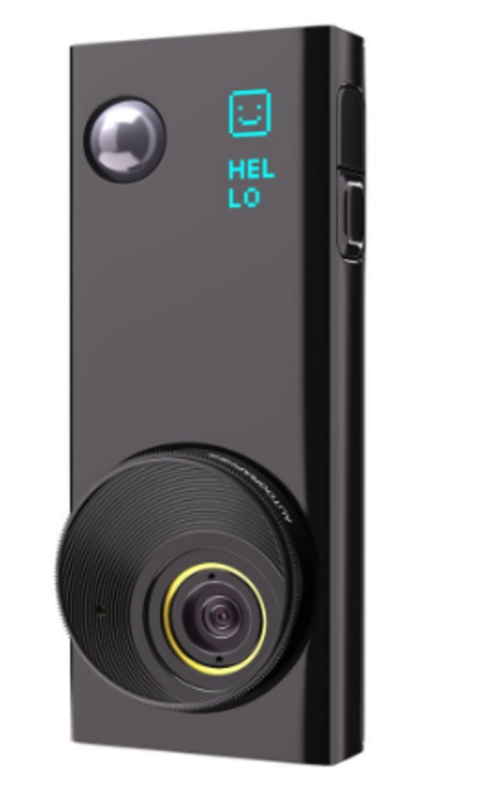
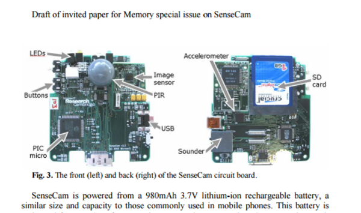
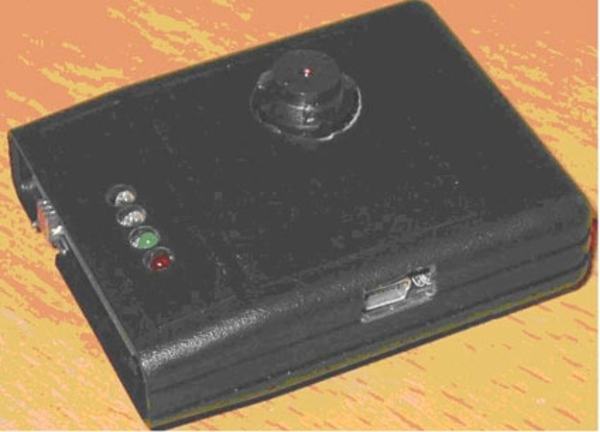
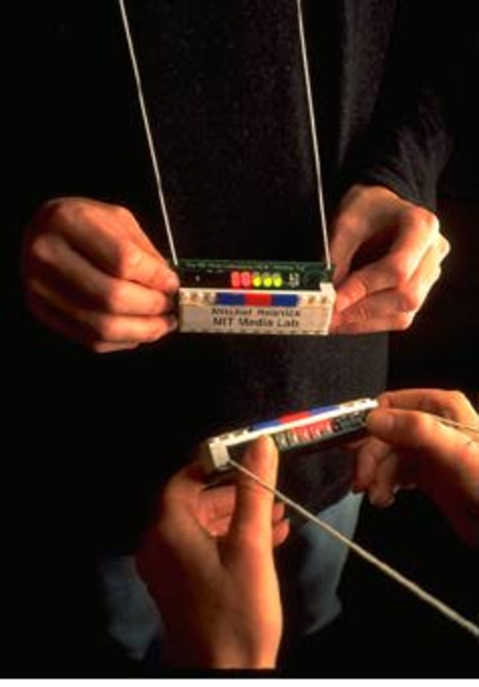

* This is the Hackaday Belgrade Badge PCB.
* The thing is that for this project, there are PCB file listed in anywhere.
* I saw in the comment section that the project author will put the PCB "later". However, I cannot find it in its Hackaday homepage, [https://hackaday.io/project/9509-badge-for-hackaday-belgrade-conference](https://hackaday.io/project/9509-badge-for-hackaday-belgrade-conference).

* The Electric Imp.
* It is a micro - controller in the size of SD Card.
* It is easy to pair with general smart phone like Android and iOS.
* The pairing method is unique as well. It uses something like morse codes from the smart phone screen into a light sensor embedded in the Electric Imp.

* This is New Relic Future Stack Badge.
* This badge was made using Electric Imp.
* This badge is also hackable.

* The design mockup of Hackaday Belgrade Badge.

* OMG Autographer desktop application.
* In this case it is used to manage contents that was captured using the OMG Autographer itself.

* The OMG Autographer.
* The thing that I always remember is its solution to make the camera apparent to solve (kinda) privacy issues.

* This is the first prototype of Microsoft SenseCam.
* It was made using PIC micro - controller.

* This is also an iteration of Microsoft SenseCam.

* Image of Thinking Tag.