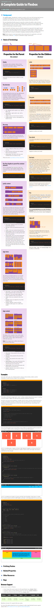

* My best experience so far is to use `display:flex;` when designing layout for my web.
* However, due to not using Bootstrap, layouts I have designed with `display:flex;` lost their responsive quality.
* There is Flex Bootstrap in development though (still in Alpha), [https://v4-alpha.getbootstrap.com/utilities/flexbox/](https://v4-alpha.getbootstrap.com/utilities/flexbox/).
* The best tutorial for `display:flex;`, [https://css-tricks.com/snippets/css/a-guide-to-flexbox/](https://css-tricks.com/snippets/css/a-guide-to-flexbox/).
* Screenshot.

