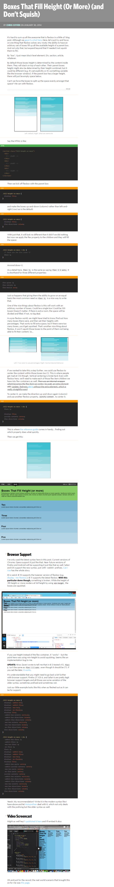

* Here is the best tutorial that showed me on how to fill height from what are left from the parent `
`, [https://css-tricks.com/boxes-fill-height-dont-squish/](https://css-tricks.com/boxes-fill-height-dont-squish/).
* Screenshot.

