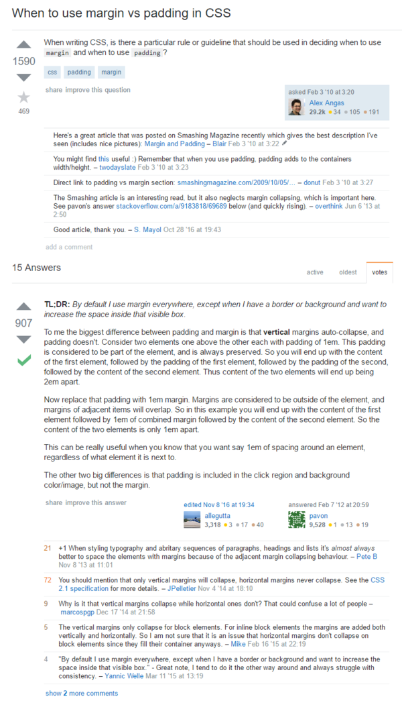

* I was looking on which one to use between margin and padding.
* The key here is to always use margin for anything else.
* Unless you need to show off the border, then you need to adjust the padding accordingly.
* Here is link to the StackOverflow, [http://stackoverflow.com/questions/2189452/when-to-use-margin-vs-padding-in-css](http://stackoverflow.com/questions/2189452/when-to-use-margin-vs-padding-in-css).
* Screenshot.

