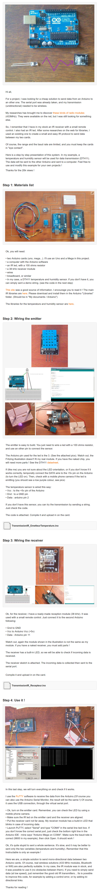

* Arduino tutorial on how to send data via infrared transceiver to other Arduino, [http://www.instructables.com/id/Cheap-wireless-transmission-between-two-Arduinos-w/?ALLSTEPS](http://www.instructables.com/id/Cheap-wireless-transmission-between-two-Arduinos-w/?ALLSTEPS).
* The problem here is now on how to get multiple signal read at the same time.
* Screenshot of the article.

* Arduino sketches.

[./20161211-1722-cet-2-arduinos-ir-communications-3.ino](./20161211-1722-cet-2-arduinos-ir-communications-3.ino)

[./20161211-1722-cet-2-arduinos-ir-communications-4.ino](./20161211-1722-cet-2-arduinos-ir-communications-4.ino)