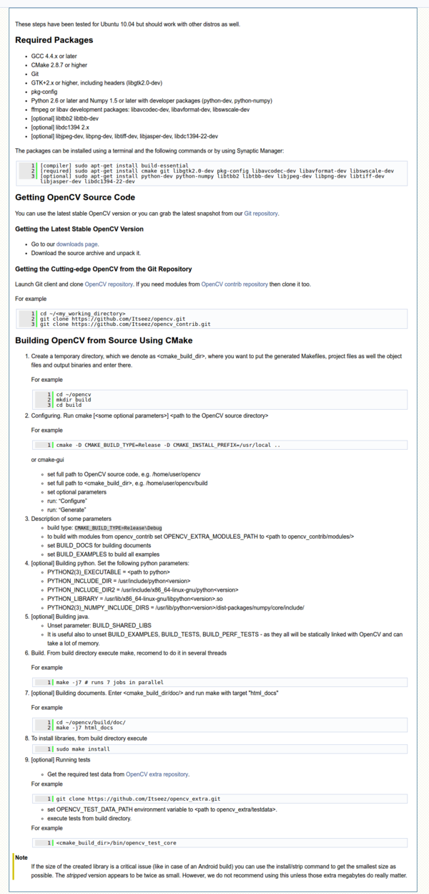
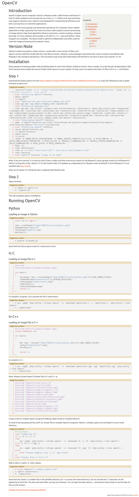
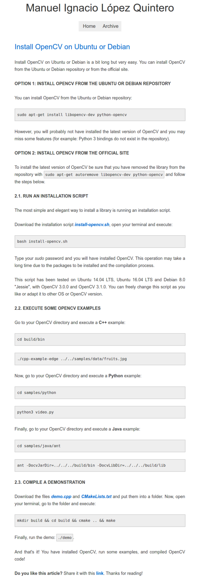

* I found that installing OpenCV in Raspbian or Ubuntu is the best when using `sudo apt-get install python-opencv` command. Check the StackOverflow discussion here, [http://stackoverflow.com/questions/26537184/how-to-install-pyopencv-on-ubuntu](http://stackoverflow.com/questions/26537184/how-to-install-pyopencv-on-ubuntu).
* Do not forget to upgrade the `pip` that you are using as well.
    * `sudo pip install --upgrade pip`
    * `sudo pip3 install --upgrade pip`
* Do not forget to install Python C binding using these commands (for `apt-get` from Ubuntu repository).
    * `sudo apt-get install python-dev`
    * `sudo apt-get install python3-dev`
* If you are not installing Python development package there will be an error like this.

```markdown
utilsmodule.c:1:20: fatal error: Python.h: No such file or directory compilation terminated.
```

* Check the discussion about missing `Python.h` here, [http://stackoverflow.com/questions/21530577/fatal-error-python-h-no-such-file-or-directory](http://stackoverflow.com/questions/21530577/fatal-error-python-h-no-such-file-or-directory).
* This is a specific package for Python 2.x binding though. So, in case you are going to use C this is not the way to go.
* I am not sure if the command also work when using Python 3.x. My project will be using Python 2.x, until I have enough reasons and motivation to convert the codes into Python 3.x.
* [http://www.pyimagesearch.com/2016/04/18/install-guide-raspberry-pi-3-raspbian-jessie-opencv-3/](http://www.pyimagesearch.com/2016/04/18/install-guide-raspberry-pi-3-raspbian-jessie-opencv-3/), tutorial on how to install OpenCV in Raspberry PI Raspbian.
* Full screenshot to the tutorial is below.


* [http://www.pyimagesearch.com/2016/10/24/ubuntu-16-04-how-to-install-opencv/](http://www.pyimagesearch.com/2016/10/24/ubuntu-16-04-how-to-install-opencv/), tutorial on how to install OpenCV in Ubuntu.
* Full screenshot to the tutorial.


* [http://docs.opencv.org/3.1.0/d7/d9f/tutorial_linux_install.html](http://docs.opencv.org/3.1.0/d7/d9f/tutorial_linux_install.html), tutorial to install OpenCV in any Linux. This is the official tutorial from the OpenCV itself.
* Full size screenshot.



* Official OpenCV installation tutorial from Ubuntu website. Although, I am concerned about the usage of third party installation script (what if the script is no longer working with the newer version of OpenCV?) the last time this web page updated was on August 2015, which is still quite new. Here is the link to the article, [https://help.ubuntu.com/community/OpenCV](https://help.ubuntu.com/community/OpenCV).
* Full size screenshot of the tutorial.



* Another tutorial on how to install OpenCV in Debian or Ubuntu, [http://milq.github.io/install-opencv-ubuntu-debian/](http://milq.github.io/install-opencv-ubuntu-debian/).
* Full size screenshot.

