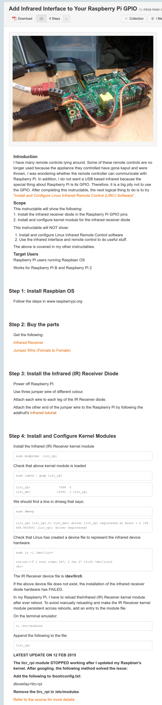

* Tutorial to add IR interface to Raspberry PI, [http://www.instructables.com/id/Add-Infrared-Interface-to-Your-Raspberry-Pi/?ALLSTEPS](http://www.instructables.com/id/Add-Infrared-Interface-to-Your-Raspberry-Pi/?ALLSTEPS).
* Full screenshot.

